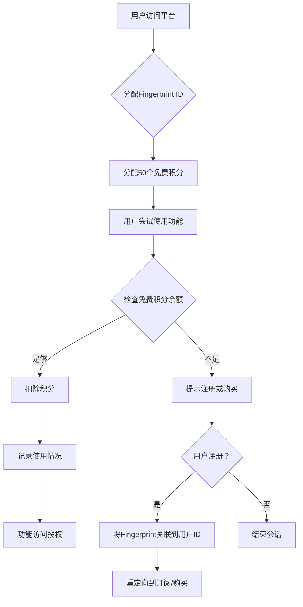
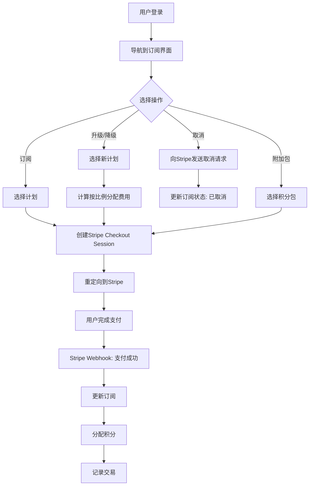
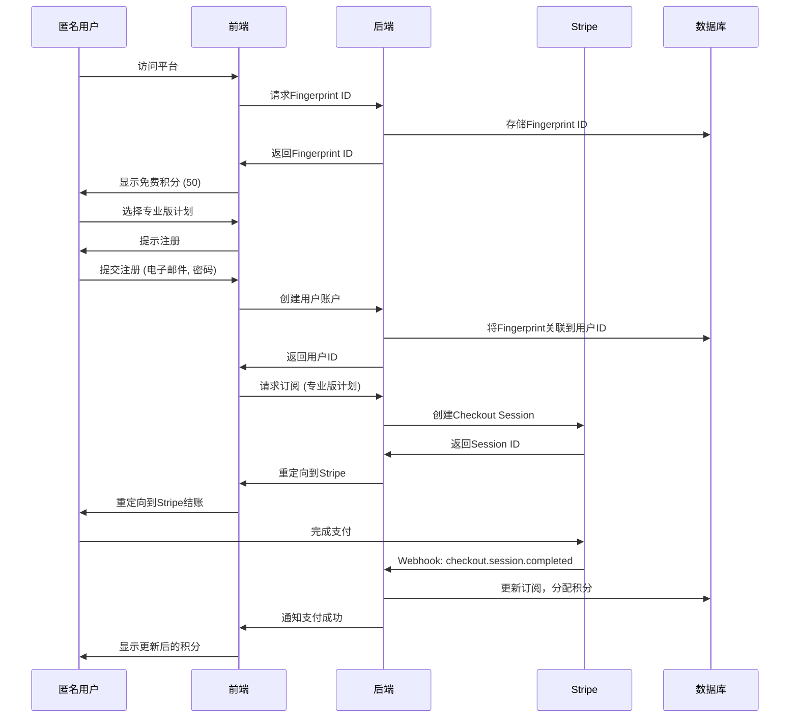
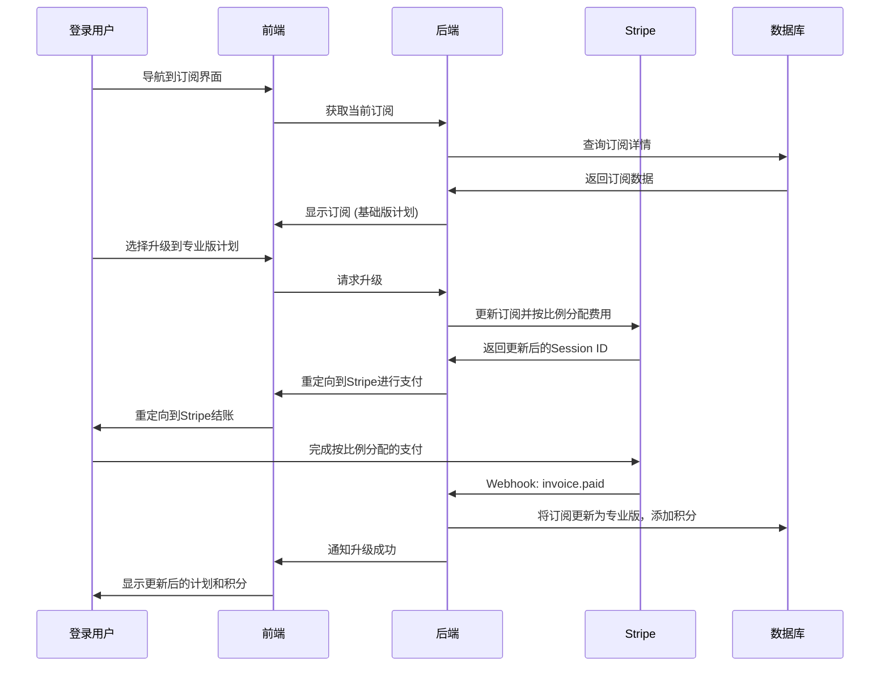
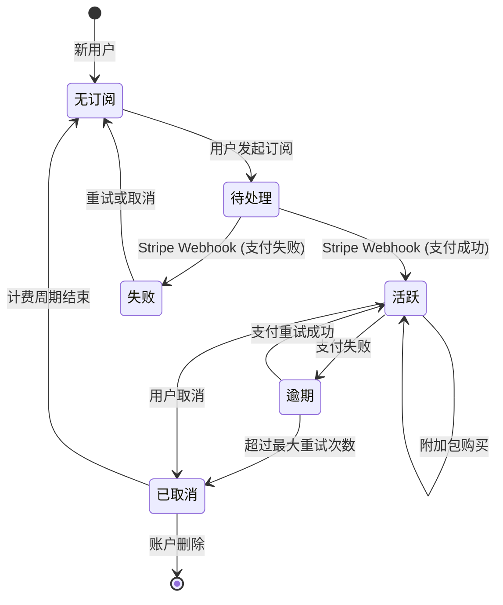
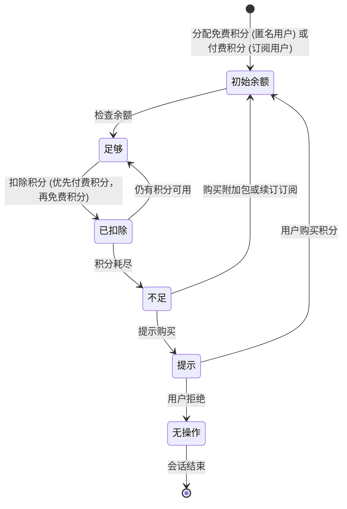

# 订阅系统：用户场景与流程设计

## 1. 概述

本文档详细描述了匿名用户和登录用户与Stripe集成的订阅与积分系统的交互场景。包括详细的用户流程、时序图和状态机图，展示订阅和积分使用的状态转换。设计确保了清晰度、可扩展性和无缝用户体验，弥补了初始草稿的不足。

---

## 2. 用户场景

### 2.1 匿名用户场景

匿名用户通过Fingerprint识别，防止滥用（例如，过度使用免费积分）。他们对功能访问受限，但可在注册前体验系统。

- **场景1：使用免费积分探索功能**
  - **描述**：匿名用户访问平台，获得免费积分，使用基本功能。
  - **步骤**：
    1. 用户访问平台，系统分配Fingerprint ID。
    2. 系统分配50个免费积分（通过Fingerprint限制，防止滥用）。
    3. 用户尝试使用功能（例如，API调用，消耗10积分）。
    4. 系统从免费余额中扣除积分并记录使用情况。
    5. 如果积分耗尽，提示用户注册或购买积分。
  - **结果**：用户体验平台，但被鼓励注册以获得完整访问权限。

- **场景2：尝试订阅**
  - **描述**：匿名用户尝试订阅付费计划，但需先注册。
  - **步骤**：
    1. 用户选择计划（例如，专业版计划）。
    2. 系统提示用户注册或登录。
    3. 用户完成注册，将Fingerprint ID关联到`user_id`。
    4. 用户被重定向到Stripe的结账页面完成支付。
    5. 支付成功后，系统分配积分并更新订阅状态。
  - **结果**：用户成为注册用户，拥有活跃订阅。

### 2.2 登录用户场景

登录用户拥有对所有功能的完整访问权限，包括订阅管理、积分购买和历史记录跟踪。

- **场景1：订阅计划**
  - **描述**：登录用户订阅月度计划。
  - **步骤**：
    1. 用户导航到订阅管理界面。
    2. 用户选择专业版计划（￥140/月，250积分）。
    3. 系统创建Stripe Checkout Session并将用户重定向到Stripe。
    4. 用户完成支付；Stripe向后端发送Webhook。
    5. 系统更新订阅状态，分配250积分并记录交易。
  - **结果**：用户获得高级功能访问权限和每月积分。

- **场景2：升级订阅**
  - **描述**：用户从基础版升级到专业版计划。
  - **步骤**：
    1. 用户在订阅界面选择专业版计划。
    2. 系统通过Stripe计算按比例分配费用并创建新Checkout Session。
    3. 用户完成按比例分配的支付。
    4. Stripe发送Webhook；系统将订阅更新为专业版并添加额外积分。
  - **结果**：用户享受增强的功能和增加的积分分配。

- **场景3：购买一次性积分**
  - **描述**：用户购买附加积分包。
  - **步骤**：
    1. 用户选择100积分附加包（￥35）。
    2. 系统创建一次性Stripe Checkout Session。
    3. 用户完成支付；Stripe发送Webhook。
    4. 系统将100个付费积分添加到用户余额并记录交易。
  - **结果**：用户获得额外的即时使用积分。

- **场景4：取消订阅**
  - **描述**：用户取消订阅。
  - **步骤**：
    1. 用户在界面点击“取消订阅”。
    2. 系统向Stripe发送取消请求。
    3. Stripe确认取消；系统更新订阅状态为“已取消”。
    4. 用户在计费周期结束前保留访问权限。
  - **结果**：用户的订阅终止，不再产生费用。

- **场景5：查看历史记录**
  - **描述**：用户查看交易和积分使用历史。
  - **步骤**：
    1. 用户导航到历史记录选项卡。
    2. 系统获取交易记录（例如，支付、退款）和积分使用日志。
    3. 界面显示包含时间戳、金额和使用功能的数据表。
  - **结果**：用户获得账户活动的透明度。

---

## 3. Mermaid流程图

### 3.1 匿名用户积分使用流程图

### 3.2 登录用户订阅流程图

---

## 4. Mermaid时序图

### 4.1 匿名用户订阅时序图

### 4.2 登录用户升级订阅时序图

---

## 5. Mermaid状态机图

### 5.1 订阅状态机

以下状态机表示用户订阅的生命周期，包括用户操作或Stripe Webhook触发的状态转换。

### 5.2 积分使用状态机

此状态机表示用户积分余额在使用过程中的状态。

---

## 6. 关键考虑

### 6.1 安全性
- **Fingerprint**：通过限制每设备积分分配，防止免费积分滥用。
- **Stripe Webhook**：验证签名以确保真实性。
- **数据隐私**：加密敏感数据（例如，`stripe_session_id`）并符合GDPR。

### 6.2 可扩展性
- **数据库索引**：优化`user_id`、`fingerprint_id`和`stripe_session_id`的查询。
- **缓存**：使用Redis缓存积分余额和订阅状态。
- **异步处理**：在队列中处理Stripe Webhook，避免用户操作延迟。

### 6.3 用户体验
- **清晰提示**：当积分耗尽时，引导匿名用户注册。
- **透明历史记录**：提供详细的交易和使用日志。
- **响应式界面**：确保订阅界面适配移动设备。

---

## 7. 未来改进
- **多货币支持**：通过Stripe支持多种货币支付。
- **促销积分**：提供限时促销积分用于营销活动。
- **通知**：为低积分余额或订阅变化发送电子邮件/短信提醒。

---

## 8. 参考资料
- Stripe Webhook文档：https://stripe.com/docs/webhooks
- Fingerprint文档：https://fingerprint.com/docs
- Mermaid语法：https://mermaid.js.org/syntax/sequenceDiagram.html