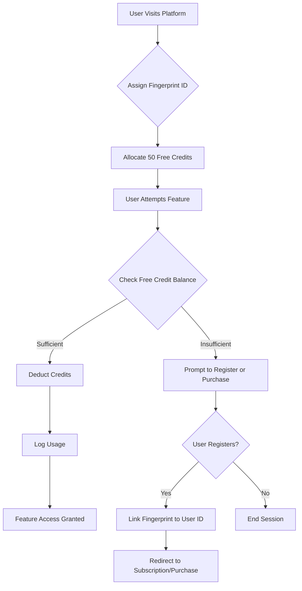
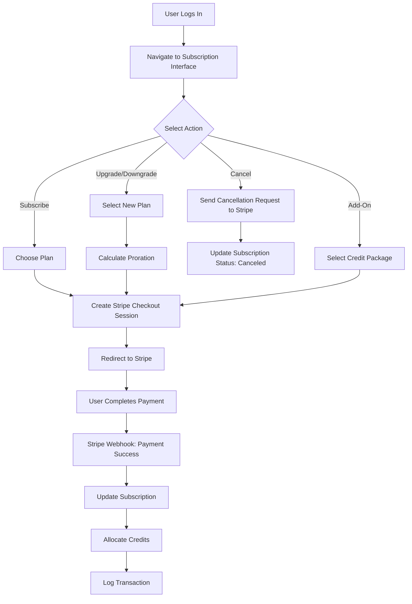
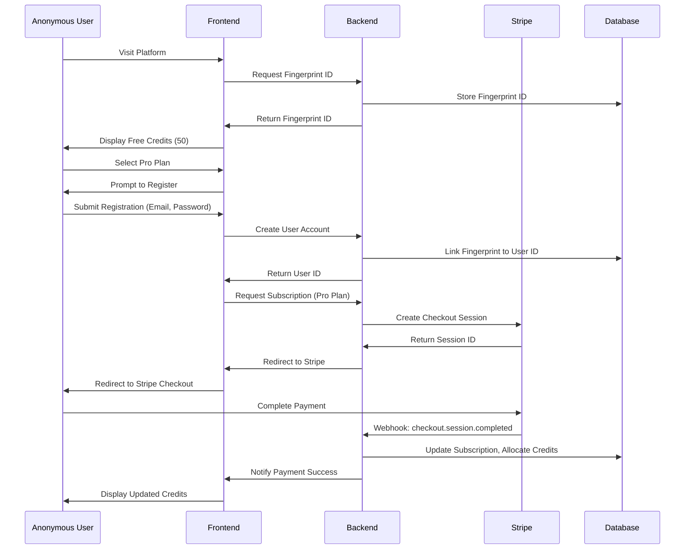
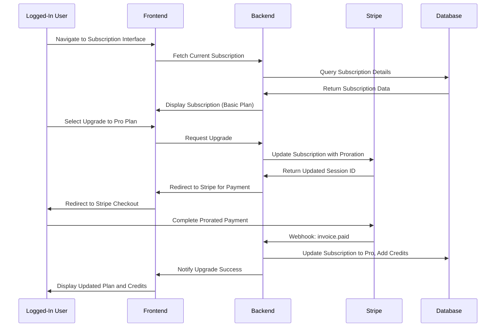
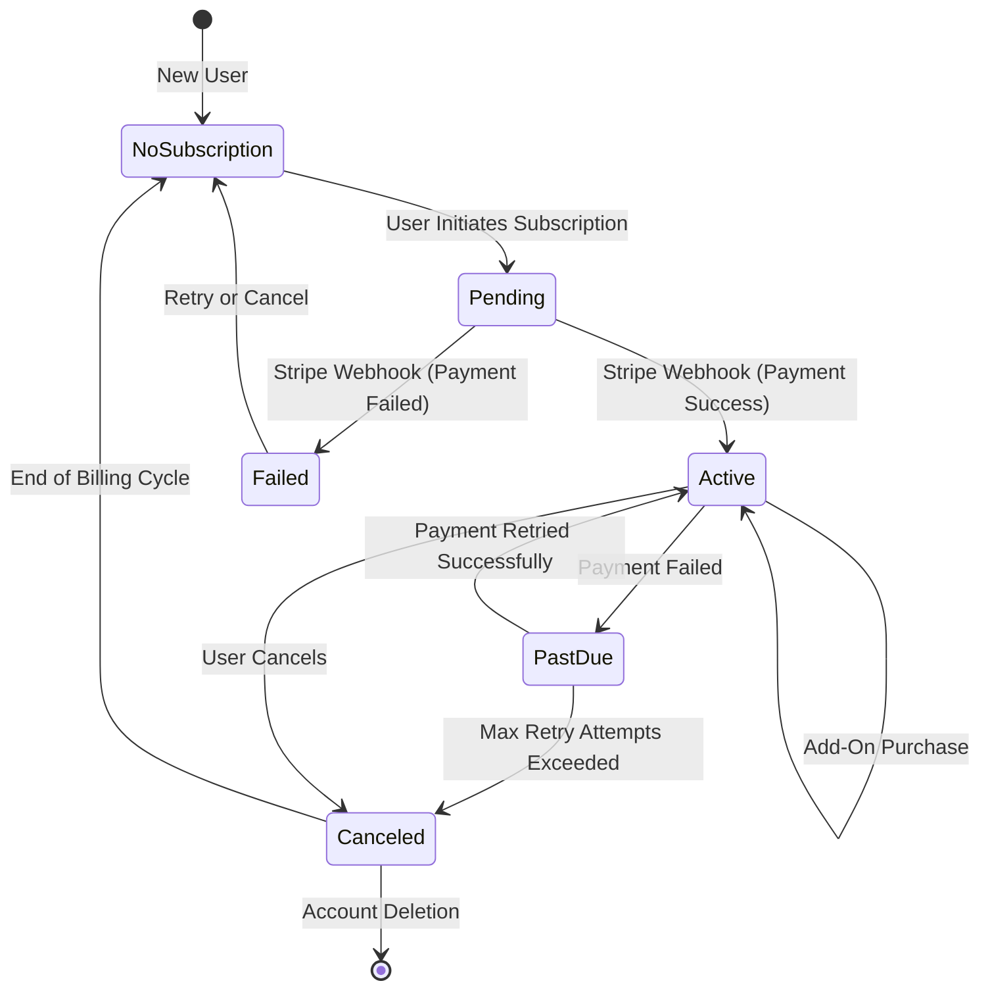
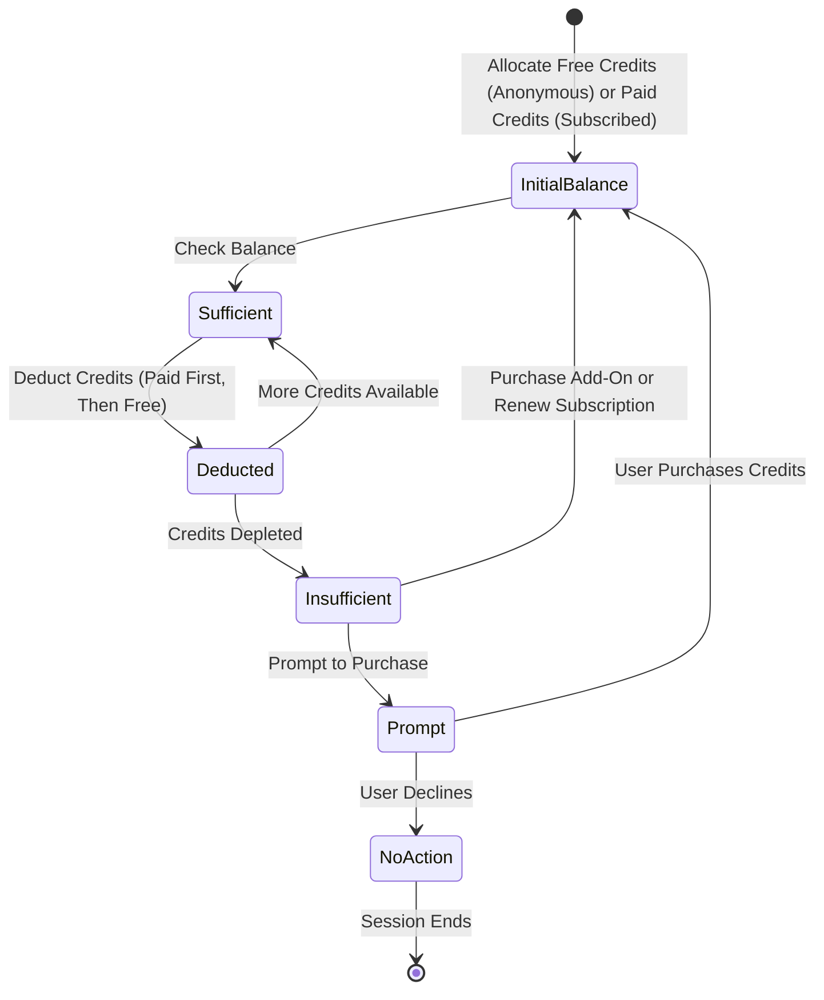

# Subscription System: User Scenarios and Flow Design

## 1. Overview

This document details the user scenarios for anonymous and logged-in users interacting with a subscription and credits system integrated with Stripe. It includes comprehensive user flows, sequence diagrams, and a state machine to represent state transitions for subscriptions and credit usage. The design ensures clarity, scalability, and a seamless user experience, addressing potential gaps in the initial draft.

---

## 2. User Scenarios

### 2.1 Anonymous User Scenarios

Anonymous users are identified via Fingerprint to prevent abuse (e.g., excessive free credit usage). They have limited access to features but can explore the system before registering.

- **Scenario 1: Exploring Features with Free Credits**
  - **Description**: An anonymous user visits the platform, receives free credits, and uses them to access basic features.
  - **Steps**:
    1. User lands on the platform; system assigns a Fingerprint ID.
    2. System allocates 50 free credits (limited by Fingerprint to prevent abuse).
    3. User attempts to use a feature (e.g., API call costing 10 credits).
    4. System deducts credits from free balance and logs usage.
    5. If credits are depleted, user is prompted to register or purchase credits.
  - **Outcome**: User experiences the platform but is encouraged to register for full access.

- **Scenario 2: Attempting to Subscribe**
  - **Description**: An anonymous user tries to subscribe to a paid plan but must register first.
  - **Steps**:
    1. User selects a plan (e.g., Pro plan).
    2. System prompts user to register or log in.
    3. User completes registration, linking their Fingerprint ID to a `user_id`.
    4. User is redirected to Stripe’s checkout page to complete payment.
    5. Upon payment success, system allocates credits and updates subscription status.
  - **Outcome**: User becomes a registered user with an active subscription.

### 2.2 Logged-In User Scenarios

Logged-in users have full access to features, including subscription management, credit purchases, and history tracking.

- **Scenario 1: Subscribing to a Plan**
  - **Description**: A logged-in user subscribes to a monthly plan.
  - **Steps**:
    1. User navigates to the subscription management interface.
    2. User selects the Pro plan ($20/month, 250 credits).
    3. System creates a Stripe Checkout Session and redirects user to Stripe.
    4. User completes payment; Stripe sends a webhook to the backend.
    5. System updates subscription status, allocates 250 credits, and logs the transaction.
  - **Outcome**: User gains access to premium features with monthly credits.

- **Scenario 2: Upgrading a Subscription**
  - **Description**: A user upgrades from Basic to Pro plan mid-cycle.
  - **Steps**:
    1. User selects the Pro plan on the subscription interface.
    2. System calculates proration via Stripe and creates a new Checkout Session.
    3. User completes payment for the prorated amount.
    4. Stripe sends a webhook; system updates subscription to Pro and adds additional credits.
  - **Outcome**: User enjoys enhanced features with increased credit allocation.

- **Scenario 3: Purchasing One-Time Credits**
  - **Description**: A user purchases an add-on credit package.
  - **Steps**:
    1. User selects a 100-credit add-on package ($5).
    2. System creates a one-time Stripe Checkout Session.
    3. User completes payment; Stripe sends a webhook.
    4. System adds 100 paid credits to the user’s balance and logs the transaction.
  - **Outcome**: User has additional credits for immediate use.

- **Scenario 4: Canceling a Subscription**
  - **Description**: A user cancels their subscription.
  - **Steps**:
    1. User clicks “Cancel Subscription” on the interface.
    2. System sends a cancellation request to Stripe.
    3. Stripe confirms cancellation; system updates subscription status to “canceled.”
    4. User retains access until the end of the billing cycle.
  - **Outcome**: User’s subscription ends without further charges.

- **Scenario 5: Viewing History**
  - **Description**: A user reviews their transaction and credit usage history.
  - **Steps**:
    1. User navigates to the history tab.
    2. System fetches transaction records (e.g., payments, refunds) and credit usage logs.
    3. Interface displays a table with timestamps, amounts, and features used.
  - **Outcome**: User gains transparency into their account activity.

---

## 3. Mermaid Flowcharts

### 3.1 Anonymous User Credit Usage Flowchart

### 3.2 Logged-In User Subscription Flowchart

---

## 4. Mermaid Sequence Diagrams

### 4.1 Anonymous User Subscribing Sequence Diagram

### 4.2 Logged-In User Upgrading Subscription Sequence Diagram

---

## 5. Mermaid State Machine Diagram

### 5.1 Subscription State Machine

The following state machine represents the lifecycle of a user’s subscription, including transitions triggered by user actions or Stripe webhooks.

### 5.2 Credit Usage State Machine

This state machine represents the states of a user’s credit balance during usage.

---

## 6. Key Considerations

### 6.1 Security
- **Fingerprint**: Prevents free credit abuse by limiting allocations per device.
- **Stripe Webhooks**: Validate signatures to ensure authenticity.
- **Data Privacy**: Encrypt sensitive data (e.g., `stripe_session_id`) and comply with GDPR.

### 6.2 Scalability
- **Database Indexes**: Optimize queries for `user_id`, `fingerprint_id`, and `stripe_session_id`.
- **Caching**: Use Redis to cache credit balances and subscription statuses.
- **Asynchronous Processing**: Process Stripe webhooks in a queue to avoid delays.

### 6.3 User Experience
- **Clear Prompts**: Guide anonymous users to register when credits are depleted.
- **Transparent History**: Provide detailed transaction and usage logs.
- **Responsive Interface**: Ensure the subscription interface is mobile-friendly.

---

## 7. Future Enhancements
- **Multi-Currency Support**: Allow payments in various currencies via Stripe.
- **Promotional Credits**: Offer time-limited credits for marketing campaigns.
- **Notifications**: Send email/SMS alerts for low credit balances or subscription changes.

---

## 8. References
- Stripe Webhooks: https://stripe.com/docs/webhooks
- Fingerprint Documentation: https://fingerprint.com/docs
- Mermaid Syntax: https://mermaid.js.org/syntax/sequenceDiagram.html