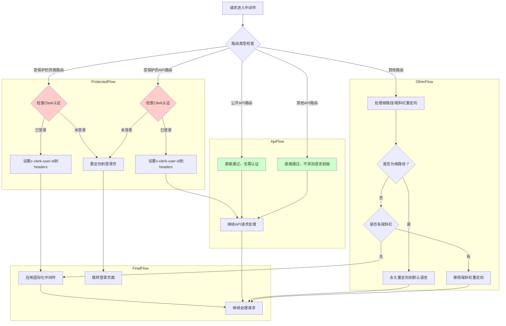
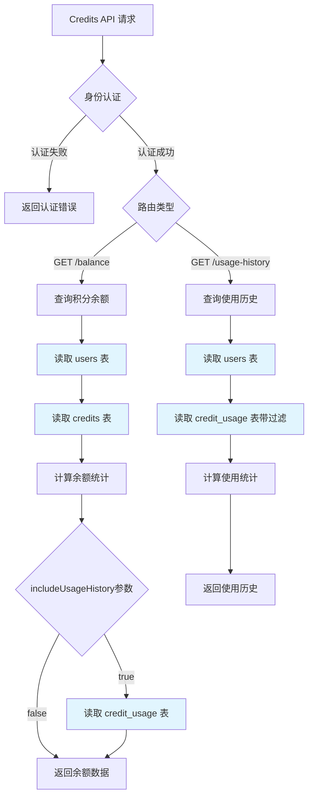
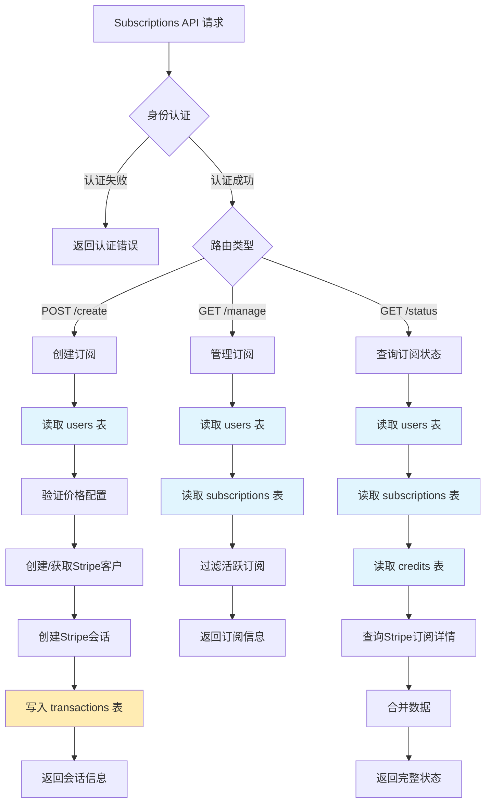
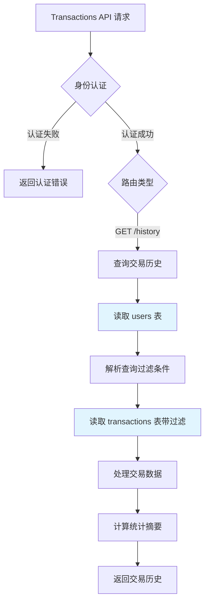
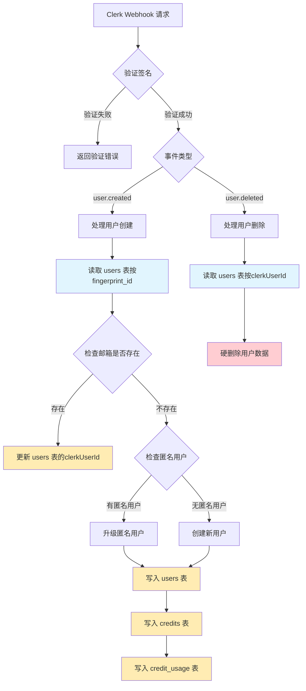
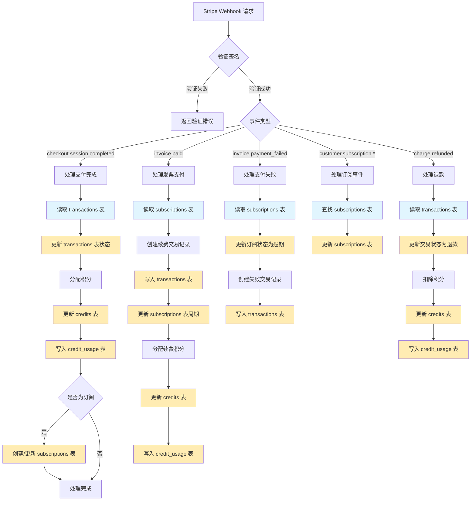
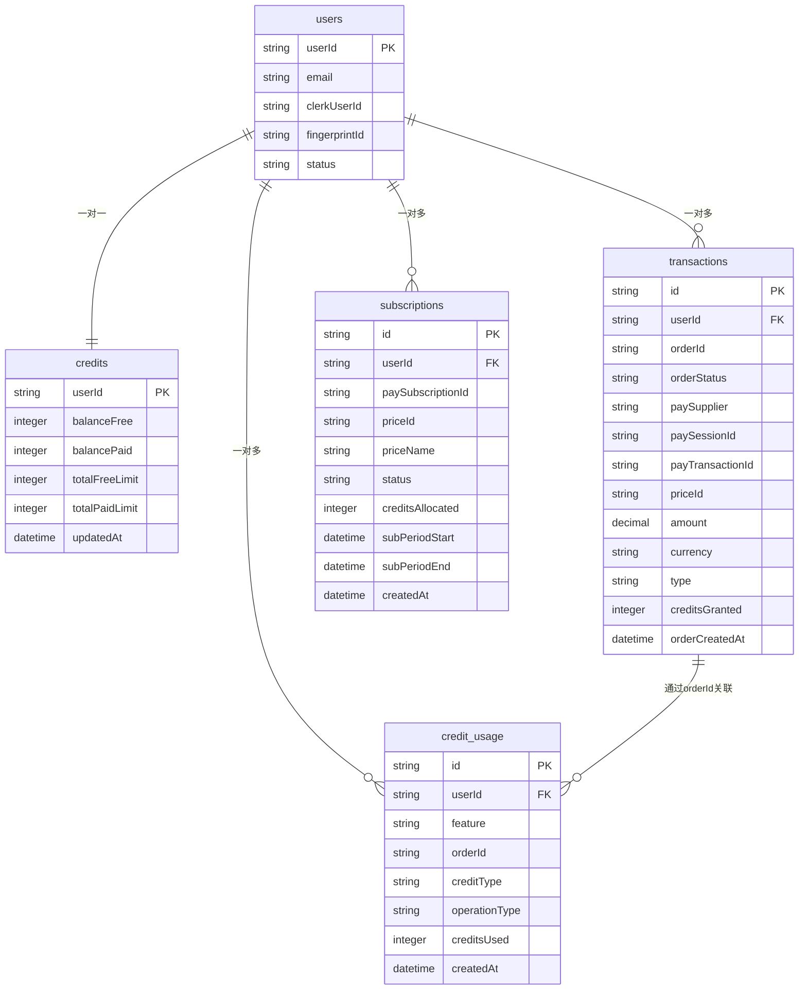

## 中间件处理逻辑

```mermaid
flowchart TD
    Start[请求进入中间件] --> RouteCheck{路由类型检查}
    
    RouteCheck -->|受保护的页面路由| ProtectedPageAuth{检查Clerk认证}
    RouteCheck -->|受保护的API路由| ProtectedApiAuth{检查Clerk认证}
    RouteCheck -->|公开API路由| PublicApi[直接通过，无需认证]
    RouteCheck -->|其他API路由| OtherApi[直接通过，不添加语言前缀]
    RouteCheck -->|其他路由| HandleOther[处理根路径/尾斜杠重定向]
    
    ProtectedPageAuth -->|已登录| SetClerkIdPage[设置x-clerk-user-id到headers]
    ProtectedPageAuth -->|未登录| RedirectSignIn[重定向到登录页]
    
    ProtectedApiAuth -->|已登录| SetClerkIdApi[设置x-clerk-user-id到headers]
    ProtectedApiAuth -->|未登录| RedirectSignIn
    
    SetClerkIdPage --> IntlMiddleware[应用国际化中间件]
    SetClerkIdApi --> ContinueApi[继续API请求处理]
    
    PublicApi --> ContinueApi
    OtherApi --> ContinueApi
    
    HandleOther --> RootPath{是否为根路径 '/'}
    RootPath -->|是| DefaultLocaleRedirect[永久重定向到默认语言]
    RootPath -->|否| TrailingSlash{是否有尾斜杠}
    
    TrailingSlash -->|有| RemoveSlashRedirect[移除尾斜杠重定向]
    TrailingSlash -->|无| IntlMiddleware
    
    IntlMiddleware --> Continue[继续处理请求]
    ContinueApi --> Continue
    DefaultLocaleRedirect --> Continue
    RemoveSlashRedirect --> Continue
    RedirectSignIn --> SignInPage[跳转登录页面]
    
    %% Positioning to reduce crossings
    subgraph ProtectedFlow
        ProtectedPageAuth
        ProtectedApiAuth
        SetClerkIdPage
        SetClerkIdApi
        RedirectSignIn
    end
    
    subgraph ApiFlow
        PublicApi
        OtherApi
        ContinueApi
    end
    
    subgraph OtherFlow
        HandleOther
        RootPath
        DefaultLocaleRedirect
        TrailingSlash
        RemoveSlashRedirect
    end
    
    subgraph FinalFlow
        IntlMiddleware
        Continue
        SignInPage
    end
    
    style ProtectedPageAuth fill:#ffcccc
    style ProtectedApiAuth fill:#ffcccc
    style PublicApi fill:#ccffcc
    style OtherApi fill:#ccffcc
```

## Credits 模块

```mermaid
flowchart TD
    CB_Start[Credits API 请求] --> CB_Auth{身份认证}
    
    CB_Auth -->|认证失败| CB_Error[返回认证错误]
    CB_Auth -->|认证成功| CB_Route{路由类型}
    
    CB_Route -->|GET /balance| CB_Balance[查询积分余额]
    CB_Route -->|GET /usage-history| CB_Usage[查询使用历史]
    
    CB_Balance --> CB_ReadUser[读取 users 表]
    CB_ReadUser --> CB_ReadCredit[读取 credits 表]
    CB_ReadCredit --> CB_CalcBalance[计算余额统计]
    CB_CalcBalance --> CB_OptionalUsage{includeUsageHistory参数}
    CB_OptionalUsage -->|true| CB_ReadUsage[读取 credit_usage 表]
    CB_OptionalUsage -->|false| CB_ReturnBalance[返回余额数据]
    CB_ReadUsage --> CB_ReturnBalance
    
    CB_Usage --> CB_ReadUser2[读取 users 表]
    CB_ReadUser2 --> CB_ReadUsageFiltered[读取 credit_usage 表带过滤]
    CB_ReadUsageFiltered --> CB_CalcSummary[计算使用统计]
    CB_CalcSummary --> CB_ReturnUsage[返回使用历史]
    
    style CB_ReadUser fill:#e1f5fe
    style CB_ReadCredit fill:#e1f5fe
    style CB_ReadUsage fill:#e1f5fe
    style CB_ReadUser2 fill:#e1f5fe
    style CB_ReadUsageFiltered fill:#e1f5fe
```

## Subscriptions 模块

```mermaid
flowchart TD
    SB_Start[Subscriptions API 请求] --> SB_Auth{身份认证}
    
    SB_Auth -->|认证失败| SB_Error[返回认证错误]
    SB_Auth -->|认证成功| SB_Route{路由类型}
    
    SB_Route -->|POST /create| SB_Create[创建订阅]
    SB_Route -->|GET /manage| SB_Manage[管理订阅]
    SB_Route -->|GET /status| SB_Status[查询订阅状态]
    
    SB_Create --> SB_ReadUser[读取 users 表]
    SB_ReadUser --> SB_ValidatePrice[验证价格配置]
    SB_ValidatePrice --> SB_CreateCustomer[创建/获取Stripe客户]
    SB_CreateCustomer --> SB_CreateSession[创建Stripe会话]
    SB_CreateSession --> SB_WriteTransaction[写入 transactions 表]
    SB_WriteTransaction --> SB_ReturnSession[返回会话信息]
    
    SB_Manage --> SB_ReadUser2[读取 users 表]
    SB_ReadUser2 --> SB_ReadSubscriptions[读取 subscriptions 表]
    SB_ReadSubscriptions --> SB_FilterActive[过滤活跃订阅]
    SB_FilterActive --> SB_ReturnManage[返回订阅信息]
    
    SB_Status --> SB_ReadUser3[读取 users 表]
    SB_ReadUser3 --> SB_ReadSubsDetail[读取 subscriptions 表]
    SB_ReadSubsDetail --> SB_ReadCredits[读取 credits 表]
    SB_ReadCredits --> SB_QueryStripe[查询Stripe订阅详情]
    SB_QueryStripe --> SB_MergeData[合并数据]
    SB_MergeData --> SB_ReturnStatus[返回完整状态]
    
    style SB_ReadUser fill:#e1f5fe
    style SB_ReadUser2 fill:#e1f5fe
    style SB_ReadUser3 fill:#e1f5fe
    style SB_ReadSubscriptions fill:#e1f5fe
    style SB_ReadSubsDetail fill:#e1f5fe
    style SB_ReadCredits fill:#e1f5fe
    style SB_WriteTransaction fill:#ffecb3
```

## Transactions 模块

```mermaid
flowchart TD
    TB_Start[Transactions API 请求] --> TB_Auth{身份认证}
    
    TB_Auth -->|认证失败| TB_Error[返回认证错误]
    TB_Auth -->|认证成功| TB_Route{路由类型}
    
    TB_Route -->|GET /history| TB_History[查询交易历史]
    
    TB_History --> TB_ReadUser[读取 users 表]
    TB_ReadUser --> TB_ParseFilters[解析查询过滤条件]
    TB_ParseFilters --> TB_ReadTransactions[读取 transactions 表带过滤]
    TB_ReadTransactions --> TB_ProcessData[处理交易数据]
    TB_ProcessData --> TB_CalcSummary[计算统计摘要]
    TB_CalcSummary --> TB_ReturnHistory[返回交易历史]
    
    style TB_ReadUser fill:#e1f5fe
    style TB_ReadTransactions fill:#e1f5fe
```

## Webhook-Clerk 模块

```mermaid
flowchart TD
    WC_Start[Clerk Webhook 请求] --> WC_Verify{验证签名}
    
    WC_Verify -->|验证失败| WC_Error[返回验证错误]
    WC_Verify -->|验证成功| WC_Event{事件类型}
    
    WC_Event -->|user.created| WC_Created[处理用户创建]
    WC_Event -->|user.deleted| WC_Deleted[处理用户删除]
    
    WC_Created --> WC_ReadFingerprint[读取 users 表按fingerprint_id]
    WC_ReadFingerprint --> WC_CheckEmail{检查邮箱是否存在}
    WC_CheckEmail -->|存在| WC_UpdateClerk[更新 users 表的clerkUserId]
    WC_CheckEmail -->|不存在| WC_CheckAnonymous{检查匿名用户}
    WC_CheckAnonymous -->|有匿名用户| WC_Upgrade[升级匿名用户]
    WC_CheckAnonymous -->|无匿名用户| WC_CreateUser[创建新用户]
    
    WC_Upgrade --> WC_WriteUser[写入 users 表]
    WC_CreateUser --> WC_WriteUser
    WC_WriteUser --> WC_InitCredit[写入 credits 表]
    WC_InitCredit --> WC_RecordUsage[写入 credit_usage 表]
    
    WC_Deleted --> WC_ReadClerkUser[读取 users 表按clerkUserId]
    WC_ReadClerkUser --> WC_HardDelete[硬删除用户数据]
    
    style WC_ReadFingerprint fill:#e1f5fe
    style WC_ReadClerkUser fill:#e1f5fe
    style WC_UpdateClerk fill:#ffecb3
    style WC_WriteUser fill:#ffecb3
    style WC_InitCredit fill:#ffecb3
    style WC_RecordUsage fill:#ffecb3
    style WC_HardDelete fill:#ffcdd2
```

## Webhook-Stripe 模块

```mermaid
flowchart TD
    WS_Start[Stripe Webhook 请求] --> WS_Verify{验证签名}
    
    WS_Verify -->|验证失败| WS_Error[返回验证错误]
    WS_Verify -->|验证成功| WS_Event{事件类型}
    
    WS_Event -->|checkout.session.completed| WS_CheckoutComplete[处理支付完成]
    WS_Event -->|invoice.paid| WS_InvoicePaid[处理发票支付]
    WS_Event -->|invoice.payment_failed| WS_PaymentFailed[处理支付失败]
    WS_Event -->|customer.subscription.*| WS_SubEvents[处理订阅事件]
    WS_Event -->|charge.refunded| WS_Refunded[处理退款]
    
    WS_CheckoutComplete --> WS_ReadTransaction[读取 transactions 表]
    WS_ReadTransaction --> WS_UpdateTransaction[更新 transactions 表状态]
    WS_UpdateTransaction --> WS_AllocateCredits[分配积分]
    WS_AllocateCredits --> WS_UpdateCredits[更新 credits 表]
    WS_UpdateCredits --> WS_RecordCredit[写入 credit_usage 表]
    WS_RecordCredit --> WS_CheckSubscription{是否为订阅}
    WS_CheckSubscription -->|是| WS_CreateSub[创建/更新 subscriptions 表]
    WS_CheckSubscription -->|否| WS_Complete[处理完成]
    WS_CreateSub --> WS_Complete
    
    WS_InvoicePaid --> WS_ReadSub[读取 subscriptions 表]
    WS_ReadSub --> WS_CreateRenewal[创建续费交易记录]
    WS_CreateRenewal --> WS_WriteRenewalTrans[写入 transactions 表]
    WS_WriteRenewalTrans --> WS_UpdateSubPeriod[更新 subscriptions 表周期]
    WS_UpdateSubPeriod --> WS_AllocateRenewal[分配续费积分]
    WS_AllocateRenewal --> WS_UpdateRenewalCredits[更新 credits 表]
    WS_UpdateRenewalCredits --> WS_RecordRenewal[写入 credit_usage 表]
    
    WS_PaymentFailed --> WS_ReadFailedSub[读取 subscriptions 表]
    WS_ReadFailedSub --> WS_UpdateSubStatus[更新订阅状态为逾期]
    WS_UpdateSubStatus --> WS_CreateFailedTrans[创建失败交易记录]
    WS_CreateFailedTrans --> WS_WriteFailedTrans[写入 transactions 表]
    
    WS_SubEvents --> WS_FindSub[查找 subscriptions 表]
    WS_FindSub --> WS_UpdateSubData[更新 subscriptions 表]
    
    WS_Refunded --> WS_ReadRefundTrans[读取 transactions 表]
    WS_ReadRefundTrans --> WS_UpdateRefundStatus[更新交易状态为退款]
    WS_UpdateRefundStatus --> WS_DeductCredits[扣除积分]
    WS_DeductCredits --> WS_UpdateRefundCredits[更新 credits 表]
    WS_UpdateRefundCredits --> WS_RecordDeduction[写入 credit_usage 表]
    
    style WS_ReadTransaction fill:#e1f5fe
    style WS_ReadSub fill:#e1f5fe
    style WS_ReadFailedSub fill:#e1f5fe
    style WS_FindSub fill:#e1f5fe
    style WS_ReadRefundTrans fill:#e1f5fe
    style WS_UpdateTransaction fill:#ffecb3
    style WS_UpdateCredits fill:#ffecb3
    style WS_RecordCredit fill:#ffecb3
    style WS_CreateSub fill:#ffecb3
    style WS_WriteRenewalTrans fill:#ffecb3
    style WS_UpdateSubPeriod fill:#ffecb3
    style WS_UpdateRenewalCredits fill:#ffecb3
    style WS_RecordRenewal fill:#ffecb3
    style WS_UpdateSubStatus fill:#ffecb3
    style WS_WriteFailedTrans fill:#ffecb3
    style WS_UpdateSubData fill:#ffecb3
    style WS_UpdateRefundStatus fill:#ffecb3
    style WS_UpdateRefundCredits fill:#ffecb3
    style WS_RecordDeduction fill:#ffecb3
```

## 数据表关系总览

```mermaid
erDiagram
    users {
        string userId PK
        string email
        string clerkUserId
        string fingerprintId
        string status
    }
    
    credits {
        string userId PK
        integer balanceFree
        integer balancePaid
        integer totalFreeLimit
        integer totalPaidLimit
        datetime updatedAt
    }
    
    credit_usage {
        string id PK
        string userId FK
        string feature
        string orderId
        string creditType
        string operationType
        integer creditsUsed
        datetime createdAt
    }
    
    transactions {
        string id PK
        string userId FK
        string orderId
        string orderStatus
        string paySupplier
        string paySessionId
        string payTransactionId
        string priceId
        decimal amount
        string currency
        string type
        integer creditsGranted
        datetime orderCreatedAt
    }
    
    subscriptions {
        string id PK
        string userId FK
        string paySubscriptionId
        string priceId
        string priceName
        string status
        integer creditsAllocated
        datetime subPeriodStart
        datetime subPeriodEnd
        datetime createdAt
    }
    
    users ||--|| credits : "一对一"
    users ||--o{ credit_usage : "一对多"
    users ||--o{ transactions : "一对多"
    users ||--o{ subscriptions : "一对多"
    transactions ||--o{ credit_usage : "通过orderId关联"
```

