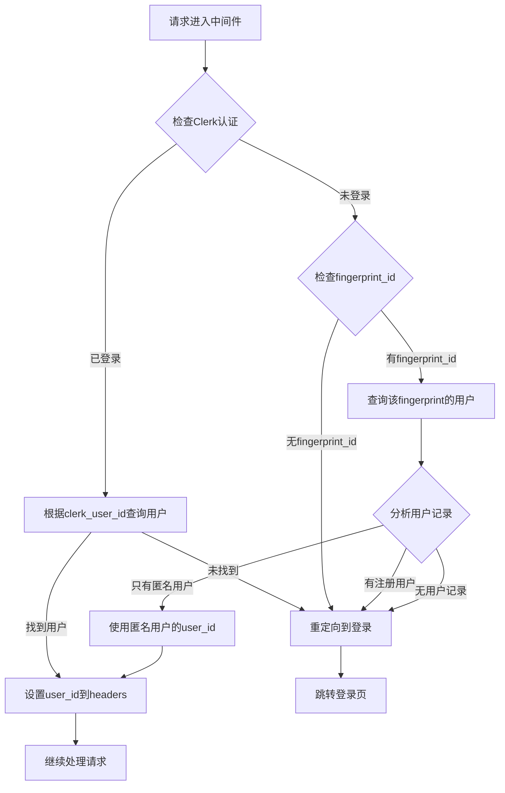

# 统一身份认证系统使用指南

## 概述

新的身份认证系统在中间件层统一处理了三种ID的关系：
- `clerk_user_id` (Clerk 用户ID)  
- `fingerprint_id` (浏览器指纹ID)
- `user_id` (系统内部用户ID)

后端API只需要关心统一的 `user_id`，大大简化了业务逻辑。

## 认证流程

### 1. 中间件处理逻辑



### 2. 用户状态判断

- **已登录注册用户**: 有 `clerk_user_id`，数据库中有对应记录
- **未登录注册用户**: 有 `fingerprint_id`，数据库中有注册状态的用户记录 → 需要登录
- **匿名用户**: 有 `fingerprint_id`，数据库中只有匿名状态的用户记录 → 可以继续使用
- **全新用户**: 没有任何记录 → 需要初始化（通过前端调用初始化API）

## API 使用方法

### 方法一：使用工具类（推荐）

```typescript
import { ApiAuthUtils } from '@/lib/auth-utils';

export async function POST(request: NextRequest) {
  try {
    // 创建认证工具实例
    const authUtils = new ApiAuthUtils(request);
    
    // 获取用户ID（如果需要强制认证）
    const userId = authUtils.requireAuth(); // 未认证会抛出错误
    
    // 或者检查是否已认证
    if (!authUtils.isAuthenticated()) {
      return NextResponse.json({ error: 'Authentication required' }, { status: 401 });
    }
    
    // 获取完整认证信息
    const authContext = authUtils.getAuthContext();
    console.log('User info:', authContext);
    
    // 使用 userId 进行业务处理
    const user = await userService.findById(userId);
    
    // ... 业务逻辑
    
  } catch (error) {
    if (error.message === 'Authentication required') {
      return NextResponse.json({ error: 'Unauthorized' }, { status: 401 });
    }
    // 其他错误处理
  }
}
```

### 方法二：直接从头部获取

```typescript
export async function GET(request: NextRequest) {
  const userId = request.headers.get('x-user-id');
  
  if (!userId) {
    return NextResponse.json({ error: 'User ID not found' }, { status: 401 });
  }
  
  // 使用 userId 进行业务处理
  const user = await userService.findById(userId);
  // ...
}
```

### 方法三：在服务端组件中使用

```typescript
import { getUserIdFromHeaders, getAuthContext } from '@/lib/auth-utils';

export default async function DashboardPage() {
  // 获取用户ID
  const userId = await getUserIdFromHeaders();
  
  if (!userId) {
    redirect('/sign-in');
  }
  
  // 获取完整认证信息
  const authContext = await getAuthContext();
  
  // 使用 userId 获取用户数据
  const user = await userService.findById(userId);
  const credits = await creditService.getCredits(userId);
  
  return (
    <div>
      <h1>欢迎，{user.email || '匿名用户'}</h1>
      <p>积分余额：{credits?.balanceFree + credits?.balancePaid}</p>
    </div>
  );
}
```

## 可用的请求头信息

中间件会设置以下请求头供后端使用：

```typescript
// 核心用户ID（最重要）
'x-user-id': string

// 认证状态
'x-user-authenticated': 'true' | 'false'
'x-user-registered': 'true' | 'false' 
'x-user-status': 'anonymous' | 'registered' | 'frozen' | 'deleted'

// 辅助信息
'x-fingerprint-id': string | null
'x-clerk-user-id': string | null  
'x-user-email': string | null
```

## 路由保护配置

在 `middleware.ts` 中配置路由保护：

```typescript
// 需要身份认证的路由
const protectedRoutes = createRouteMatcher([
  '/(.*)/(dashboard|settings|profile)/(.*)',
  '/(.*)/(subscriptions|billing)/(.*)',
]);

// 公开路由，不需要认证
const publicRoutes = createRouteMatcher([
  '/(.*)/(sign-in|sign-up)',
  '/(.*)/(legal|blog)/(.*)',
  '/(.*)/waitlist',
  '/',
]);
```

## 业务场景示例

### 场景1：订阅创建API

```typescript
// 原来需要复杂的用户识别逻辑
export async function POST(request: NextRequest) {
  // ❌ 原来的复杂逻辑
  const { userId: clerkUserId } = await auth();
  let user;
  
  if (clerkUserId) {
    user = await userService.findByClerkUserId(clerkUserId);
  } else {
    const fingerprintId = extractFingerprint(request);
    user = await userService.findByFingerprintId(fingerprintId);
  }
  // ... 更多复杂判断
  
  // ✅ 现在的简单逻辑
  const authUtils = new ApiAuthUtils(request);
  const userId = authUtils.requireAuth();
  const user = await userService.findById(userId);
  
  // 直接进行业务逻辑
  // ...
}
```

### 场景2：积分查询API

```typescript
export async function GET(request: NextRequest) {
  const authUtils = new ApiAuthUtils(request);
  const userId = authUtils.requireAuth();
  
  // 直接使用 userId 查询积分
  const credits = await creditService.getCredits(userId);
  const usage = await creditUsageService.findByUserId(userId);
  
  return NextResponse.json({
    credits,
    usage,
  });
}
```

### 场景3：用户状态检查

```typescript
export async function GET(request: NextRequest) {
  const authUtils = new ApiAuthUtils(request);
  const authContext = authUtils.getAuthContext();
  
  if (!authContext.isRegistered) {
    // 匿名用户，只返回基本信息
    return NextResponse.json({
      userType: 'anonymous',
      features: ['basic'],
    });
  }
  
  // 注册用户，返回完整功能
  return NextResponse.json({
    userType: 'registered',
    features: ['basic', 'premium', 'subscription'],
    email: authContext.email,
  });
}
```

## 错误处理

```typescript
export async function POST(request: NextRequest) {
  try {
    const authUtils = new ApiAuthUtils(request);
    const userId = authUtils.requireAuth();
    
    // 业务逻辑...
    
  } catch (error) {
    if (error.message === 'Authentication required') {
      return NextResponse.json(
        { error: 'Please sign in to access this resource' }, 
        { status: 401 }
      );
    }
    
    console.error('API Error:', error);
    return NextResponse.json(
      { error: 'Internal server error' }, 
      { status: 500 }
    );
  }
}
```

## 迁移指南

### 从旧的认证系统迁移

1. **移除复杂的用户识别逻辑**
   ```typescript
   // ❌ 删除这些代码
   const { userId: clerkUserId } = await auth();
   const fingerprintId = extractFingerprint(request);
   // ... 复杂的if-else判断
   ```

2. **使用新的工具类**
   ```typescript
   // ✅ 替换为简单的工具类
   const authUtils = new ApiAuthUtils(request);
   const userId = authUtils.requireAuth();
   ```

3. **统一使用user_id**
   ```typescript
   // ✅ 所有业务逻辑都使用统一的user_id
   const user = await userService.findById(userId);
   const credits = await creditService.getCredits(userId);
   const subscriptions = await subscriptionService.findByUserId(userId);
   ```

## 调试和监控

在开发环境中，中间件会输出详细的日志：

```bash
Authenticated user found: { clerkUserId: 'user_xxx', userId: 'uuid-xxx' }
Set user_id in headers: uuid-xxx
Anonymous user found: { fingerprintId: 'fp_xxx', userId: 'uuid-yyy' }
Registered user not logged in, redirecting to sign-in
```

这样可以帮助调试认证流程中的问题。

## 总结

新的统一身份认证系统的优势：

1. **简化API开发**: 后端只需要关心 `user_id`
2. **统一认证逻辑**: 所有复杂的ID关系处理都在中间件层
3. **更好的可维护性**: 认证逻辑集中管理
4. **灵活的路由保护**: 支持不同级别的认证要求
5. **完整的错误处理**: 统一的错误处理机制

所有的API都可以专注于业务逻辑，而不需要担心复杂的用户身份识别问题！