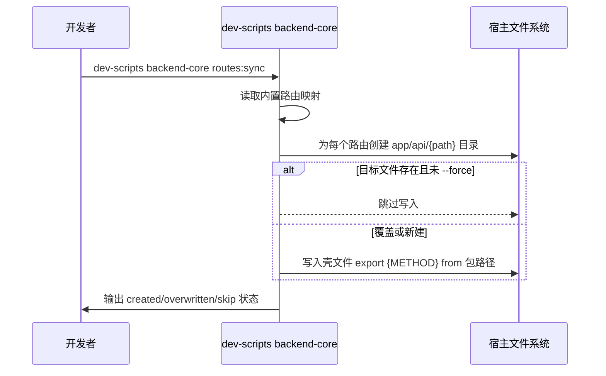

## Backend Core 集成脚本说明（dev-scripts 版本）

CLI 功能原先在 `@windrun-huaiin/backend-core` 包内，现统一由 `@windrun-huaiin/dev-scripts` 提供，命令前缀为 `dev-scripts backend-core ...`。

### 包含内容
- Prisma：公共模型 `prisma/schema.prisma`（generator/datasource 为示例，可删）、增量 SQL `migrations/*.sql`、`prisma` 单例与事务工具。
- Service：数据库层 user/credit/subscription/transaction/creditAuditLog/apilog/userBackup；Stripe/Clerk/匿名用户相关 Next.js handlers。
- CLI：`dev-scripts backend-core routes:list|routes:sync` 生成本地路由壳。
- Lib：money-price-config（读 env）、appConfig、stripe-config、auth-utils，对外可直接 import。

### 宿主如何使用（第三方直接集成）
1. 安装：`pnpm add @windrun-huaiin/backend-core`（脚本命令通过 dev-scripts 提供）
2. 生成路由壳：`pnpm dev-scripts backend-core routes:sync --app-dir src/app`  
   - 默认不覆盖已有文件，`--force` 可覆盖。生成示例：
   ```ts
   // app/api/stripe/checkout/route.ts
   export { POST } from '@windrun-huaiin/backend-core/app/api/stripe/checkout/route';
   ```
   - 想自定义时直接改写或删除壳文件即可。
3. 使用服务：`import { prisma, userService, creditService } from '@windrun-huaiin/backend-core';`
4. 使用工具/配置：`import { getPriceConfig, getCreditsFromPriceId, stripe, ApiAuthUtils } from '@windrun-huaiin/backend-core/lib';`
5. Prisma/schema（提供追加命令）：  
   - `pnpm dev-scripts backend-core prisma:sync --schema prisma/schema.prisma` 将包内 models 追加到宿主 schema（保留宿主 datasource/generator，标记 `// === backend-core models ===`）。  
   - 命令会把包内 `@@schema("nextai")` 替换为宿主 datasource 的 schema 名（若能解析到）。  
   - `pnpm dev-scripts backend-core migrations:sync --dest prisma` 将包内 `migrations/*.sql` 复制到指定目录（默认跳过已存在，`--force` 可覆盖），然后 `npx prisma generate`。
6. 同步SQL： `pnpm dev-scripts backend-core migrations:sync --dest prisma --force`
7. 升级：升级包 → 跑 `dev-scripts backend-core routes:sync` 同步新增路由 → 手动比对/合并 schema + 执行迁移 → `npx prisma generate`。

### 环境变量
```conf
# 积分初始化变量
CREDITS_INIT_FREE_AMOUNT=1
CREDITS_INIT_FREE_REGISTER_AMOUNT=2
CREDITS_INIT_FREE_EXPIRED_DAYS=7
CREDITS_ONE_TIME_EXPIRED_DAYS=30

## Stripe配置
STRIPE_SECRET_KEY=
STRIPE_PRO_MONTHLY_PRICE_ID=
STRIPE_PRO_MONTHLY_AMOUNT=
STRIPE_PRO_MONTHLY_CURRENCY=
STRIPE_PRO_MONTHLY_CREDITS=
STRIPE_PRO_YEARLY_PRICE_ID=
STRIPE_PRO_YEARLY_AMOUNT=
STRIPE_PRO_DISCOUNT_PERCENT=
STRIPE_PRO_YEARLY_CURRENCY=
STRIPE_PRO_YEARLY_CREDITS=

STRIPE_ULTRA_MONTHLY_PRICE_ID=
STRIPE_ULTRA_MONTHLY_AMOUNT=
STRIPE_ULTRA_MONTHLY_CURRENCY=
STRIPE_ULTRA_MONTHLY_CREDITS=
STRIPE_ULTRA_YEARLY_PRICE_ID=
STRIPE_ULTRA_YEARLY_AMOUNT=
STRIPE_ULTRA_DISCOUNT_PERCENT=
STRIPE_ULTRA_YEARLY_CURRENCY=
STRIPE_ULTRA_YEARLY_CREDITS=

```

### CLI routes:sync 做了什么


### schema 合并注意
- 包内 `prisma/schema.prisma` 的 generator/datasource 仅示例；合并时以宿主配置为准，可只复制 models。
- 宿主有自定义模型或独立数据库时，确保公共模型命名/字段与包的 service 兼容；数据库连接、schema 名称由宿主控制。
