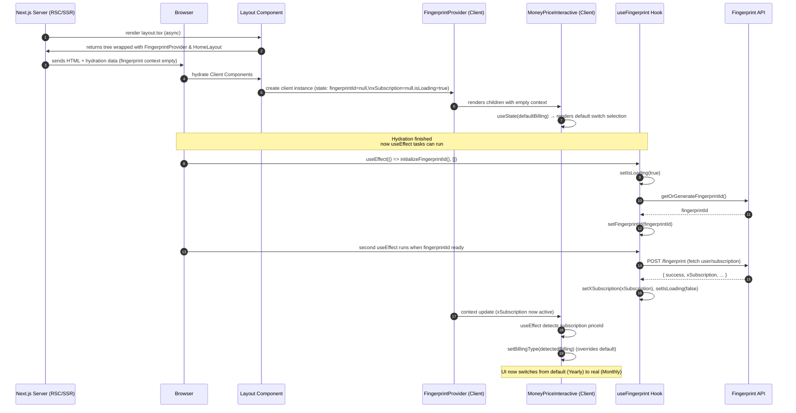
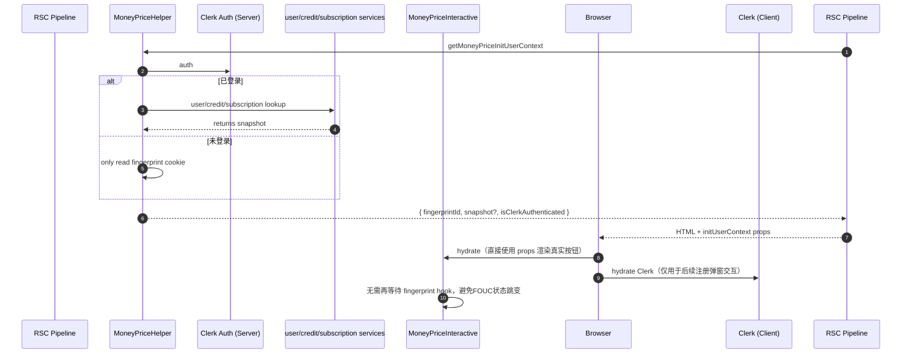

# Money Price 价格卡片：设计与实现文档

## 0. 客户端布局规范

- **Billing Type 切换按钮**：`data-billing-switch` 容器在移动端整块 `sticky` 到弹窗顶部（`max-md:sticky top-30 z-30`），保证滚动长卡片时切换器始终可见；容器本身是 `inline-flex` 的圆角胶囊，移动端 `w-full max-w-[340px]` 并自动居中，桌面端宽度由内容决定但同样保留 `px-2/py-2` 的内边距和浅色描边；按钮采用固定的 `min-w-[100px]`（桌面 `120px`）和 `px-2 sm:px-4 py-2`，激活态切换到紫粉渐变并附带一个 `absolute` 的折扣 Badge（位于按钮上方居中），未激活态保持透明 pill，使得三种计费类型在不同语言长度下也能居中排布且视觉状态清晰。
- **价格卡栅格**：`MoneyPriceInteractive` 的卡片区域采用 `flex-wrap`。移动端每张卡宽度固定为 `90vw`（最多 360px），左右自动留 5% 边距；桌面端通过 `width: clamp(280px, 32vw, 360px)` 并 `flex-shrink-0` 控制卡片宽度，外层 `gap` + `justify-center` 保证自动排成 2 或 3 列。`maxFeaturesCount` 负责对齐卡片高度，底部按钮区域用 `flex-1` 撑开，从而在任何 billingType 切换下，三张卡的宽高都保持一致，视觉上不会跳动。

## 1. 组件分层总览

```
money-price/
├── money-price.tsx                        # 服务端组件，处理SSR、翻译、静态渲染
├── money-price-data.ts                    # 服务端 helper，复用 Money Price 文案&配置
├── money-price-interactive.tsx  # 客户端组件，处理交互逻辑
├── money-price-config.ts            # 配置文件，包含价格和产品信息
├── money-price-types.ts              # 类型定义
└── money-price-button.tsx         # 按钮组件，封装动态逻辑
└── money-price-config-util.ts    # 工具方法，封装通用操作
└── customer-portal.ts             # 客户端 helper，统一处理 Stripe Portal 跳转
context/                                        # 应用层 apps/ddaas/src/services/context
├── user-context-service.ts                       # 应用层，统一查询用户信息，为money组件和初始化用户FingerprintContext提供一致的数据来源
lib/                                                  # 应用层 apps/ddaas/src/lib
├── money-price-helper.ts                       # 应用层，数据包装器，封装好money-price组件需要的服务端渲染数据
```

- **服务端组件 `money-price.tsx`**：在服务器端构造展示所需的文本与价格信息，支持动态模式选择（订阅/积分包/混合），负责渲染静态 DOM 结构和计费类型切换按钮。
- **服务端 helper `money-price-data.ts`**：通过 `buildMoneyPriceData({ locale, currency, enabledBillingTypes? })` 生成完整的 `MoneyPriceData`，方便其它 Server Component（如积分弹窗）复用同一份翻译与配置。
- **服务端 helper `money-price-helper`**：应用层，数据包装器，封装好money-price组件需要的服务端渲染数据。
- **服务端DB service`user-context-service.ts`**：应用层，统一查询用户信息，为money组件和初始化用户FingerprintContext提供一致的数据来源。
- **客户端组件 `money-price-interactive.tsx`**：注入交互行为（计费周期切换、动态价格更新、用户状态检测、工具提示等），支持配置驱动的计费类型过滤。
- **按钮客户端组件 `money-price-button.tsx`**：独立封装按钮渲染与行为，支持订阅模式和OneTime模式的不同逻辑，依据 `UserContext` 与 `billingType` 决定按钮状态。
- **配置与类型**：
  - `money-price-config-util.ts`：统一价格定位工具函数，支持订阅产品和积分包产品
  - `money-price-types.ts`：动态类型定义，支持任意计费类型扩展
  - `apps/ddaas/src/lib/money-price-config.ts`：业务层配置，分离订阅产品和积分包产品
- **客户门户 helper `customer-portal.ts`**：暴露 `redirectToCustomerPortal({ customerPortalApiEndpoint, signInPath?, redirectToSignIn?, returnUrl? })`，页面与弹窗共享同一条跳转逻辑。

## 2. 数据来源与注入流程
1. **国际化文案**：服务端组件通过 `getTranslations` 读取 `moneyPrice` 命名空间，支持分离的 `subscription` 和 `credits` 配置，获得标题、副标题、`billingSwitch`（支持 monthly/yearly/onetime）、各计划的特性列表、按钮文案。
2. **价格配置**：调用 `getActiveProviderConfig(config)` 提取当前支付供应商的配置，支持分离的 `subscriptionProducts`（F1/P2/U3 订阅产品）和 `creditPackProducts`（F1/P2/U3 积分包产品）。
3. **动态模式选择**：
   - 根据 `enabledBillingTypes` 参数智能选择显示订阅计划或积分包计划
   - 混合模式下优先显示订阅计划，支持动态切换
   - 向后兼容：未配置时保持 monthly/yearly 行为
4. **服务端渲染输出**：
   - 根据选定的计费类型和计划渲染价格卡片结构
   - 支持 F1/P2/U3 统一产品键映射
   - 渲染计费类型切换按钮（monthly/yearly/onetime）
   - 外部也可复用 `buildMoneyPriceData` 拿到同一份 `MoneyPriceData`；若需要默认切换到某个计费类型，只需在消费端覆盖 `billingSwitch.defaultKey`
   - 获取用户数据封装为context，直接服务端渲染
5. **客户端增强**：
   - `MoneyPriceInteractive` 接收服务端传入的 `data`、`config`、`enabledBillingTypes` 等参数
   - 配置驱动的计费类型过滤，移除硬编码约束
   - 支持订阅产品和积分包产品的统一价格检测
   - 用户状态根据服务端context数据渲染按钮
6. **按钮行为配置**
   - 跳转Stripe Checkout
   - 跳转Stripe Portal
   - 弹窗Clerk Signup Modal获重定向
   
## 3. 用户态与按钮行为

### 3.1 用户态判定
- `UserState`：`Anonymous` / `FreeUser` / `ProUser` / `UltraUser`。
- 判定规则：
  1. 无 Clerk 登录或指纹上下文 → `Anonymous`。
  2. 无激活订阅 → `FreeUser`。
  3. 激活订阅并匹配 `P2` 价格 ID → `ProUser`；匹配 `U3` → `UltraUser`。

### 3.2 一次性积分包（billingType = `onetime`）

| 用户状态 | F1 卡片 | P2 卡片 | U3 卡片 |
| --- | --- | --- | --- |
| Anonymous | 按钮 `Get Started`；跳登录 | 同左 | 同左 |
| 已登录（含 Free / Pro / Ultra） | 按钮 `Buy Credits`（无翻译时回退 `Upgrade`）；调用 Checkout API；购买后进入 Stripe 一次性支付 | 同左 | 同左 |

说明：积分包不会触发订阅校验，所有登录用户都可购买。

### 3.3 订阅卡片（Monthly 视图）

| 用户状态 | F1 (Free) | P2 (Pro) | U3 (Ultra) |
| --- | --- | --- | --- |
| Anonymous | 按钮 `Get Started`；跳登录 | 按钮 `Get Pro`；跳登录 | 按钮 `Get Ultra`；跳登录 |
| FreeUser | 按钮 `Current Plan`；禁用 | 按钮 `Upgrade`；调用 Checkout | 按钮 `Upgrade`；调用 Checkout |
| Pro（月付） | 隐藏 | 按钮 `Current Plan`；禁用 | 按钮 `Upgrade`；触发 Portal（若开关关闭则按钮隐藏） |
| Pro（年付） | 隐藏 | 隐藏 | 隐藏 |
| Ultra（月付） | 隐藏 | 隐藏 | 按钮 `Current Plan`；禁用 |
| Ultra（年付） | 隐藏 | 隐藏 | 隐藏 |

说明：
- 订阅阶梯遵循 `Free → 月 Pro → 月 Ultra → 年 Pro → 年 Ultra`。
- 在可升级场景下：若用户已有激活订阅则优先走 Portal，Portal 接口不可用时回退到 Checkout。
- 关闭开关 `enableSubscriptionUpgrade` 时，所有 `Upgrade` 按钮直接不渲染。

### 3.4 订阅卡片（Yearly 视图）

| 用户状态 | F1 (Free) | P2 (Pro) | U3 (Ultra) |
| --- | --- | --- | --- |
| Anonymous | 按钮 `Get Started`；跳登录 | 按钮 `Get Pro`；跳登录 | 按钮 `Get Ultra`；跳登录 |
| FreeUser | 按钮 `Current Plan`；禁用 | 按钮 `Upgrade`；调用 Checkout | 按钮 `Upgrade`；调用 Checkout |
| Pro（月付） | 隐藏 | 按钮 `Upgrade`；触发 Portal（开关关闭则隐藏） | 按钮 `Upgrade`；触发 Portal（开关关闭则隐藏） |
| Pro（年付） | 隐藏 | 按钮 `Current Plan`；禁用 | 按钮 `Upgrade`；触发 Portal（开关关闭则隐藏） |
| Ultra（月付） | 隐藏 | 按钮 `Upgrade`；触发 Portal（开关关闭则隐藏） | 按钮 `Upgrade`；触发 Portal（开关关闭则隐藏） |
| Ultra（年付） | 隐藏 | 隐藏 | 按钮 `Current Plan`；禁用 |

### 3.5 升级开关与变量
- `MoneyPriceProps.enableSubscriptionUpgrade`（默认 `true`）控制是否展示订阅升级按钮。
- 首页默认读取 `process.env.ENABLE_STRIPE_SUBSCRIPTION_UPGRADE`，值为 `'false'` 时关闭升级按钮。
- 开关只影响订阅卡片：OneTime 购买、登录提示、当前套餐按钮不受影响。


## 4. 计费周期与价格展示逻辑
- **计费类型支持**：
  - 支持动态计费类型：`monthly`、`yearly`、`onetime` 及任意自定义类型
  - 通过 `enabledBillingTypes` 参数控制可用计费类型
  - 配置驱动的按钮渲染，移除硬编码约束
- **默认值确定**：
  - 服务端：根据翻译配置中的 `billingSwitch.defaultKey`（默认为 `yearly`）渲染初始样式
  - 客户端：动态检测用户当前订阅的计费类型，支持订阅产品和积分包产品的价格ID匹配
  - 回退机制：若检测失败则使用配置的默认值或第一个可用选项
- **动态计划切换**：
  - 根据当前 `billingType` 动态选择显示 `subscriptionPlans` 或 `creditsPlans`
  - OneTime 模式下显示积分包计划，其他模式显示订阅计划
  - 实时价格更新和折扣信息展示
- **价格展示增强**：
  - 统一的 `getProductPricing` 函数支持订阅产品和积分包产品
  - 折扣徽标智能显示：订阅模式支持百分比替换，OneTime模式直接显示文本
  - 副标题动态拼接：OneTime 模式下支持 billingSwitch subTitle + 产品 subtitle 的样式化显示
- **受控渲染优化**：
  - 移除DOM直接操作，改为React受控组件渲染
  - 统一的状态管理和数据流
  - 更好的TypeScript类型安全支持

## 5. 使用说明

## 5.1 ✅ 代码配置
**实现效果**：订阅产品与积分包产品在配置层面清晰分离：

```typescript
PaymentProviderConfig {
  subscriptionProducts: {     // 订阅模式产品
    F1/P2/U3: {
      plans: { monthly, yearly }
    }
  },
  creditPackProducts: {       // 积分包产品
    F1/P2/U3: {
      priceId, amount, credits
    }
  }
}
```

**映射优化**：统一为F1/P2/U3产品键，简化映射逻辑：
- ✅ onetime + F1 → F1 积分包（直接映射）
- ✅ onetime + P2 → P2 积分包（直接映射）
- ✅ onetime + U3 → U3 积分包（直接映射）

#### 5.2 ✅ 翻译结构
**实现效果**：subscription 和 credits 计划完全分离配置：

```json
{
  "moneyPrice": {
    "subscription": {
      "plans": [/* 订阅计划：F1/P2/U3 */]
    },
    "credits": {
      "plans": [/* 积分包计划：F1/P2/U3 */]
    },
    "billingSwitch": {
      "options": [
        { "key": "monthly", "name": "Monthly" },
        { "key": "yearly", "name": "Yearly" },
        { "key": "onetime", "name": "One-Time", "discountText": "Credit Pack" }
      ]
    }
  }
}
```

**智能选择逻辑**：服务端组件根据 `enabledBillingTypes` 参数自动选择合适的翻译配置。

### 5.3. ✅ 使用模式
- ✅ `money-price-types.ts`：从硬编码联合类型改为动态字符串类型
- ✅ 新增 `enabledBillingTypes` 和 `mode` 属性支持灵活配置
- ✅ 产品配置结构支持任意计费类型的 Record 结构
- ✅ 分离 `SubscriptionProductConfig` 和 `CreditPackProductConfig` 类型
- ✅ `buildMoneyPriceData` 可在任意 Server Component 中生成一致的 `MoneyPriceData`，避免重复拼接翻译

#### 5.3.1 ✅ 场景化配置实现
```typescript
// 纯订阅模式
<MoneyPrice enabledBillingTypes={['monthly', 'yearly']} />

// 纯积分包模式
<MoneyPrice enabledBillingTypes={['onetime']} />

// 混合模式（支持所有计费类型）
<MoneyPrice enabledBillingTypes={['monthly', 'yearly', 'onetime']} />

// 自定义组合（如只支持年付和一次性）
<MoneyPrice enabledBillingTypes={['yearly', 'onetime']} />

// 模态弹窗：保留全部计费方式，仅调整默认选项
const moneyPriceData = await buildMoneyPriceData({ locale, currency: '$' });
<MoneyPriceInteractive
  data={{ ...moneyPriceData, billingSwitch: { ...moneyPriceData.billingSwitch, defaultKey: 'onetime' } }}
  config={moneyPriceConfig}
  checkoutApiEndpoint="/api/stripe/checkout"
  customerPortalApiEndpoint="/api/stripe/customer-portal"
/>;
```

### 5.4 ✅ 弹窗复用注意事项
- 保持 `enabledBillingTypes` 未传或传入完整列表，确保弹窗里可以自由切换订阅 / 一次性视图。
- 只需覆盖 `billingSwitch.defaultKey` 即可调整初始展示（如积分弹窗默认切到 `onetime`）。

## 6. 组件渲染逻辑

### FOUC问题产生原因
> 因为SSR渲染以及性能考虑，并不能在首屏渲染时就把Context数据就准备好，所以首屏服务端渲染的结果是没有Context的
> 这导致浏览器侧首先会渲染出空context数据的结果，然后再有客户端组件初始化



### 6.1 旧版：客户端 Fingerprint Context 流程

```mermaid
sequenceDiagram
    autonumber
    participant Server as MoneyPrice (Server Component)
    participant Browser as Browser
    participant Clerk as Clerk Provider
    participant FPProvider as FingerprintProvider (Client)
    participant Hook as useFingerprint Hook
    participant MoneyPrice as MoneyPriceInteractive

    Server->>Browser: SSR HTML（无用户上下文）
    Browser->>Clerk: hydrate Clerk，判断登录
    Browser->>FPProvider: hydrate FingerprintProvider
    FPProvider->>Hook: run useFingerprint()
    Hook->>Hook: generate fingerprintId (localStorage/cookie)
    Hook->>/api/user/anonymous/init: fetch xUser/xSubscription/xCredit
    /api/user/anonymous/init-->>Hook: returns context
    Hook-->>FPProvider: context ready (loading=false)
    FPProvider-->>MoneyPrice: broadcast context
    MoneyPrice->>MoneyPrice: useEffect 检测 priceId → setBillingType
    MoneyPrice->>MoneyPrice: re-render按钮（由 Anonymous 切换到订阅态）<br/> 于是会出现FOUC抖动现象
```

**核心特点**
- 首屏完全依赖客户端 hook：UI 先按匿名态渲染，再等待指纹接口返回后 setState。
- Clerk hydrate 与 fingerprint fetch 顺序无法保证，已登录用户仍会短暂看到匿名按钮（FOUC）。
- 指纹接口承载匿名/注册并存逻辑，渲染时机难以控制。

### 6.2 新版：服务端 InitUserContext 流程



**核心特点**
- SSR 阶段就能确定“是否登录 + 对应订阅状态”，首屏按钮/计费选项稳定。
- 未登录场景仅传递指纹 ID 和 auth 状态，避免同一 `fp_id` 渲染出其它账号的数据。
- 客户端只负责交互（计费切换、按钮点击、Clerk 弹窗），去掉 fingerprint context 依赖，彻底消除闪烁。
- `redirectToCustomerPortal` helper 已抽离，点击“管理订阅”时页面与弹窗都会走同一套 Portal 逻辑。
