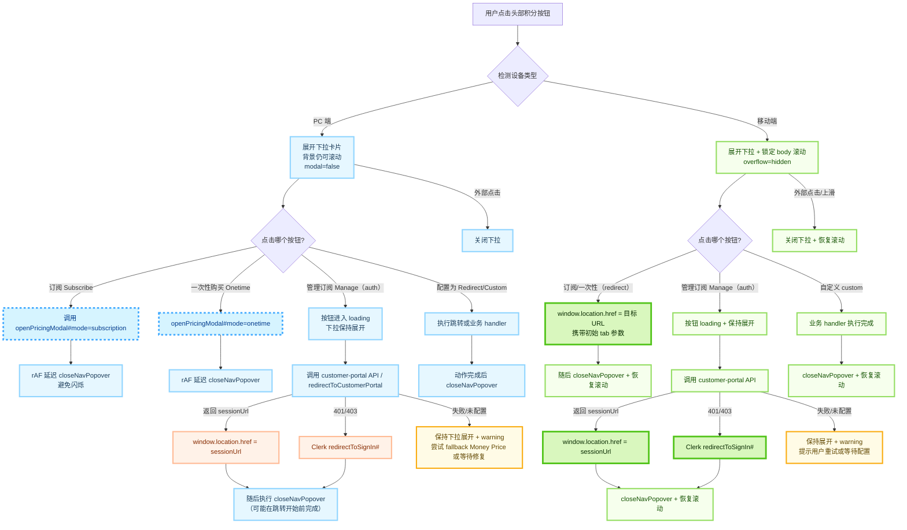

# CreditOverview 组件使用说明

本组件位于 `packages/third-ui/src/main/credit`，用于在应用中统一展示积分总览信息，包含总余额、积分桶明细、订阅信息与一次性购买入口。组件分为服务端与客户端两层，上层应用只需在服务端准备好数据对象后直接调用。

当前实现遵循最新的视觉与交互规范：

- 导航触发按钮（`CreditNavButton`）仅展示礼包图标与积分数值，浅色主题为白底+紫色渐变 hover，暗色主题为深色胶囊。
- PC 端下拉设置 `modal={false}`，展开后页面仍可滚动；移动端会在下拉展开时锁定 `body`/`html` 滚动，确保视口只聚焦积分内容。
- 订阅区与 CTA 统一使用渐变体系，管理/订阅操作复用 `GradientButton`，`w-full` 下文字居中。
- 积分桶列表为两行布局：首行展示类型和余额，第二行展示过期信息。额外描述通过 hover/focus 提示呈现。
- 积分明细支持展开/折叠，默认收起以便节省首次弹出的视觉空间。
  - 引入 useState 管理积分明细折叠状态，默认收起。
  - 标题行右侧按钮根据 bucketExpanded 切换 icons.ChevronDown/Up，有桶数据时可折叠。
  - 折叠占位块改为按钮，可点击展开列表，保持标题与一次性按钮间距；展开时展示原有的积分条目列表。
  - 无数据时隐藏折叠按钮，沿用原空态，购买按钮始终可见。

## 组件分层总览

```
components/                                         # apps/ddaas/src/components，业务侧组件目录
├── credit-popover.tsx                         # 业务侧组件
---------------------------------------
credit/                                                       # packages/third-ui/src.main/credit目录，Credit通用封装组件目录
├── credit-nav-button.tsx                    # 下拉组件按钮
├── credit-overview-client.tsx        # 下拉详情客户端组件
├── credit-overview.ts                          # 下拉详情服务端组件
├── types.ts                                              # 类型定义  
```

### 关键角色与职责

| 组件 | 主要职责 |
| ---- | ---- |
| `CreditNavButton` | 统一管理下拉展开/折叠、移动端滚动锁定、全局价格弹窗的生命周期，并通过 Context 让内部组件在需要时折叠下拉或唤起弹窗。 |
| `CreditOverviewClient` | 纯展示逻辑 + 行为编排。内部只需调用 `useCreditNavPopover()` 暴露的 `close`/`openPricingModal` 等方法，而不再直接渲染弹窗。 |
| `CreditOverview` | Server Component，负责获取翻译和拼装 `CreditOverviewClient` 所需的 props。 |

> ⚠️ 价格弹窗的 UI 现在由 `CreditNavButton` 统一渲染，通过 `MoneyPriceInteractive` 复用计费模块视觉；`CreditOverviewClient` 调用 `navPopover.openPricingModal` 时需传入 `pricingContext` 和按模式处理后的 `moneyPriceData`。

## 交互流程

### PC 端

1. 用户点击头部积分按钮 → `DropdownMenu` 展开下拉卡片。由于 `modal={false}`，主页面仍能滚动。
2. 卡片内部按钮：遵循 `ctaBehaviors` 配置，PC 端可独立选择 `modal`、`redirect`、`auth`、`custom` 等动作。
   - `modal`：调用 `openPricingModal` 打开 Money Price 弹窗，并通过 `requestAnimationFrame` 延迟折叠，避免闪烁。
   - `redirect`：先设置 `window.location.href`，再调用 `closeNavPopover()` 解除滚动锁；对用户而言几乎等同于“跳转前一瞬间自动收起”。
   - `auth`：点击后按钮进入 `GradientButton` 自带的 loading，保持下拉展开，待 `redirectToCustomerPortal` 成功（包括 302 跳 Portal、401/403 触发 Clerk 登录）后才折叠；若接口失败则保留下拉并提示 warning，便于用户重试或走 fallback。
   - `custom`：等待业务 handler resolve 后再折叠，确保所有副作用完成。
3. 弹窗与下拉的生命周期解耦：即使下拉已经折叠，弹窗仍挂载在 `CreditNavButton` 下，直到用户点击关闭或 ESC。
4. 通过`w-[90vw] max-w-[90vw] max-h-[80vh] overflow-y-auto overflow-x-hidden sm:w-[410px] sm:max-h-[90vh] sm:max-w-[95vw]`来控制积分下拉框的宽度、高度以及竖直滚动条

> CTA 按钮统一使用 `GradientButton`，`preventDoubleClick=true` + loading 反馈可以确保异步阶段不会触发第二次点击，同时让用户明确“正在处理”。

### 移动端

1. 点击积分按钮展开下拉时，`credit-nav-button` 会将 `body` 与 `html` 的 `overflow` 改为 `hidden`，禁止背景页面滑动，但通过`max-h-[80vh] overflow-y-auto`在其内部会有竖直滚动条。
2. 外部点击或手势（包括滑动页面空白区域）被监听，一旦触发立即折叠下拉并恢复滚动。
3. 卡片内部按钮行为：
   - 移动端不渲染任何 `modal` 动作；`ctaBehaviors.mobile` 只能配置 `redirect`、`auth` 或 `custom`，否则会在控制台给出告警。
   - `redirect`：同样先设置 `window.location.href` 再折叠，避免未跳走就先关闭导致的“什么都没发生”错觉。
   - `auth`：与 PC 一致，保持下拉和 loading 状态，等接口拿到最终 URL 或触发登录操作后再折叠；失败会维持展开状态并继续打印 warning。
   - `custom`：等待 handler 执行完毕再收起（很多 Native Bridge 操作也需要一些时间）。
4. 弹窗本身不锁定页面，仍由 Radix `AlertDialog` 控制，关闭时会恢复滚动；其内容同样可滚动，按钮点击只影响弹窗，不会重新展开下拉。

> 通过 Context 将“折叠 + 弹窗”能力上提到 `CreditNavButton`，任何新增按钮只要调用 `navPopover.close()` 或 `navPopover.openPricingModal(...)` 就能遵循一致的交互规范。

## 数据结构说明

| 字段 | 说明 |
| ---- | ---- |
| `totalBalance: number` | 所有积分类型的总余额，顶部卡片大号展示。 |
| `buckets: CreditBucket[]` | 积分明细数组。 |
| `subscription?: SubscriptionInfo` | 有有效订阅时提供，用于渲染订阅信息卡片。 |
| `pricingContext?: CreditPricingContext` | 提供后优先使用 Money Price 弹窗，所有 CTA 改为 `onClick` 控制，不再依赖 `href`。 |
| `ctaBehaviors?: CreditCTAConfig` | 可选配置项，分别为订阅/管理/一次性按钮定义桌面与移动端动作；未配置时使用默认策略（桌面优先弹窗，移动端直接跳转或鉴权跳转）。 |

`CreditBucket` 结构：
- `kind: string`：积分类型标识，例如 `free`、`subscription`、`onetime`。组件会根据内置翻译自动展示标题，可通过 `label` 覆盖。
- `balance: number`：当前余额。
- `limit: number`：该类型积分额度上限。
- `status?: 'active' | 'expiringSoon' | 'expired'`：可选状态标签。
- `progressPercent?: number`：进度条百分比（0-100），不传则由组件根据 `balance/limit` 计算。
- `description?: string`：额外说明，例如剩余天数。为了保持布局紧凑，该信息会在卡片信息按钮上以悬浮提示展示。

`SubscriptionInfo` 结构：
- `planName: string`：订阅名称。
- `periodStart: string`、`periodEnd: string`：ISO 时间字符串，组件会按当前 locale 渲染。

## 快速上手

- credit-popover.tsx （业务侧 Server Component）
- 翻译键位credit字段
`CreditPricingContext` 结构：
- `moneyPriceData: MoneyPriceData`：调用 `buildMoneyPriceData` 生成的多语言静态内容；`CreditOverviewClient` 会根据按钮模式（订阅 / 一次性）动态设置 `billingSwitch.defaultKey`。
- `moneyPriceConfig: MoneyPriceConfig`：与 Money Price 主区域共用的支付配置。
- `checkoutApiEndpoint?: string`、`customerPortalApiEndpoint?: string`：Stripe 结算/门户接口。
- `enableSubscriptionUpgrade?: boolean`：沿用 Money Price 行为，用于控制订阅升级按钮是否可点击。
- `initUserContext?: InitUserContext`：透传给 `MoneyPriceInteractive`，避免重复请求用户上下文。

提供 `pricingContext` 时请注意：

1. 入口在积分弹窗中默认聚焦一次性计费，可通过 `moneyPriceData.billingSwitch.defaultKey = 'onetime'` 覆盖默认值，但不要过滤 `billingSwitch.options`，这样用户仍可切换订阅视图。
2. CTA 不再走 `<a href>`，全部通过 `onClick` 调用 `requestPricingModal` 或直接跳转，以便在移动端先折叠菜单再进入下一步。
3. 弹窗使用与 Money Price 主区域完全相同的 `MoneyPriceInteractive`，继续复用 `redirectToCustomerPortal` 等逻辑，支持点击遮罩/ESC 关闭。

## CTA 动作配置

### 结构定义

`CreditOverviewData` 中新增 `ctaBehaviors?: CreditCTAConfig`，按按钮 key（`subscribe`、`manage`、`onetime`）区分，并支持为桌面/移动端分别配置：

```ts
type CreditActionConfig =
  | { kind: 'modal'; mode: 'subscription' | 'onetime' }
  | { kind: 'redirect'; url: string }
  | { kind: 'auth'; endpoint?: string; returnUrl?: string }
  | { kind: 'custom'; handlerKey: string };

type DeviceAwareCreditAction = {
  desktop?: CreditActionConfig;
  mobile?: CreditActionConfig;
};

interface CreditCTAConfig {
  subscribe?: DeviceAwareCreditAction;
  manage?: DeviceAwareCreditAction;
  onetime?: DeviceAwareCreditAction;
}
```

- **modal**：仅在 PC 端可用，调用 `openPricingModal`。
- **redirect**：简单跳转，适用于任何端。
- **auth**：需要先访问配置的 API 获取真实 URL，默认会回退到 `pricingContext.customerPortalApiEndpoint` 配置并携带 Clerk 鉴权；执行期间保持下拉展开，待 Promise resolve 后才关闭。
- **custom**：为未来扩展保留，`CreditOverviewClient` 可通过 `customActionHandlers` prop 注入 handler。

移动端禁止 `modal`，若误配会在控制台给出 warning 并继续执行默认策略。未配置的端仍会使用内置的 fallback：

- 桌面：订阅/一次性优先打开 Money Price 弹窗；管理动作优先尝试 `auth`（客户门户）。
- 移动：订阅/一次性若缺少配置，仅会提示警告并折叠卡片，需业务显式提供 `redirect`/`auth`/`custom`。

示例：

```ts
ctaBehaviors: {
  subscribe: {
    desktop: { kind: 'modal', mode: 'subscription' },
    mobile: { kind: 'redirect', url: '/pricing?tab=subscribe' },
  },
  manage: {
    desktop: { kind: 'auth' },
    mobile: { kind: 'auth', endpoint: '/api/stripe/customer-portal' },
  },
  onetime: {
    desktop: { kind: 'modal', mode: 'onetime' },
    mobile: { kind: 'redirect', url: '/pricing?tab=onetime' },
  },
}
```

若某个动作需要调用自定义 handler，可配置 `custom` 并在业务侧直接渲染 `CreditOverviewClient` 时传入 `customActionHandlers`（Server Component `CreditOverview` 默认不注入，可在自定义封装中扩展）。


## CTA交互流程图


