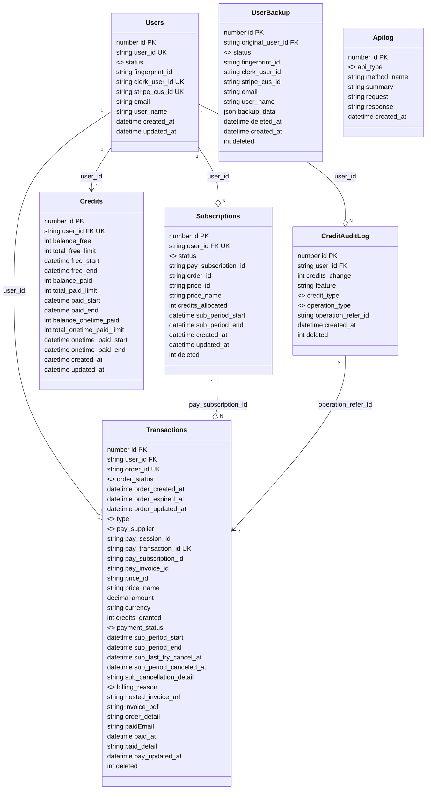

## 3. 数据模型设计

### 3.1 核心数据表

#### 用户表 (Users)
存储用户信息，包括通过Fingerprint识别的匿名用户和Clerk注册用户。

| 列名                | 类型         | 描述                                    |
|---------------------|--------------|----------------------------------------|
| `id`                | BigInt       | 主键                                    |
| `user_id`           | UUID         | 用户ID，唯一用户标识符，用于关联其他表，自动生成 |
| `status`            | String       | 用户状态：anonymous（匿名）、registered（已注册）、frozen（冻结）等，默认anonymous |
| `fingerprint_id`    | String       | 匿名用户的Fingerprint标识符，用于识别设备指纹 |
| `clerk_user_id`     | String       | Clerk用户ID，注册用户唯一，匿名用户为空 |
| `stripe_cus_id`     | String       | Stripe客户ID，用于支付集成                |
| `email`             | String       | 用户电子邮件（注册用户必填，匿名用户为空） |
| `user_name`         | String       | 用户名（可选）                         |
| `created_at`        | Timestamp    | 账户创建时间戳，默认当前时间            |
| `updated_at`        | Timestamp    | 最后更新时间戳，默认当前时间            |

#### 订阅表 (Subscriptions)
跟踪用户的订阅信息及其详细内容。

| 列名                | 类型         | 描述                                    |
|---------------------|--------------|----------------------------------------|
| `id`                | BigInt       | 主键                                   |
| `user_id`           | UUID         | 外键，引用`Users`表，唯一               |
| `status`            | String       | 订阅状态：active（活跃）、canceled（已取消）、incomplete（不完整）等，默认incomplete |
| `pay_subscription_id` | String     | 支付厂商订阅ID (sub_xxx)，用于关联支付系统 |
| `order_id`          | String       | 订单ID，关联到交易表                   |
| `price_id`          | String       | 支付厂商价格ID (price_xxx)              |
| `price_name`        | String       | 价格名称（例如，Basic、Pro）           |
| `credits_allocated` | Integer      | 每个计费周期分配的积分，默认0          |
| `sub_period_start`  | Timestamp    | 当前订阅周期开始时间戳                |
| `sub_period_end`    | Timestamp    | 当前订阅周期结束时间戳                |
| `created_at`        | Timestamp    | 订阅创建时间戳，默认当前时间           |
| `updated_at`        | Timestamp    | 最后更新时间戳，默认当前时间           |
| `deleted`           | Integer      | 删除标记：0（否）、1（是），默认0     |

#### 积分表 (Credits)
管理用户积分余额。

| 列名                | 类型         | 描述                                    |
|---------------------|--------------|----------------------------------------|
| `id`                | BigInt       | 主键，唯一积分记录ID                   |
| `user_id`           | UUID         | 外键，引用`Users`表，唯一                     |
| `balance_free`      | Integer      | 免费积分余额                          |
| `total_free_limit`  | Integer      | 免费积分总限额                          |
| `free_start`        | Timestamp    | 免费积分有效期开始时间                  |
| `free_end`          | Timestamp    | 免费积分有效期结束时间                  |
| `balance_paid`      | Integer      | 订阅付费积分余额                          |
| `total_paid_limit`  | Integer      | 订阅付费积分总限额                          |
| `paid_start`        | Timestamp    | 订阅付费积分有效期开始时间              |
| `paid_end`          | Timestamp    | 订阅付费积分有效期结束时间              |
| `balance_onetime_paid` | Integer   | 一次性支付积分余额                     |
| `total_onetime_paid_limit` | Integer | 一次性支付积分总限额                  |
| `onetime_paid_start` | Timestamp   | 一次性支付积分有效期开始时间            |
| `onetime_paid_end`  | Timestamp    | 一次性支付积分有效期结束时间            |
| `created_at`        | Timestamp    | 记录创建时间戳                        |
| `updated_at`        | Timestamp    | 最后更新时间戳                        |

#### 订单交易表 (Transactions)
记录支付交易，包括订阅和一次性购买。

| 列名                | 类型         | 描述                                    |
|---------------------|--------------|----------------------------------------|
| `id`                | BigInt       | 主键，唯一交易ID                       |
| `user_id`           | UUID         | 外键，引用`Users`表                     |
| `order_id`          | String       | 订单ID，唯一订单标识符                 |
| `order_status`      | Enum         | 订单状态：已创建created、已支付success、已退款refunded、已取消canceled、失败failed     |
| `order_created_at`  | Timestamp    | 订单创建时间戳                        |
| `order_expired_at`  | Timestamp    | 订单过期时间戳                        |
| `order_updated_at`  | Timestamp    | 订单最后更新时间戳                        |
| `type`              | Enum         | 交易类型：subscription（订阅）、one_time（一次性）                     |
| `pay_supplier`      | Enum         | 支付厂商：Stripe、Apple、Paypal等                |
| `pay_session_id`    | String       | 支付厂商Checkout Session ID (cs_xxx)    |
| `pay_transaction_id`    | String   | 支付厂商交易ID，唯一交易标识符         |
| `pay_subscription_id` | String     | 支付厂商订阅ID (sub_xxx)                |
| `pay_invoice_id`    | String       | 支付厂商发票ID (in_xxx)                 |
| `price_id`          | String       | 支付厂商价格ID (price_xxx)              |
| `price_name`        | String       | 价格名称（例如，Basic、Pro）           |
| `amount`            | DECIMAL(10,2)| 支付金额                              |
| `currency`          | String       | 货币代码（例如，USD、CNY）             |
| `credits_granted`   | Integer      | 此交易授予的积分数                      |
| `payment_status`    | Enum         | 支付状态：un_paid（未支付）、paid（已支付）等  |
| `sub_period_start`  | Timestamp    | 订阅周期开始时间戳                    |
| `sub_period_end`    | Timestamp    | 订阅周期结束时间戳                    |
| `sub_last_try_cancel_at` | Timestamp | 最后一次尝试取消订阅的时间           |
| `sub_period_canceled_at` | Timestamp | 订阅取消的时间戳                     |
| `sub_cancellation_detail` | String | 订阅取消详情                         |
| `billing_reason`    | String       | 账单原因                              |
| `hosted_invoice_url` | String      | 支付厂商托管发票URL                   |
| `invoice_pdf`       | String       | 发票PDF链接                            |
| `order_detail`      | String       | 订单详情（JSON格式）                 |
| `paidEmail`         | String       | 支付邮箱                              |
| `paid_at`           | Timestamp    | 支付完成时间戳                        |
| `paid_detail`       | String       | 支付详情（JSON格式）                 |
| `pay_updated_at`    | Timestamp    | 支付厂商信息最后更新时间戳            |
| `deleted`           | Integer      | 删除标记：0（否）、1（是），默认0     |

#### 积分使用表 (CreditAuditLog)
跟踪和审计积分的使用情况，记录所有积分的消耗、充值、冻结等操作。

| 列名                | 类型         | 描述                                    |
|---------------------|--------------|----------------------------------------|
| `id`                | BigInt       | 主键，唯一审计日志ID                   |
| `user_id`           | UUID         | 外键，引用`Users`表                     |
| `credits_change`    | Integer      | 积分变化数量（正数为增加，负数为消耗） |
| `feature`           | String       | 使用的功能（例如，API调用、工具等）      |
| `credit_type`       | Enum         | 积分类型：free（免费）、paid（付费）、onetime（一次性）  |
| `operation_type`    | Enum         | 操作类型：consume（消耗）、recharge（充值）、freeze（冻结）、unfreeze（解冻）等  |
| `operation_refer_id`| String       | 操作参考ID（例如，订单ID，用于关联交易记录） |
| `created_at`        | Timestamp    | 操作发生的时间戳                      |
| `deleted`           | Integer      | 删除标记：0（否）、1（是），默认0     |

#### 用户备份表 (UserBackup)
存储用户注销时的备份数据，用于数据恢复和审计。

| 列名                | 类型         | 描述                                    |
|---------------------|--------------|----------------------------------------|
| `id`                | BigInt       | 主键，唯一备份记录ID                   |
| `original_user_id`  | UUID         | 原始用户ID，外键关联到Users表            |
| `status`            | String       | 用户状态（备份时的状态）                |
| `fingerprint_id`    | String       | 设备指纹ID                             |
| `clerk_user_id`     | String       | Clerk用户ID                            |
| `stripe_cus_id`     | String       | Stripe客户ID                           |
| `email`             | String       | 用户邮箱                               |
| `user_name`         | String       | 用户名                                 |
| `backup_data`       | JSON         | 完整的用户数据备份（包括积分、订阅等）  |
| `deleted_at`        | Timestamp    | 用户删除时间戳，默认当前时间            |
| `created_at`        | Timestamp    | 备份创建时间戳，默认当前时间            |
| `deleted`           | Integer      | 删除标记：0（否）、1（是），默认0     |

#### API日志表 (Apilog)
记录系统API调用的日志信息，用于监控和审计。

| 列名                | 类型         | 描述                                    |
|---------------------|--------------|----------------------------------------|
| `id`                | BigInt       | 主键，唯一日志ID                       |
| `api_type`          | String       | API类型分类                            |
| `method_name`       | String       | 调用的方法名称                         |
| `summary`           | String       | API调用摘要                            |
| `request`           | String       | 请求参数（JSON格式）                 |
| `response`          | String       | 响应结果（JSON格式）                 |
| `created_at`        | Timestamp    | API调用时间戳，默认当前时间            |

### 3.2 索引
- **用户表**：主键 (`id`), `user_id` 唯一索引，`fingerprint_id` 索引（用于匿名用户识别）
- **订阅表**：主键 (`id`), `pay_subscription_id` 索引，`order_id` 索引
- **积分表**：主键 (`id`), `user_id` 唯一索引
- **交易表**：主键 (`id`), `order_id` 唯一索引，`pay_subscription_id` 索引，`user_id` 索引
- **积分使用表**：主键 (`id`), `credit_type` 索引，`operation_type` 索引，`user_id` 索引
- **用户备份表**：主键 (`id`), `original_user_id` 索引，`fingerprint_id` 索引，`email` 索引，`clerk_user_id` 索引

### 3.3 数据表及关联关系

1. **用户表 (Users)**
   - **描述**: 存储用户（包括匿名用户和注册用户）的信息。
   - **关联关系**:
     - **与订阅表 (Subscriptions)**: 一对1
       - 一个用户最多只有1个活跃订阅。
       - **关联字段**: `Users.user_id` (主键) 与 `Subscriptions.user_id` (外键)。
     - **与积分表 (Credits)**: 一对一
       - 每个用户有且仅有一个积分余额记录，用于跟踪免费和付费积分。
       - **关联字段**: `Users.user_id` (主键) 与 `Credits.user_id` (外键)。
     - **与交易表 (Transactions)**: 一对多
       - 一个用户可以有多个交易记录（例如，多次订阅或购买积分包）。
       - **关联字段**: `Users.user_id` (主键) 与 `Transactions.user_id` (外键)。
     - **与积分使用表 (CreditAuditLog)**: 一对多
       - 一个用户可以有多次积分使用记录。
       - **关联字段**: `Users.user_id` (主键) 与 `CreditAuditLog.user_id` (外键)。

2. **订阅表 (Subscriptions)**
   - **描述**: 跟踪用户的订阅信息。
   - **关联关系**:
     - **与用户表 (Users)**: 一对一
       - 每个订阅属于一个用户。
       - **关联字段**: `Subscriptions.user_id` (外键) 与 `Users.user_id` (主键)。
     - **与交易表 (Transactions)**: 一对多（间接关联）
       - 订阅可能涉及多个交易（例如，续费、升级等），但这种关联通常通过 Stripe 的 `pay_subscription_id` 间接建立，`Transactions` 表记录与订阅相关的支付。
       - **关联字段**: `Subscriptions.pay_subscription_id` 与 `Transactions.pay_subscription_id`。

3. **积分表 (Credits)**
   - **描述**: 管理用户的积分余额。
   - **关联关系**:
     - **与用户表 (Users)**: 一对一
       - 每个用户有一个积分余额记录。
       - **关联字段**: `Credits.user_id` (外键) 与 `Users.user_id` (主键)。
     - **与交易表 (Transactions)**: 间接关联
       - 积分余额可能通过交易增加（例如，订阅或一次性购买），但不直接通过外键关联，而是通过业务逻辑（如 `Transactions.credits_granted` 影响 `Credits.balance_paid`和 `Credits.balance_onetime_paid`）。
       - **关联字段**: 无直接外键，依赖业务逻辑。

4. **交易表 (Transactions)**
   - **描述**: 记录支付交易（订阅或一次性购买）。
   - **关联关系**:
     - **与用户表 (Users)**: 多对一
       - 每个交易属于一个用户。
       - **关联字段**: `Transactions.user_id` (外键) 与 `Users.user_id` (主键)。
     - **与订阅表 (Subscriptions)**: 多对一（间接）
       - 交易可能与订阅相关，记录订阅的支付或续费。
       - **关联字段**: `Transactions.pay_subscription_id` 与 `Subscriptions.pay_subscription_id`。

5. **积分使用表 (CreditAuditLog)**
   - **描述**: 从系统角度审计积分操作日志。
   - **关联关系**:
     - **与用户表 (Users)**: 多对一
       - 每次积分操作记录属于一个用户。
       - **关联字段**: `CreditAuditLog.user_id` (外键) 与 `Users.user_id` (主键)。
     - **与交易表 (Transactions)**: 间接关联
       - 当`operation_type`为`recharge`且`credit_type`为`paid`时，积分充值来源于交易，`operationReferId`为订单ID。
       - **关联逻辑**: 通过业务逻辑关联，充值积分数量来自`Transactions.credits_granted`。

### 3.4 关联关系总结

| 表名                | 关联表              | 关联类型   | 关联字段                              |
|---------------------|---------------------|------------|---------------------------------------|
| Users               | Subscriptions       | 一对一     | `Users.user_id` -> `Subscriptions.user_id` |
| Users               | Credits             | 一对一     | `Users.user_id` -> `Credits.user_id`   |
| Users               | Transactions        | 一对多     | `Users.user_id` -> `Transactions.user_id` |
| Users               | CreditAuditLog        | 一对多     | `Users.user_id` -> `CreditAuditLog.user_id` |
| Subscriptions       | Users               | 一对一     | `Subscriptions.user_id` -> `Users.user_id` |
| Subscriptions       | Transactions        | 一对多（间接） | `Subscriptions.pay_subscription_id` -> `Transactions.pay_subscription_id`  |
| Credits             | Users               | 一对一     | `Credits.user_id` -> `Users.user_id`   |
| Transactions        | Users               | 多对一     | `Transactions.user_id` -> `Users.user_id` |
| CreditAuditLog        | Users               | 多对一     | `CreditAuditLog.user_id` -> `Users.user_id` |
| CreditAuditLog        | Transactions        | 多对一（间接） | 通过业务逻辑关联，充值积分来自`Transactions.credits_granted` |

### 3.5 数据表结构图

