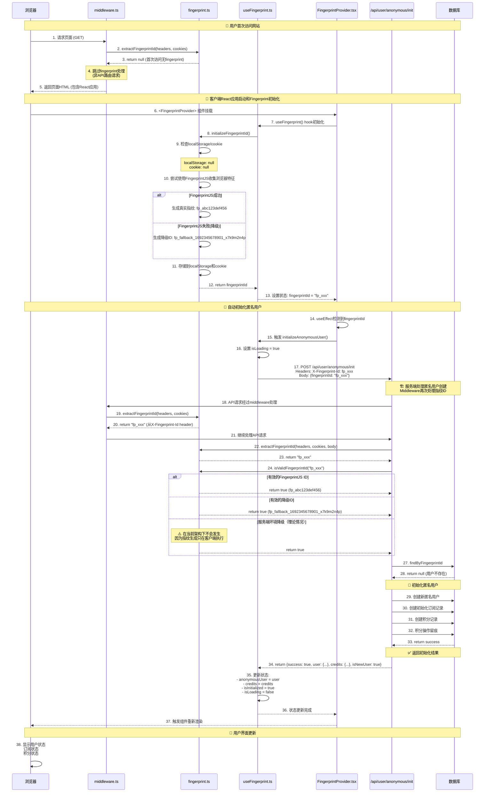
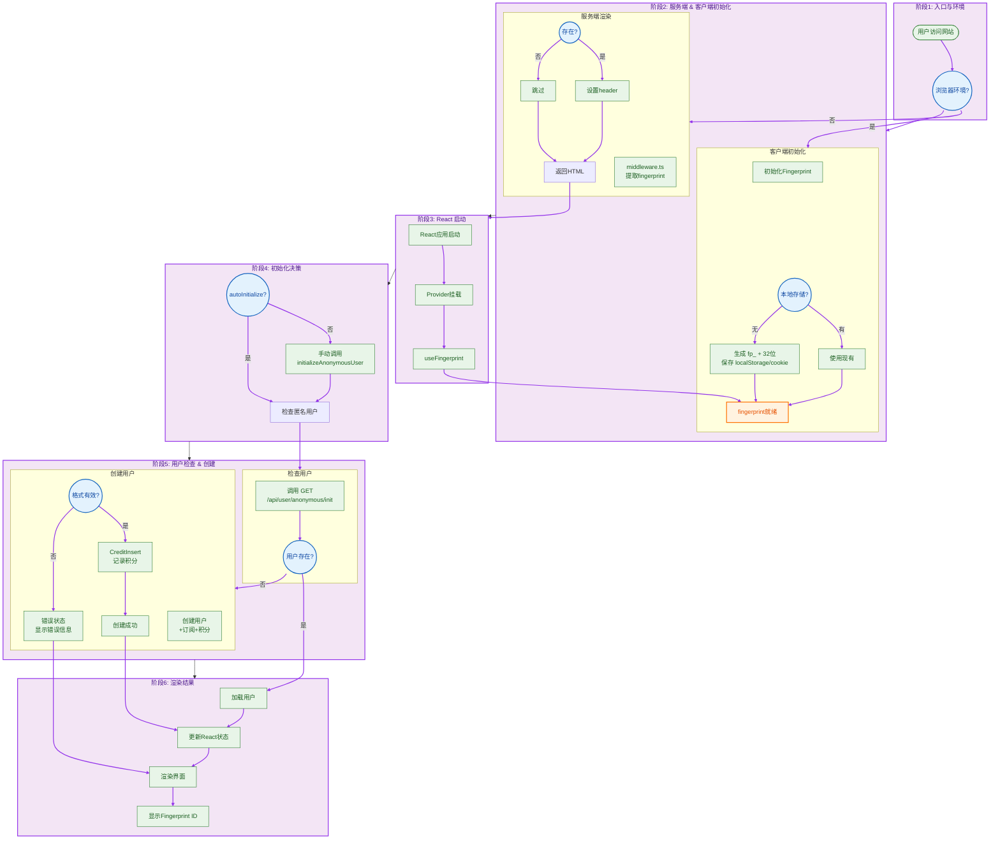
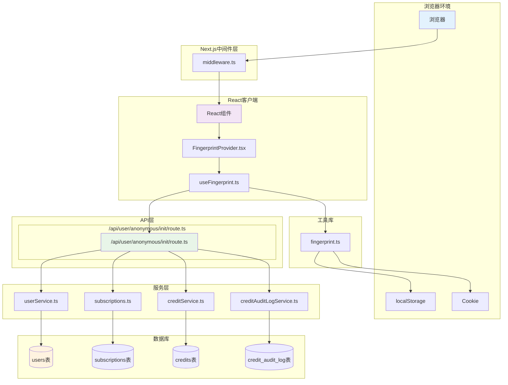

# 匿名用户 Fingerprint 使用指南

本文档说明如何在应用中使用fingerprint功能来管理匿名用户。

## 功能概述

- **自动fingerprint生成**：为每个访问者生成唯一的浏览器指纹ID
- **匿名用户管理**：自动创建匿名用户记录并分配50免费积分
- **数据持久化**：fingerprint存储在localStorage和cookie中
- **中间件集成**：自动在请求中识别和传递fingerprint ID
- **Clerk集成**: 提供适配组件完成Clerk用户数据传递

## 核心组件

### 1. Fingerprint客户端工具库

```typescript
import { getOrGenerateFingerprintId, createFingerprintHeaders } from '@third-ui/clerk/fingerprint';

// 获取或生成fingerprint ID
const fpId = await getOrGenerateFingerprintId();

// 创建包含fingerprint的fetch headers
const headers = await createFingerprintHeaders();
```

### 2. React Hook

```typescript
import { useFingerprint } from '@third-ui/clerk/fingerprint';

function MyComponent() {
  const config = {
    apiEndpoint: '/api/user/anonymous/init',
    autoInitialize: true
  };
  
  const { 
    fingerprintId, 
    anonymousUser, 
    credits, 
    isLoading,
    isInitialized,
    error,
    initializeAnonymousUser,
    refreshUserData
  } = useFingerprint(config);

  if (isLoading) return <div>Loading...</div>;
  if (error) return <div>Error: {error}</div>;

  return (
    <div>
      <p>Fingerprint: {fingerprintId}</p>
      <p>User ID: {anonymousUser?.userId}</p>
      <p>Credits: {credits?.totalBalance}</p>
      <p>Initialized: {isInitialized ? 'Yes' : 'No'}</p>
    </div>
  );
}
```

### 3. Context Provider

```typescript
import { FingerprintProvider, useFingerprintContext } from '@third-ui/clerk/fingerprint';

function App() {
  const config = {
    apiEndpoint: '/api/user/anonymous/init',
    autoInitialize: true
  };
  
  return (
    <FingerprintProvider config={config}>
      <MyApp />
    </FingerprintProvider>
  );
}

function MyApp() {
  const { 
    fingerprintId,
    anonymousUser, 
    credits,
    isLoading,
    isInitialized,
    error,
    initializeAnonymousUser,
    refreshUserData
  } = useFingerprintContext();
  // 使用fingerprint数据
}
```

## API端点

### 初始化匿名用户

```bash
# 创建新匿名用户
POST /api/user/anonymous/init
Content-Type: application/json
X-Fingerprint-Id: fp_xxxxxxxxxxxxxxxxxxxxxxxxxxxxxxxx

{
  "fingerprintId": "fp_xxxxxxxxxxxxxxxxxxxxxxxxxxxxxxxx"
}

# 响应
{
  "success": true,
  "user": {
    "userId": "uuid",
    "fingerprintId": "fp_xxx",
    "status": "anonymous",
    "createdAt": "2024-01-01T00:00:00.000Z"
  },
  "credits": {
    "balanceFree": 50,
    "balancePaid": 0,
    "totalBalance": 50
  },
  "isNewUser": true
}
```

### 获取匿名用户信息

```bash
# 获取现有用户信息
GET /api/user/anonymous/init?fingerprintId=fp_xxx
X-Fingerprint-Id: fp_xxxxxxxxxxxxxxxxxxxxxxxxxxxxxxxx
```

## 中间件集成

中间件自动处理fingerprint ID的提取和验证：

```typescript
// middleware.ts 会自动：
// 1. 从请求headers、cookies中提取fingerprint ID
// 2. 在响应中设置fingerprint ID header
// 3. 记录调试日志
```

## 使用场景

### 1. 应用初始化

FingerprintProvider已经集成到应用的layout中：

```typescript
// src/app/[locale]/(home)/layout.tsx - 主页layout
// src/app/[locale]/(clerk)/layout.tsx - Clerk页面layout

return (
  <ClerkProviderClient locale={locale}>
    <FingerprintProvider autoInitialize={true}>
      <HomeLayout {...customeOptions}>
        {children}
      </HomeLayout>
    </FingerprintProvider>
  </ClerkProviderClient>
);
```

**已挂载位置**：
- ✅ **主页路由** (`/[locale]/(home)/*`): 包括首页、博客、法律页面等
- ✅ **Clerk路由** (`/[locale]/(clerk)/*`): 包括登录、注册、用户管理页面
- 🔄 **自动初始化**: `autoInitialize={true}` 用户访问时自动创建匿名用户

### 2. 用户状态显示

应用已提供了 `FingerprintStatus` 组件来显示用户状态：

```typescript
// 使用现成的状态组件
import { FingerprintStatus } from '@/components/FingerprintStatus';

function MyPage() {
  return (
    <div>
      <h1>我的页面</h1>
      <FingerprintStatus />
    </div>
  );
}
```


## 数据流程详解

### FingerprintID生成和降级策略详解

#### 客户端指纹生成流程

1. **FingerprintJS正常流程**：
   ```typescript
   // 直接导入FingerprintJS (客户端代码无需动态导入)
   import FingerprintJS from '@fingerprintjs/fingerprintjs';
   
   // 使用FingerprintJS收集浏览器特征
   const fp = await FingerprintJS.load();
   const result = await fp.get();
   const fingerprintId = `fp_${result.visitorId}`;
   // 结果例如: fp_abc123def456gh789ijk
   ```

2. **客户端降级策略**：
   ```typescript
   // 当FingerprintJS失败时（网络问题、浏览器不支持等）
   catch (error) {
     console.warn('Failed to generate fingerprint with FingerprintJS:', error);
     const fallbackId = `fp_fallback_${Date.now()}_${Math.random().toString(36).slice(2, 11)}`;
     // 结果例如: fp_fallback_1692345678901_x7k9m2n4p
   }
   ```

3. **服务端环境降级**（理论上不会发生）：
   ```typescript
   // ⚠️ 注意：在当前架构下，此情况实际不会发生
   // 因为fingerprint生成只在客户端useEffect中执行
   return `fp_server_${Date.now()}_${Math.random().toString(36).substr(2, 9)}`;
   // 结果例如: fp_server_1692345678901_x7k9m2n4p
   ```

#### 降级策略触发条件

| 场景 | 触发条件 | 生成的ID格式 | 持久性 | 实际发生 |
|------|----------|-------------|--------|----------|
| **正常指纹** | FingerprintJS成功收集浏览器特征 | `fp_abc123def456` | ✅ 高 - 基于真实浏览器特征 | ✅ 常见 |
| **客户端降级** | FingerprintJS加载失败、网络错误、浏览器不支持 | `fp_fallback_timestamp_random` | ⚠️ 中 - 存储在localStorage/cookie | ⚠️ 偶尔 |
| **服务端降级** | 在Node.js环境中生成（理论情况） | `fp_server_timestamp_random` | ❌ 低 - 每次都是新ID | ❌ 不会发生 |

#### 服务端提取和验证逻辑

```typescript
// extractFingerprintId 优先级顺序
export function extractFingerprintId(headers, cookies, query) {
  // 1. 优先从HTTP header获取 (X-Fingerprint-Id)
  const headerValue = headers.get('x-fingerprint-id');
  if (headerValue && isValidFingerprintId(headerValue)) {
    return headerValue;
  }
  
  // 2. 从cookie获取 (fingerprint_id)
  const cookieValue = cookies.fingerprint_id;
  if (cookieValue && isValidFingerprintId(cookieValue)) {
    return cookieValue;
  }
  
  // 3. 从query参数获取 (fingerprint_id 或 fp_id)
  const queryValue = query.fingerprint_id || query.fp_id;
  if (queryValue && isValidFingerprintId(queryValue)) {
    return queryValue;
  }
  
  return null;
}
```

#### ID格式验证规则

```typescript
export function isValidFingerprintId(fingerprintId: string): boolean {
  // 支持的格式：
  // ✅ fp_abc123def456 (FingerprintJS - 常见)
  // ✅ fp_fallback_1692345678901_x7k9m2n4p (客户端降级 - 偶尔)
  // ⚠️ fp_server_1692345678901_x7k9m2n4p (服务端降级 - 理论上不会发生)
  return /^fp(_fallback|_server)?_[a-zA-Z0-9_]+$/.test(fingerprintId);
}
```

#### 关键执行时序说明

**❌ 错误理解**: middleware在首次页面请求时就能获取到fingerprintId
**✅ 正确理解**: 
1. **首次页面请求** → middleware → extractFingerprintId → **返回null**（因为用户第一次访问）
2. **React应用渲染** → FingerprintProvider挂载 → 生成fingerprintId → 存储到localStorage/cookie
3. **后续API请求** → middleware → extractFingerprintId → **返回fingerprintId**（从header/cookie获取）

#### 首次访问冲突问题及解决方案

**🔥 核心问题**：这是一个经典的"鸡生蛋"问题
```
首次访问流程冲突：
1. 用户输入URL → 浏览器发起GET请求 → middleware执行 → 没有指纹ID ❌
2. 返回HTML → React hydration → 生成指纹ID ✅
3. 下次请求才能携带指纹ID → middleware才能提取 ✅
```

**🏭 业界标准做法**：
- **FingerprintJS官方**：指纹收集只能在客户端进行，服务端负责提取和验证
- **延迟初始化策略**：首次页面加载不依赖指纹ID，客户端hydration后再生成
- **分层处理**：页面渲染 + 异步指纹初始化 + 后续API调用

**✅ 推荐解决方案**：

1. **Middleware优雅降级**：
   ```typescript
   // middleware.ts
   export function middleware(request: NextRequest) {
     const fingerprintId = extractFingerprintId(request.headers, request.cookies);
     
     // 首次访问：fingerprintId = null，正常继续
     if (!fingerprintId) {
       console.log('首次访问，跳过指纹验证');
       return NextResponse.next();
     }
     
     // 后续访问：验证和处理指纹ID
     if (isValidFingerprintId(fingerprintId)) {
       const response = NextResponse.next();
       response.headers.set('x-fingerprint-id', fingerprintId);
       return response;
     }
   }
   ```

2. **客户端两阶段初始化**：
   ```typescript
   // FingerprintProvider.tsx
   useEffect(() => {
     // 第一阶段：页面加载完成后生成指纹
     const initFingerprint = async () => {
       const fpId = await generateFingerprintId();
       setFingerprintId(fpId);
     };
     
     initFingerprint();
   }, []);
   
   useEffect(() => {
     // 第二阶段：有指纹ID后初始化用户
     if (fingerprintId && autoInitialize) {
       initializeAnonymousUser();
     }
   }, [fingerprintId]);
   ```

3. **API路由容错处理**：
   ```typescript
   // /api/user/anonymous/init/route.ts
   export async function POST(request: NextRequest) {
     const fingerprintId = extractFingerprintId(
       request.headers, 
       request.cookies,
       await request.json()
     );
     
     if (!fingerprintId) {
       return NextResponse.json(
         { error: '指纹ID缺失，请刷新页面重试' }, 
         { status: 400 }
       );
     }
     
     // 正常处理逻辑...
   }
   ```

**📋 最佳实践总结**：
- ✅ **首次访问允许无指纹**：middleware和API优雅处理null情况
- ✅ **客户端主导生成**：所有指纹生成在浏览器中完成
- ✅ **服务端负责验证**：只做提取、验证、存储工作
- ✅ **异步初始化用户**：页面渲染不阻塞在指纹生成上
- ✅ **后续请求增强**：第二次及以后的请求携带完整指纹信息

### 匿名用户首次访问时序图



### 匿名用户首次访问流程图



### 核心文件交互图



## 数据流程总结

1. **首次访问**：
   - 生成fingerprint ID
   - 调用 `/api/user/anonymous/init` 创建匿名用户
   - 分配50免费积分

2. **再次访问**：
   - 从localStorage/cookie获取fingerprint ID
   - 调用 `/api/user/anonymous/init` 获取现有用户数据

3. **用户注册**：
   - Clerk webhook接收用户创建事件
   - 根据传递的user_id升级匿名用户为注册用户

4. **用户注销**：
   - Clerk webhook接收用户删除事件
   - 备份并删除用户数据
   - 用户重新成为匿名状态

## 安全考虑

- Fingerprint ID只用于匿名用户识别，不包含敏感信息
- 每个fingerprint限制分配的免费积分，防止滥用
- 支持GDPR合规的用户数据删除
- 所有API请求都经过适当的验证和错误处理

## 性能优化

- Fingerprint ID存储在localStorage和cookie中，减少重复生成
- 中间件只在必要时处理fingerprint逻辑
- React Context提供缓存的用户数据，避免重复API调用
- 懒加载用户数据，只在需要时初始化

