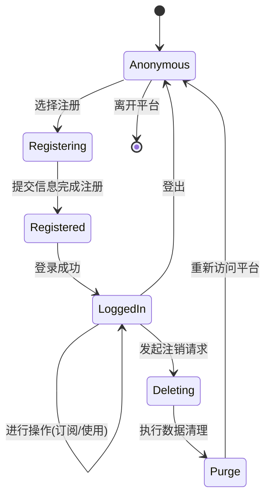
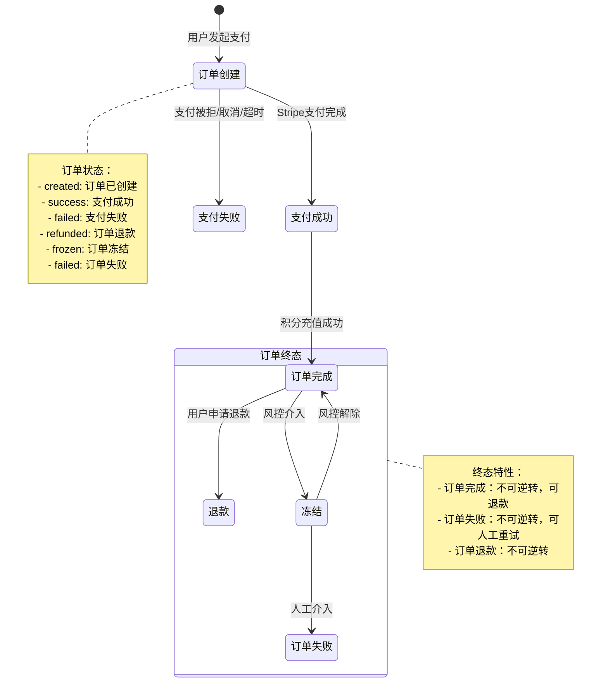
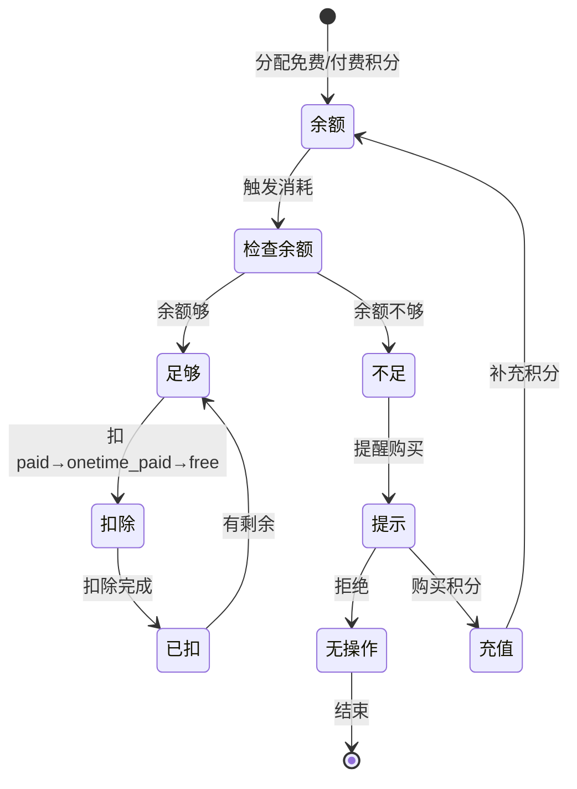

## 5. 状态流转

### 5.1 状态定义

#### 5.1.1 用户状态
| 状态 | 状态值 | 描述 | 是否终态 | 可逆转性 |
|------|--------|------|----------|----------|
| 匿名 | `anonymous` | 未注册 | ❌ | ✅ 可重试 |
| 已注册 | `registered` | Clerk用户 | ❌ | ✅ 可失败 |
| 已冻结 | `frozen` | 管理员/风控介入 | ❌ | ✅ 可重试 |
| 已注销 | `deleted` | Clerk删除 | ✅ | ❌ 不可逆转 |

#### 5.1.2 订单状态
| 状态 | 状态值 | 描述 | 是否终态 | 可逆转性 |
|------|--------|------|----------|----------|
| 订单创建 | `created` | 订单已创建，等待支付 | ❌ | ✅ 可重试 |
| 支付成功 | `success` | Stripe支付成功 | ❌ | ✅ 可失败 |
| 支付失败 | `failed` | 支付被拒绝/取消/超时 | ❌ | ✅ 可重试 |
| 订单退款 | `refunded` | 订单已退款（部分或全额） | ✅ | ❌ 不可逆转 |
| 订单冻结 | `frozen` | 风控或合规介入冻结 | ❌ | ✅ 可解除 |
| 订单失败 | `failed` | 最终失败状态 | ✅ | ❌ 不可逆转 |

#### 5.1.3 订阅状态
| 状态 | 状态值 | 描述 | 是否终态 | 可逆转性 |
|------|--------|------|----------|----------|
| 匿名初始化 | `incomplete` | 匿名用户 | ❌ | ✅ 可重试 |
| 试用期 | `trialing` | 系统开启功能 | ❌ | ✅ 可变化|
| 活跃 | `active` | 订阅支付 | ❌ | ✅ 可续订 |
| 已过期 | `past_due` | 订阅的到期 | ❌  | ✅ 可逆转 |
| 已取消 | `canceled` | 取消订阅 | ✅ | ❌ 不可逆转 |

### 5.2 用户生命周期状态机图

以下状态机图描述了用户从匿名状态到注册、登录、注销、再注册的生命周期状态转换，涵盖 `Users` 表的状态变化。

### 5.3 订单状态机

以下状态机表示用户订阅的生命周期，包括用户操作或Stripe Webhook触发的状态转换。

### 5.4 积分状态机

此状态机表示用户积分余额在使用过程中的状态。

