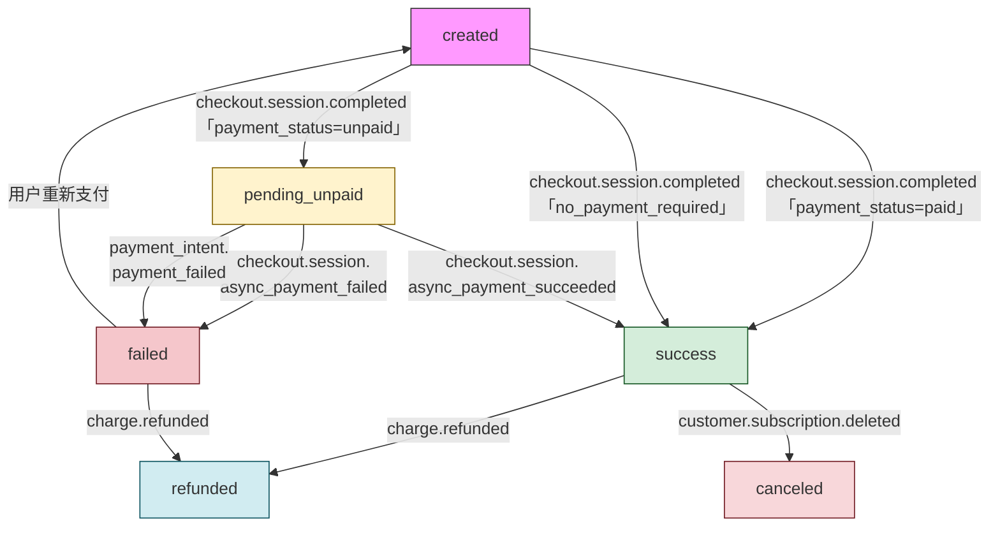
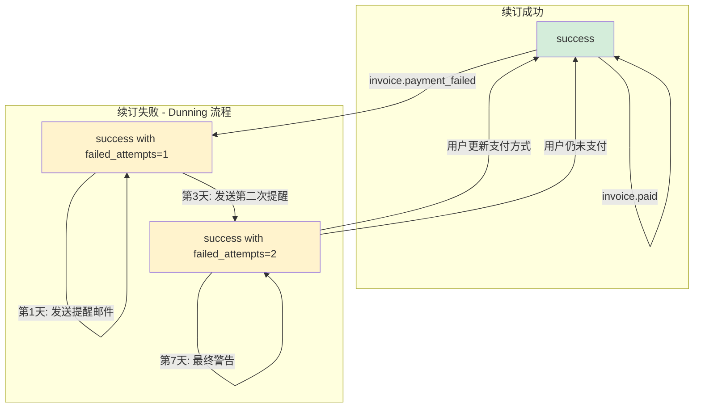
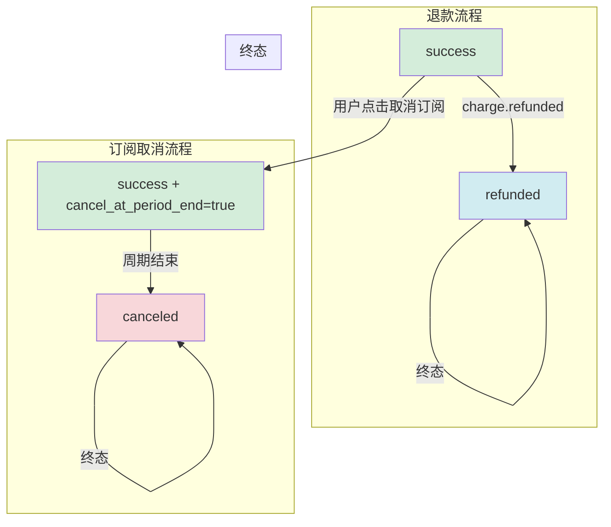
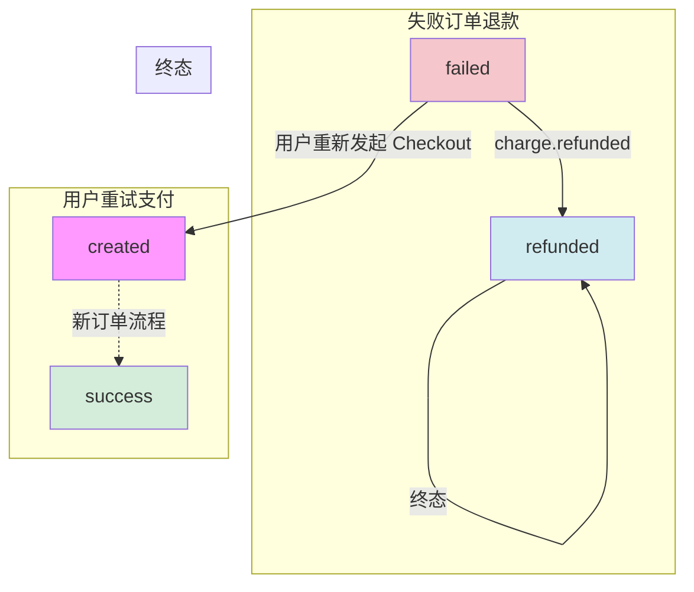
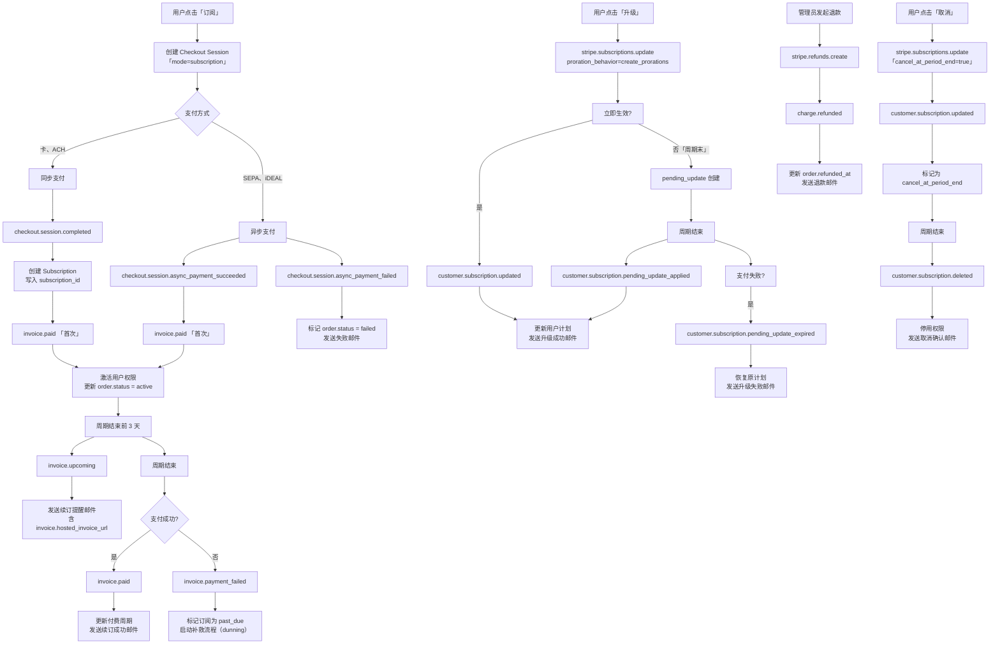
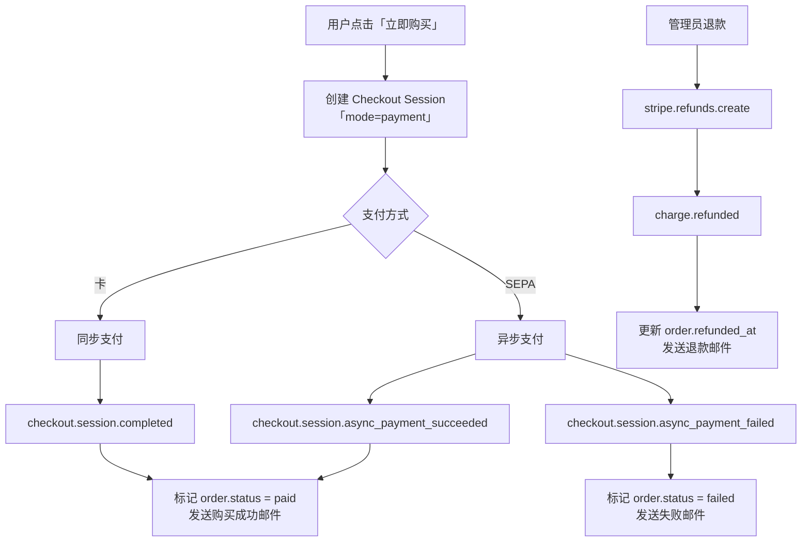
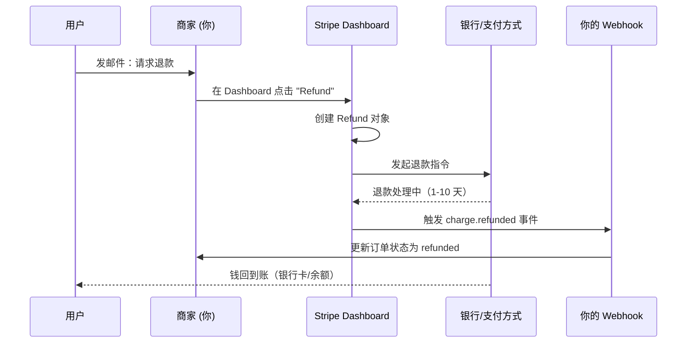
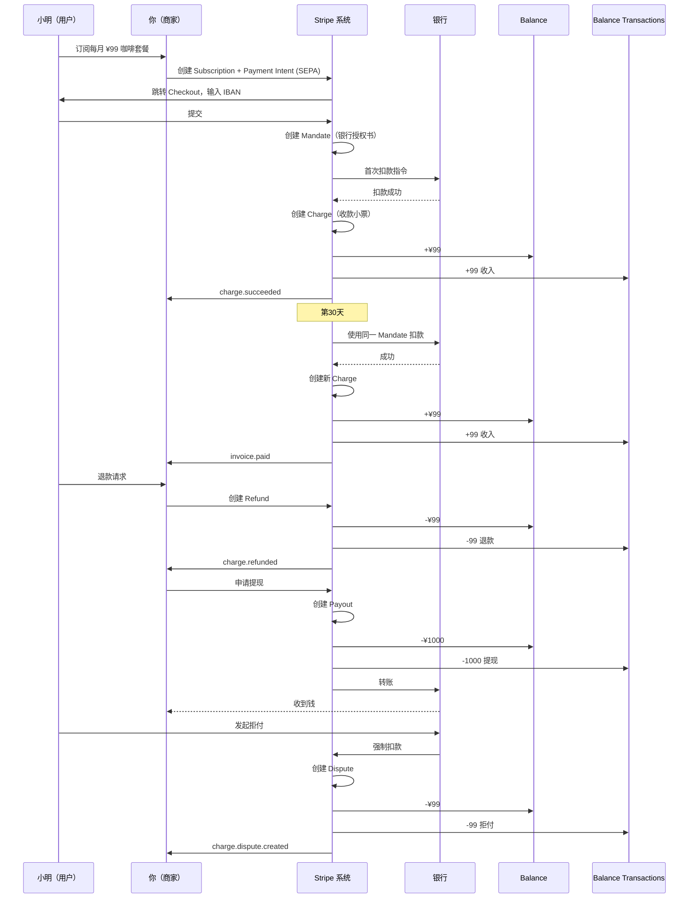

# Stripe对接设计

## 关键设计原则

## 测试信息
本文档详细说明了每个 Stripe webhook 事件对应的数据库表操作。
使用测试卡号：
- 成功：`4242 4242 4242 4242`
- 拒绝：`4000 0000 0000 0002`
- 3D 验证：`4000 0025 0000 3155`

| 原则 | 实现方式 |
|------|----------|
| **业务锚点** | `subscription.metadata.order_id`（订阅） `session.metadata.order_id`（One-Time） |
| **幂等键** | `event.id` → 数据库唯一索引 |
| **事件无序安全** | 所有事件都通过 `order_id` 查询数据库   通过订阅ID实时查询 |

## 订单状态扭转

| 路径 | 起始状态 | 触发事件 | 目标状态 | 条件/说明 |
|------|---------|----------|---------|----------|
| **创建 → 同步成功** | `created` | `checkout.session.completed` | `success` | `payment_status = 'paid'` |
| **创建 → 异步待处理** | `created` | `checkout.session.completed` | `pending_unpaid` | `payment_status = 'unpaid'` |
| **异步待处理 → 成功** | `pending_unpaid` | `checkout.session.async_payment_succeeded` | `success` | 银行确认到账 |
| **异步待处理 → 失败** | `pending_unpaid` | `checkout.session.async_payment_failed` | `failed` | 银行拒绝支付 |
| **创建 → One-Time 成功** | `created` | `payment_intent.succeeded` | `success` | 非 Checkout 一次性支付 |
| **创建 → One-Time 失败** | `created` | `payment_intent.payment_failed` | `failed` | 非 Checkout 支付失败 |
| **成功 → 续订成功** | `success` | `invoice.paid` | `success` | 每月自动续订 |
| **成功 → 续订失败** | `success` | `invoice.payment_failed` | `success` | 保持状态，记录 `failed_attempts++` |
| **成功 → 退款** | `success` | `charge.refunded` | `refunded` | 管理员发起退款 |
| **成功 → 取消订阅** | `success` | `customer.subscription.deleted` | `canceled` | 周期末取消 |
| **失败 → 退款** | `failed` | `charge.refunded` | `refunded` | 退款已失败的订单 |
| **失败 → 重试** | `failed` | 用户重新支付 | `created` | 创建新订单或复用原订单 |
| **终态** | `refunded` | — | `refunded` | 不可逆 |
| **终态** | `canceled` | — | `canceled` | 不可逆 |
| **终态** | `failed` | — | `failed` | 可重试 |

### 总览

### 同步·异步支付成功或失败

```mermaid
flowchart TD
    A[created] 
    B[pending_unpaid] 
    C[success]
    D[failed]
    
    subgraph "同步支付路径"
        A1[A created] -->|"checkout.session.completed<br/>「payment_status=paid」"| C1[C success]
    end
    
    subgraph "异步支付路径"
        A2[A created] -->|"checkout.session.completed<br/>「payment_status=unpaid」"| B2[B pending_unpaid]
        B2 -->|"checkout.session.async_payment_succeeded"| C2[C success]
        B2 -->|"checkout.session.async_payment_failed"| D2[D failed]
    end
    
    subgraph "One-Time 支付"
        A3[A created] -->|"payment_intent.succeeded"| C3[C success]
        A3 -->|"payment_intent.payment_failed"| D3[D failed]
    end
    
    style A1 fill:#f9f
    style C1 fill:#d4edda
    style A2 fill:#f9f
    style B2 fill:#fff3cd
    style C2 fill:#d4edda
    style D2 fill:#f5c6cb
    style A3 fill:#f9f
    style C3 fill:#d4edda
    style D3 fill:#f5c6cb
```

### 续订成功或失败

### 已成功订单退款或取消

### 已失败订单退款或重试

## 核心事件

| 事件 | 所属模块 | 关键作用 | 触发时机 | 你必须做的事（业务 + 幂等） |
|------|----------|----------|----------|----------------------------|
| `checkout.session.completed` | Checkout | 首次支付成功（入口） | 用户完成 Checkout（订阅或 One-Time） | 1. 读取 `session.metadata.order_id` 2. **写入 `subscription_id`（订阅）或 `status=paid`（One-Time）** 3. 发送欢迎/购买成功邮件 |
| `checkout.session.async_payment_succeeded` | Checkout | 异步支付成功 | 异步支付最终成功（如 SEPA） | 同 `checkout.session.completed`，**不要重复激活**（幂等） |
| `checkout.session.async_payment_failed` | Checkout | 异步支付失败 | 异步支付最终失败 | 更新订单为 `failed`，发送失败邮件 |
| `invoice.paid` | Invoice | **续订成功 / 首次成功** | 首次支付成功 / 每次续订成功 | 1. `stripe.subscriptions.retrieve(invoice.subscription)` 2. 读取 `subscription.metadata.order_id` 3. **更新付费周期、激活权限** 4. 发送续订成功邮件 |
| `invoice.payment_failed` | Invoice | 续订失败 | 续订支付失败 | 1. 标记订阅为 `past_due` 2. 启动 dunning（第1天、第3天、第7天邮件） |
| `invoice.upcoming` | Invoice | 续订前提醒 | 续订前（默认 3 天） | 发送“即将扣款”邮件，含 `hosted_invoice_url` |
| `customer.subscription.created` | Subscription | 订阅创建（可选） | 订阅对象创建 | **可选**：可由 `checkout.session.completed` 替代 |
| `customer.subscription.updated` | Subscription | **升降级、数量变更** | 升降级、数量变更、取消设置 | 1. 比较 `previous_attributes` 2. 若 `items` 变更 → 更新用户计划 3. 若 `cancel_at_period_end` → 标记为待取消 |
| `customer.subscription.deleted` | Subscription | 用户取消 | 订阅彻底结束 | 1. 停用用户权限 2. 清理资源 3. 发送取消确认邮件 |
| `customer.subscription.pending_update_applied` | Subscription | 延迟升降级生效 | 延迟升降级生效 | **更新用户计划为新计划**，发送升级成功邮件 |
| `customer.subscription.pending_update_expired` | Subscription | 升降级因支付失败取消 | 延迟升降级因支付失败取消 | 恢复原计划，发送“升级失败”邮件 |
| `payment_intent.succeeded` | One-Time | One-Time 支付成功 | One-Time 支付成功（非 Checkout） | 同 `checkout.session.completed`（One-Time） |
| `payment_intent.payment_failed` | One-Time | One-Time 支付失败 | One-Time 支付失败 | 更新订单为 `failed`，发送失败邮件 |
| `charge.refunded` | Refund | 退款成功 | 退款成功 | 1. 更新 `order.refunded_at` 2. 退还权限（如需） 3. 发送退款邮件 |
| `invoice.finalized` | Invoice | 发票生成（可选） | 发票生成但未支付 | **可选**：发送“待支付”提醒 |

## 订阅全生命周期流程图

## 即付模式全生命周期流程图

## 幂等性控制

1. checkout.session.completed / checkout.session.async_payment_succeeded：已通过订单状态与 paymentStatus 拦截重复处理，重复事件不会再次分配积分或更新订单
2. checkout.session.async_payment_failed：会先检查订单是否已成功，再将状态置为 failed，重复事件安全
3. invoice.paid（首次开通）：只更新发票相关字段，重复事件写入相同值，可视为幂等
4. invoice.paid（续费成功）：校验发票ID，同一张发票不允许重复生成续费订单、累加积分、记 credit_usage
5. invoice.payment_failed（续费失败）：校验发票ID，同一张发票不允许重复生成失败订单与 usage 记录，需要幂等保护
6. charge.refunded：订单状态校验、积分安全扣减与订阅取消逻辑，重复退款事件不会再产生额外影响
7. customer.subscription.created，主要做状态覆盖或简单更新，当前逻辑基本幂等
8. customer.subscription.updated，主要做状态覆盖或简单更新，当前逻辑基本幂等
9. customer.subscription.deleted，主要做状态覆盖或简单更新，当前逻辑基本幂等
10. payment_intent.succeeded，主要做状态覆盖或简单更新，当前逻辑基本幂等
11. payment_intent.payment_failed，主要做状态覆盖或简单更新，当前逻辑基本幂等

## 退款与争议处理

### 退款流程

### 支付方式特点
| 支付方式 | 同步/异步 | 说明 | `payment_status` | 是否激活 | 退款到账时间 |
|--------|----------|------|--------------------------------------------------|------------------|-------------|
| **信用卡（Visa, MasterCard, Amex 等）** | 同步 | 实时扣款，秒级确认 | `paid` | 是 | 5–10 个工作日 |
| **Apple Pay** | 同步 | 实时授权 | `paid` | 是 | 1–3 个工作日 |
| **Google Pay** | 同步 | 实时授权 | `paid` | 是 | 1–3 个工作日 |
| **Link by Stripe** | 同步 | 基于卡的快速支付 | `paid` | 是 | 5–10 个工作日 |
| **Alipay（国际卡）** | 同步 | 实时 | `paid` | 是 | 1–3 个工作日 |
| **WeChat Pay（国际卡）** | 同步 | 实时 | `paid` | 是 | 1–3 个工作日 |
| **GrabPay** | 同步 | 实时 | `paid` | 是 | 1–3 个工作日 |
| **FPX（马来西亚）** | 同步 | 实时银行转账 | `paid` | 是 | 1–3 个工作日 |
| **SEPA Direct Debit** | 异步 | 1–5 天到账 | `unpaid` | 否（需等 `async_payment_succeeded`） | 5–7 个工作日 |
| **ACH Direct Debit（美国）** | 异步 | 2–5 天到账 | `unpaid` | 否 | 2–5 个工作日 |
| **Bacs Direct Debit（英国）** | 异步 | 3 天到账 | `unpaid` | 否 | 3–5 个工作日 |
| **iDEAL（荷兰）** | 异步 | 银行跳转，1–2 天 | `unpaid` | 否 | 1–3 个工作日 |
| **Bancontact（比利时）** | 异步 | 银行跳转 | `unpaid` | 否 | 1–3 个工作日 |
| **Przelewy24（波兰）** | 异步 | 银行跳转 | `unpaid` | 否 | 1–3 个工作日 |
| **Konbini（日本便利店）** | 异步 | 用户需去便利店付款 | `unpaid` | 否 | 1–3 个工作日 |
| **Boleto（巴西）** | 异步 | 1–3 天到账 | `unpaid` | 否 | 1–3 个工作日 |
| **OXXO（墨西哥）** | 异步 | 1–3 天到账 | `unpaid` | 否 | 1–3 个工作日 |
| **Afterpay / Clearpay** | 异步 | 分期支付，需审核 | `unpaid` | 否 | 按分期计划退款 |

## Stripe概念

| 对象 | 一句话解释 | 真实作用 |
|------|-----------|--------|
| **Balance** | 你的 Stripe 钱包余额 | 账户中可提现的净资金（收入 - 退款 - 费用） |
| **Balance Transactions** | 钱的每笔进出记录 | 详细流水：收入、退款、费用、提现、拒付 |
| **Charges** | 用户付钱的原始小票 | 每次成功扣款的原始记录，不可变 |
| **Disputes** | 用户找银行投诉的退款 | 银行强制扣款，需提供证据反驳 |
| **Mandates** | 长期扣款的银行授权书 | 允许 Stripe 代表你重复扣款（如订阅） |
| **Payment Intents** | 一次支付的完整指令 | 管理支付全流程（创建 → 认证 → 确认） |
| **Payouts** | 把钱转到你银行的工资单 | 从 Balance 提现至银行账户 |
| **Refunds** | 你主动退给用户的钱 | 商家发起的退款，扣减 Balance |

