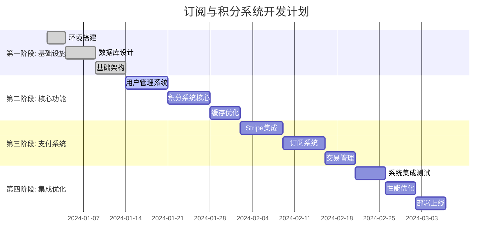

# 订阅与积分系统开发计划

## 1. 项目概述

### 1.1 项目目标
基于 `PaidDesign-v1.0.md` 设计文档，开发一个完整的订阅与积分系统，支持匿名用户和注册用户的积分管理、订阅购买、支付处理等功能。

### 1.2 技术栈
- **前端**: Next.js + TypeScript + Tailwind CSS
- **后端**: Node.js + TypeScript + Express/NestJS
- **数据库**: PostgreSQL + Prisma ORM
- **缓存**: Redis
- **支付**: Stripe
- **认证**: Clerk
- **部署**: Vercel (前端) + Vercel Functions (后端)

### 1.3 开发周期
- **总周期**: 12周
- **里程碑**: 每3周一个里程碑
- **迭代**: 每1周一个迭代

### 1.4 项目甘特图

## 2. 开发阶段规划

### 2.1 第一阶段：基础设施搭建 (第1-3周)
**目标**: 搭建开发环境，完成数据库设计和基础架构

#### 2.1.1 第1周：环境搭建
**优先级**: 🔴 高 | **复杂度**: 🟢 简单 | **并行性**: ✅ 可并行

| 任务 | 负责人 | 复杂度 | 预估工时 | 前置依赖 |
|------|--------|--------|----------|----------|
| 开发环境搭建 | 全团队 | 🟢 简单 | 1天 | 无 |
| Git仓库初始化 | 全团队 | 🟢 简单 | 0.5天 | 无 |
| Vercel项目配置 | 前端 | 🟢 简单 | 1天 | 无 |
| 数据库环境搭建 | 后端 | 🟡 中等 | 1天 | 无 |
| Redis环境搭建 | 后端 | 🟢 简单 | 0.5天 | 无 |
| 前端项目初始化 | 前端 | 🟢 简单 | 1天 | 无 |
| 后端项目初始化 | 后端 | 🟢 简单 | 1天 | 无 |
| Vercel CI/CD配置 | 前端 | 🟢 简单 | 1天 | Git仓库 |

#### 2.1.2 第2周：数据库设计
**优先级**: 🔴 高 | **复杂度**: 🟡 中等 | **并行性**: ❌ 串行

| 任务 | 负责人 | 复杂度 | 预估工时 | 前置依赖 |
|------|--------|--------|----------|----------|
| Prisma Schema设计 | 后端 | 🟡 中等 | 2天 | 环境搭建 |
| Prisma迁移脚本编写 | 后端 | 🟢 简单 | 1天 | Schema设计 |
| 数据库索引优化 | 后端 | 🟡 中等 | 1天 | Schema设计 |
| Prisma Client配置 | 后端 | 🟢 简单 | 0.5天 | 数据库环境 |
| 数据库备份策略 | 后端 | 🟡 中等 | 1天 | 数据库环境 |

#### 2.1.3 第3周：基础架构
**优先级**: 🔴 高 | **复杂度**: 🟡 中等 | **并行性**: ✅ 可并行

| 任务 | 负责人 | 复杂度 | 预估工时 | 前置依赖 |
|------|--------|--------|----------|----------|
| Redis缓存架构设计 | 后端 | 🟡 中等 | 1天 | Redis环境 |
| 缓存策略实现 | 后端 | 🟡 中等 | 2天 | 缓存架构设计 |
| 错误处理机制 | 全团队 | 🟢 简单 | 1天 | 项目初始化 |
| 日志系统搭建 | 后端 | 🟢 简单 | 1天 | 项目初始化 |
| Vercel监控配置 | 前端 | 🟢 简单 | 1天 | 项目初始化 |
| API文档规范制定 | 全团队 | 🟢 简单 | 0.5天 | 无 |

### 2.2 第二阶段：核心功能开发 (第4-6周)
**目标**: 实现用户管理、积分系统核心功能

#### 2.2.1 第4周：用户管理系统
**优先级**: 🔴 高 | **复杂度**: 🟡 中等 | **并行性**: ✅ 可并行

| 任务 | 负责人 | 复杂度 | 预估工时 | 前置依赖 |
|------|--------|--------|----------|----------|
| Clerk集成配置 | 前端+后端 | 🟡 中等 | 2天 | 基础架构 |
| 用户表CRUD接口 | 后端 | 🟢 简单 | 1天 | 数据库设计 |
| 用户注册/登录流程 | 前端+后端 | 🟡 中等 | 3天 | Clerk集成 |
| 匿名用户处理逻辑 | 后端 | 🟡 中等 | 2天 | 用户CRUD |
| 用户状态管理 | 前端 | 🟢 简单 | 1天 | 用户注册/登录 |
| 用户注销功能 | 前端+后端 | 🟢 简单 | 1天 | 用户管理 |

#### 2.2.2 第5周：积分系统核心
**优先级**: 🔴 高 | **复杂度**: 🟡 中等 | **并行性**: ✅ 可并行

| 任务 | 负责人 | 复杂度 | 预估工时 | 前置依赖 |
|------|--------|--------|----------|----------|
| 积分表CRUD接口 | 后端 | 🟢 简单 | 1天 | 数据库设计 |
| 积分余额查询接口 | 后端 | 🟢 简单 | 0.5天 | 积分CRUD |
| 积分消耗逻辑实现 | 后端 | 🟡 中等 | 2天 | 积分CRUD |
| 积分充值逻辑实现 | 后端 | 🟡 中等 | 2天 | 积分CRUD |
| 积分使用记录接口 | 后端 | 🟢 简单 | 1天 | 积分CRUD |
| 积分前端组件开发 | 前端 | 🟢 简单 | 2天 | 积分接口 |
| 积分余额显示组件 | 前端 | 🟢 简单 | 1天 | 积分接口 |

#### 2.2.3 第6周：缓存优化
**优先级**: 🟡 中 | **复杂度**: 🟡 中等 | **并行性**: ✅ 可并行

| 任务 | 负责人 | 复杂度 | 预估工时 | 前置依赖 |
|------|--------|--------|----------|----------|
| 用户信息缓存实现 | 后端 | 🟡 中等 | 2天 | 用户管理 |
| 积分信息缓存实现 | 后端 | 🟡 中等 | 2天 | 积分系统 |
| 缓存一致性保证 | 后端 | 🔴 复杂 | 3天 | 缓存实现 |
| 缓存性能测试 | 后端 | 🟢 简单 | 1天 | 缓存实现 |
| 缓存监控告警 | DevOps | 🟡 中等 | 1天 | 缓存实现 |

### 2.3 第三阶段：支付系统集成 (第7-9周)
**目标**: 集成Stripe支付，实现订阅购买功能

#### 2.3.1 第7周：Stripe集成
**优先级**: 🔴 高 | **复杂度**: 🔴 复杂 | **并行性**: ❌ 串行

| 任务 | 负责人 | 复杂度 | 预估工时 | 前置依赖 |
|------|--------|--------|----------|----------|
| Stripe账户配置 | 产品经理 | 🟢 简单 | 0.5天 | 无 |
| Stripe SDK集成 | 后端 | 🟡 中等 | 1天 | 基础架构 |
| Stripe Webhook配置 | 后端 | 🟡 中等 | 2天 | Stripe集成 |
| 支付会话创建接口 | 后端 | 🟡 中等 | 2天 | Stripe集成 |
| 支付状态处理逻辑 | 后端 | 🔴 复杂 | 3天 | Webhook配置 |
| 支付安全验证 | 后端 | 🔴 复杂 | 2天 | 支付逻辑 |

#### 2.3.2 第8周：订阅系统
**优先级**: 🔴 高 | **复杂度**: 🟡 中等 | **并行性**: ✅ 可并行

| 任务 | 负责人 | 复杂度 | 预估工时 | 前置依赖 |
|------|--------|--------|----------|----------|
| 订阅表CRUD接口 | 后端 | 🟢 简单 | 1天 | 数据库设计 |
| 订阅计划管理 | 后端 | 🟡 中等 | 2天 | 订阅CRUD |
| 订阅购买流程 | 前端+后端 | 🟡 中等 | 3天 | Stripe集成 |
| 订阅状态管理 | 后端 | 🟡 中等 | 2天 | 订阅购买 |
| 订阅续费逻辑 | 后端 | 🔴 复杂 | 3天 | 订阅状态 |
| 订阅升级/降级 | 后端 | 🔴 复杂 | 3天 | 订阅状态 |

#### 2.3.3 第9周：交易管理
**优先级**: 🟡 中 | **复杂度**: 🟡 中等 | **并行性**: ✅ 可并行

| 任务 | 负责人 | 复杂度 | 预估工时 | 前置依赖 |
|------|--------|--------|----------|----------|
| 交易表CRUD接口 | 后端 | 🟢 简单 | 1天 | 数据库设计 |
| 交易记录管理 | 后端 | 🟡 中等 | 2天 | 交易CRUD |
| 订单状态管理 | 后端 | 🟡 中等 | 2天 | 交易记录 |
| 退款处理逻辑 | 后端 | 🔴 复杂 | 3天 | 交易记录 |
| 交易历史查询 | 后端 | 🟢 简单 | 1天 | 交易记录 |
| 交易前端组件 | 前端 | 🟢 简单 | 2天 | 交易接口 |

### 2.4 第四阶段：系统集成与优化 (第10-12周)
**目标**: 系统集成测试、性能优化、部署上线

#### 2.4.1 第10周：系统集成
**优先级**: 🔴 高 | **复杂度**: 🟡 中等 | **并行性**: ✅ 可并行

| 任务 | 负责人 | 复杂度 | 预估工时 | 前置依赖 |
|------|--------|--------|----------|----------|
| 端到端流程测试 | 全团队 | 🟡 中等 | 3天 | 所有功能 |
| 用户流程集成测试 | 测试 | 🟢 简单 | 2天 | 用户管理 |
| 支付流程集成测试 | 测试 | 🟡 中等 | 2天 | 支付系统 |
| 积分流程集成测试 | 测试 | 🟢 简单 | 1天 | 积分系统 |
| 缓存集成测试 | 测试 | 🟡 中等 | 1天 | 缓存系统 |
| Bug修复 | 全团队 | 🟡 中等 | 2天 | 集成测试 |

#### 2.4.2 第11周：性能优化
**优先级**: 🟡 中 | **复杂度**: 🔴 复杂 | **并行性**: ✅ 可并行

| 任务 | 负责人 | 复杂度 | 预估工时 | 前置依赖 |
|------|--------|--------|----------|----------|
| Prisma查询优化 | 后端 | 🔴 复杂 | 3天 | 系统集成 |
| API响应时间优化 | 后端 | 🟡 中等 | 2天 | 系统集成 |
| 前端性能优化 | 前端 | 🟡 中等 | 2天 | 系统集成 |
| 缓存策略优化 | 后端 | 🟡 中等 | 2天 | 缓存系统 |
| Vercel性能测试 | 前端 | 🟡 中等 | 1天 | 性能优化 |
| 压力测试 | 后端 | 🔴 复杂 | 2天 | 负载测试 |

#### 2.4.3 第12周：部署上线
**优先级**: 🔴 高 | **复杂度**: 🟡 中等 | **并行性**: ❌ 串行

| 任务 | 负责人 | 复杂度 | 预估工时 | 前置依赖 |
|------|--------|--------|----------|----------|
| Vercel生产环境部署 | 前端 | 🟢 简单 | 1天 | 性能优化 |
| 数据库迁移 | 后端 | 🟡 中等 | 1天 | 生产环境 |
| Vercel监控配置 | 前端 | 🟢 简单 | 0.5天 | 生产环境 |
| 安全配置 | 前端+后端 | 🟡 中等 | 1天 | 生产环境 |
| 上线验证 | 全团队 | 🟢 简单 | 1天 | 部署完成 |
| 文档完善 | 全团队 | 🟢 简单 | 1天 | 上线验证 |

## 3. 人员配置建议

### 3.1 团队规模
- **前端开发**: 2人 (包含Vercel部署)
- **后端开发**: 3人
- **测试**: 1人
- **产品经理**: 1人

### 3.2 技能要求

#### 3.2.1 前端开发
- **初级**: 熟悉React/Next.js，能完成简单组件开发
- **高级**: 熟悉TypeScript、状态管理、性能优化

#### 3.2.2 后端开发
- **初级**: 熟悉Node.js，能完成CRUD接口开发
- **中级**: 熟悉数据库设计、缓存策略
- **高级**: 熟悉支付系统、高并发处理、系统架构

#### 3.2.3 前端开发 (Vercel部署)
- **中级**: 熟悉Vercel、CI/CD、监控系统
- **高级**: 熟悉Vercel Functions、安全配置、性能调优

## 4. 风险评估与应对

### 4.1 技术风险

| 风险 | 概率 | 影响 | 应对策略 |
|------|------|------|----------|
| Stripe集成复杂度 | 中 | 高 | 提前研究Stripe文档，准备备用方案 |
| 缓存一致性问题 | 中 | 中 | 设计完善的缓存策略，充分测试 |
| Prisma查询性能瓶颈 | 低 | 高 | 提前进行性能测试，优化查询 |
| Vercel函数冷启动 | 中 | 中 | 优化函数大小，使用缓存策略 |
| 支付安全漏洞 | 低 | 高 | 严格的安全审查，第三方安全审计 |

### 4.2 进度风险

| 风险 | 概率 | 影响 | 应对策略 |
|------|------|------|----------|
| 需求变更 | 中 | 中 | 采用敏捷开发，保持灵活性 |
| 人员变动 | 低 | 高 | 做好知识文档，交叉培训 |
| 技术难点 | 中 | 中 | 预留缓冲时间，提前技术预研 |

## 5. 质量保证

### 5.1 代码质量
- 代码审查制度
- 单元测试覆盖率 > 80%
- 集成测试覆盖所有关键流程
- 自动化测试流水线

### 5.2 安全要求
- 支付数据加密存储
- API接口安全认证
- 用户数据隐私保护
- 定期安全审计

### 5.3 性能要求
- API响应时间 < 200ms
- 页面加载时间 < 2s
- 系统并发用户 > 1000
- 缓存命中率 > 90%

## 6. 里程碑检查点

### 6.1 第一里程碑 (第3周末)
- ✅ 开发环境搭建完成
- ✅ 数据库设计完成
- ✅ 基础架构搭建完成

### 6.2 第二里程碑 (第6周末)
- ✅ 用户管理系统完成
- ✅ 积分系统核心功能完成
- ✅ 缓存系统优化完成

### 6.3 第三里程碑 (第9周末)
- ✅ Stripe支付集成完成
- ✅ 订阅系统功能完成
- ✅ 交易管理系统完成

### 6.4 第四里程碑 (第12周末)
- ✅ 系统集成测试完成
- ✅ 性能优化完成
- ✅ 生产环境部署完成

## 7. 成功标准

### 7.1 功能标准
- 支持匿名用户和注册用户
- 完整的积分管理功能
- 安全的支付处理流程
- 可靠的订阅管理系统

### 7.2 性能标准
- 系统稳定运行
- 响应时间满足要求
- 支持预期并发用户数
- 缓存策略有效

### 7.3 质量标准
- 代码质量达标
- 测试覆盖率满足要求
- 安全要求满足
- 文档完整准确

---

**文档版本**: v1.0  
**创建日期**: 2024年12月  
**最后更新**: 2024年12月  
**负责人**: 技术负责人
