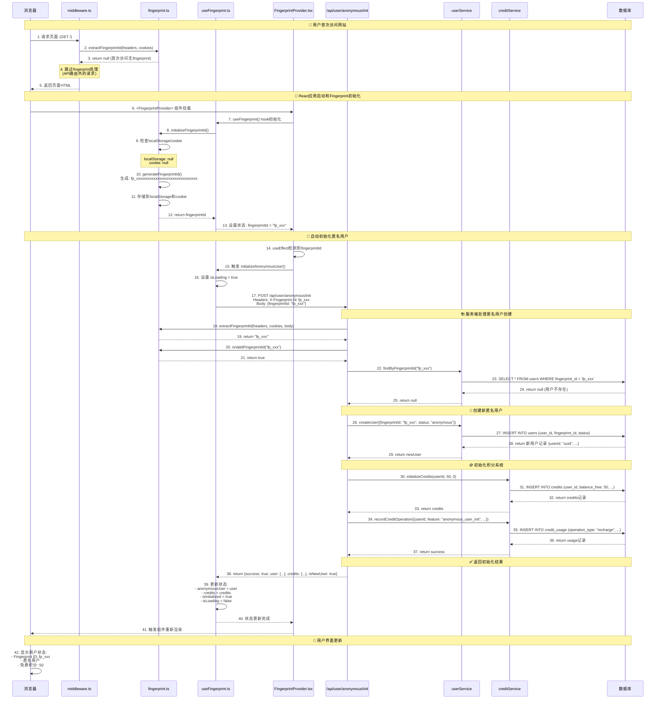
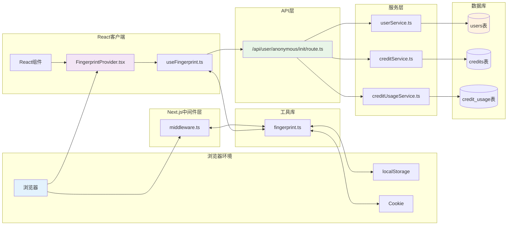

# 匿名用户 Fingerprint 使用指南

本文档说明如何在应用中使用fingerprint功能来管理匿名用户。

## 功能概述

- **自动fingerprint生成**：为每个访问者生成唯一的浏览器指纹ID
- **匿名用户管理**：自动创建匿名用户记录并分配50免费积分
- **数据持久化**：fingerprint存储在localStorage和cookie中
- **中间件集成**：自动在请求中识别和传递fingerprint ID

## 核心组件

### 1. Fingerprint工具库 (`/lib/fingerprint.ts`)

```typescript
import { getOrGenerateFingerprintId, createFingerprintHeaders } from '@/lib/fingerprint';

// 获取或生成fingerprint ID
const fpId = getOrGenerateFingerprintId();

// 创建包含fingerprint的fetch headers
const headers = createFingerprintHeaders();
```

### 2. React Hook (`/lib/hooks/useFingerprint.ts`)

```typescript
import { useFingerprint } from '@/lib/hooks/useFingerprint';

function MyComponent() {
  const { 
    fingerprintId, 
    anonymousUser, 
    credits, 
    isLoading,
    initializeAnonymousUser 
  } = useFingerprint();

  if (isLoading) return <div>Loading...</div>;

  return (
    <div>
      <p>Fingerprint: {fingerprintId}</p>
      <p>User ID: {anonymousUser?.userId}</p>
      <p>Credits: {credits?.totalBalance}</p>
    </div>
  );
}
```

### 3. Context Provider (`/lib/context/FingerprintProvider.tsx`)

```typescript
import { FingerprintProvider, useFingerprintContext } from '@/lib/context/FingerprintProvider';

function App() {
  return (
    <FingerprintProvider autoInitialize={true}>
      <MyApp />
    </FingerprintProvider>
  );
}

function MyApp() {
  const { anonymousUser, credits } = useFingerprintContext();
  // 使用fingerprint数据
}
```

## API端点

### 初始化匿名用户

```bash
# 创建新匿名用户
POST /api/user/anonymous/init
Content-Type: application/json
X-Fingerprint-Id: fp_xxxxxxxxxxxxxxxxxxxxxxxxxxxxxxxx

{
  "fingerprintId": "fp_xxxxxxxxxxxxxxxxxxxxxxxxxxxxxxxx"
}

# 响应
{
  "success": true,
  "user": {
    "userId": "uuid",
    "fingerprintId": "fp_xxx",
    "status": "anonymous",
    "createdAt": "2024-01-01T00:00:00.000Z"
  },
  "credits": {
    "balanceFree": 50,
    "balancePaid": 0,
    "totalBalance": 50
  },
  "isNewUser": true
}
```

### 获取匿名用户信息

```bash
# 获取现有用户信息
GET /api/user/anonymous/init?fingerprintId=fp_xxx
X-Fingerprint-Id: fp_xxxxxxxxxxxxxxxxxxxxxxxxxxxxxxxx
```

## 中间件集成

中间件自动处理fingerprint ID的提取和验证：

```typescript
// middleware.ts 会自动：
// 1. 从请求headers、cookies中提取fingerprint ID
// 2. 在响应中设置fingerprint ID header
// 3. 记录调试日志
```

## 使用场景

### 1. 应用初始化

FingerprintProvider已经集成到应用的layout中：

```typescript
// src/app/[locale]/(home)/layout.tsx - 主页layout
// src/app/[locale]/(clerk)/layout.tsx - Clerk页面layout

return (
  <ClerkProviderClient locale={locale}>
    <FingerprintProvider autoInitialize={true}>
      <HomeLayout {...customeOptions}>
        {children}
      </HomeLayout>
    </FingerprintProvider>
  </ClerkProviderClient>
);
```

**已挂载位置**：
- ✅ **主页路由** (`/[locale]/(home)/*`): 包括首页、博客、法律页面等
- ✅ **Clerk路由** (`/[locale]/(clerk)/*`): 包括登录、注册、用户管理页面
- 🔄 **自动初始化**: `autoInitialize={true}` 用户访问时自动创建匿名用户

### 2. 用户状态显示

应用已提供了 `FingerprintStatus` 组件来显示用户状态：

```typescript
// 使用现成的状态组件
import { FingerprintStatus } from '@/components/FingerprintStatus';

function MyPage() {
  return (
    <div>
      <h1>我的页面</h1>
      <FingerprintStatus />
    </div>
  );
}

// 或者自定义显示
function CustomUserStatus() {
  const { anonymousUser, credits, isLoading } = useFingerprintContext();

  if (isLoading) return <div>初始化中...</div>;

  return (
    <div>
      <h3>用户信息</h3>
      <p>状态: {anonymousUser?.status === 'anonymous' ? '匿名用户' : '注册用户'}</p>
      <p>免费积分: {credits?.balanceFree}</p>
      <p>付费积分: {credits?.balancePaid}</p>
      <p>总积分: {credits?.totalBalance}</p>
    </div>
  );
}
```

**FingerprintStatus组件特性**：
- 🎯 显示完整的用户状态和积分信息
- 🔄 提供刷新和重试按钮
- 🎨 支持深色模式
- ⚡ 实时状态更新
- 🛠️ 错误处理和加载状态

### 3. 功能访问控制

```typescript
function FeatureComponent() {
  const { credits, refreshUserData } = useFingerprintContext();

  const useFeature = async () => {
    if (!credits || credits.totalBalance < 10) {
      alert('积分不足，请注册或购买积分');
      return;
    }

    // 调用需要积分的功能
    await fetch('/api/feature', {
      method: 'POST',
      headers: createFingerprintHeaders(),
      body: JSON.stringify({ action: 'use_feature' })
    });

    // 刷新用户数据
    await refreshUserData();
  };

  return (
    <button onClick={useFeature}>
      使用功能 (消耗10积分)
    </button>
  );
}
```

### 4. 匿名到注册用户转换

当用户决定注册时，Clerk webhook会自动处理匿名用户的升级：

```typescript
// 在Clerk SignUp组件中传递用户数据
function SignUpComponent() {
  const { anonymousUser } = useFingerprintContext();

  return (
    <SignUp
      unsafeMetadata={{
        user_id: anonymousUser?.userId,
        fingerprint_id: anonymousUser?.fingerprintId
      }}
    />
  );
}
```

## 调试工具

在开发环境中，可以使用调试组件查看fingerprint状态：

```typescript
import { FingerprintDebugInfo } from '@/lib/context/FingerprintProvider';

function App() {
  return (
    <div>
      <MyApp />
      <FingerprintDebugInfo /> {/* 只在开发环境显示 */}
    </div>
  );
}
```

## 数据流程详解

### 匿名用户首次访问时序图



### 匿名用户首次访问流程图

```mermaid
flowchart TD
    Start([用户访问网站]) --> CheckBrowser{浏览器环境?}
    
    CheckBrowser -->|否| ServerSide[服务端渲染]
    CheckBrowser -->|是| InitFP[初始化Fingerprint]
    
    ServerSide --> Middleware[middleware.ts处理]
    Middleware --> ExtractFP[提取fingerprint ID]
    ExtractFP --> FPExists{fingerprint存在?}
    FPExists -->|否| SkipFP[跳过fingerprint处理]
    FPExists -->|是| SetHeader[设置响应header]
    SkipFP --> ReturnHTML[返回HTML页面]
    SetHeader --> ReturnHTML
    
    InitFP --> CheckStorage{检查本地存储}
    CheckStorage -->|localStorage有| UseExisting[使用现有fingerprint]
    CheckStorage -->|cookie有| UseExisting
    CheckStorage -->|都没有| Generate[生成新fingerprint ID]
    
    Generate --> GenerateID["生成: fp_ + 32位随机字符"]
    GenerateID --> SaveStorage[保存到localStorage和cookie]
    SaveStorage --> FPReady[fingerprint ID就绪]
    UseExisting --> FPReady
    
    ReturnHTML --> ReactInit[React应用初始化]
    ReactInit --> ProviderMount[FingerprintProvider挂载]
    ProviderMount --> HookInit[useFingerprint初始化]
    HookInit --> FPReady
    
    FPReady --> AutoInit{autoInitialize?}
    AutoInit -->|否| WaitManual[等待手动调用]
    AutoInit -->|是| CheckUser[检查用户是否已存在]
    
    CheckUser --> CallAPI["调用 GET /api/user/anonymous/init"]
    CallAPI --> UserExists{用户存在?}
    UserExists -->|是| LoadUser[加载现有用户数据]
    UserExists -->|否| CreateUser[创建新匿名用户]
    
    LoadUser --> UpdateState[更新React状态]
    
    CreateUser --> ValidateFP[验证fingerprint格式]
    ValidateFP --> Invalid{有效?}
    Invalid -->|否| ErrorState[错误状态]
    Invalid -->|是| CreateUserRecord[创建用户记录]
    
    CreateUserRecord --> DBInsert["数据库插入:\nusers表 (user_id, fingerprint_id, status)"]
    DBInsert --> InitCredits[初始化积分]
    InitCredits --> CreditInsert["数据库插入:\ncredits表 (balance_free: 50)"]
    CreditInsert --> RecordUsage[记录积分操作]
    RecordUsage --> UsageInsert["数据库插入:\ncredit_usage表 (recharge, free)"]
    UsageInsert --> Success[创建成功]
    
    Success --> UpdateState
    UpdateState --> RenderUI[渲染用户界面]
    RenderUI --> ShowStatus["显示:\n- Fingerprint ID\n- 匿名用户状态\n- 50免费积分"]
    
    WaitManual --> ManualTrigger[手动调用initializeAnonymousUser]
    ManualTrigger --> CheckUser
    
    ErrorState --> ShowError[显示错误信息]
    
    style Start fill:#e1f5fe
    style FPReady fill:#f3e5f5
    style Success fill:#e8f5e8
    style ShowStatus fill:#fff3e0
    style ErrorState fill:#ffebee
```



### 核心文件交互图



### 关键代码执行顺序

1. **浏览器访问** (`/` 路径)
2. **middleware.ts:21** - `handleFingerprintId()` 尝试提取fingerprint
3. **fingerprint.ts:131** - `extractFingerprintId()` 检查headers/cookies
4. **React渲染** - 页面组件开始渲染
5. **FingerprintProvider.tsx:45** - Provider组件挂载
6. **useFingerprint.ts:140** - Hook初始化，调用`checkExistingUser()`
7. **fingerprint.ts:47** - `getOrGenerateFingerprintId()` 生成新ID
8. **fingerprint.ts:21** - `generateFingerprintId()` 创建唯一ID
9. **useFingerprint.ts:164** - 自动调用`initializeAnonymousUser()`
10. **route.ts:17** - API接收POST请求初始化用户
11. **userService.ts:17** - 创建新用户记录
12. **creditService.ts:14** - 初始化50免费积分
13. **creditUsageService.ts:40** - 记录积分充值操作
14. **useFingerprint.ts:113** - 更新React状态
15. **界面渲染** - 显示匿名用户状态和积分信息

## 数据流程总结

1. **首次访问**：
   - 生成fingerprint ID
   - 调用 `/api/user/anonymous/init` 创建匿名用户
   - 分配50免费积分

2. **再次访问**：
   - 从localStorage/cookie获取fingerprint ID
   - 调用 `/api/user/anonymous/init` 获取现有用户数据

3. **用户注册**：
   - Clerk webhook接收用户创建事件
   - 根据传递的user_id升级匿名用户为注册用户

4. **用户注销**：
   - Clerk webhook接收用户删除事件
   - 备份并删除用户数据
   - 用户重新成为匿名状态

## 安全考虑

- Fingerprint ID只用于匿名用户识别，不包含敏感信息
- 每个fingerprint限制分配的免费积分，防止滥用
- 支持GDPR合规的用户数据删除
- 所有API请求都经过适当的验证和错误处理

## 性能优化

- Fingerprint ID存储在localStorage和cookie中，减少重复生成
- 中间件只在必要时处理fingerprint逻辑
- React Context提供缓存的用户数据，避免重复API调用
- 懒加载用户数据，只在需要时初始化