# 订阅与积分系统产研设计文档 v1.0

## 1. 概述

本文档详细描述了一个与Stripe支付处理集成的订阅与积分系统的全面设计。该系统旨在为用户提供无缝的订阅服务、积分管理和支付体验，确保可扩展性、安全性和可维护性。设计涵盖了用户操作、数据模型、数据流、用户场景和系统时序，确保清晰度、专业性和鲁棒性。

### 1.1 系统目标

- 使用户能够通过Stripe订阅计划或购买一次性积分包
- 提供用户友好的界面，用于管理订阅和查看积分余额
- 使用Fingerprint确保用户（包括匿名用户）的安全识别
- 支持灵活的订阅管理（自动续费、取消、升级、附加包）
- 维护详细的交易和积分使用历史记录
- 设计可扩展的数据模型和清晰的数据流，确保可靠性和性能
- 支持匿名用户到注册用户的完整生命周期管理
  
### 1.2 里程碑

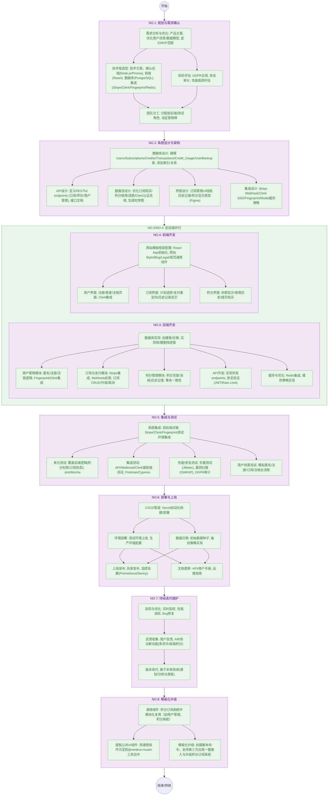
```mermaid
flowchart TB
    classDef phase fill:#F3E5F5,stroke:#AC62FD,color:#4A148C;
    classDef task fill:#E8F5E9,stroke:#66BB6A,color:#2E7D32;
    classDef parallel fill:#E8F5E9,stroke:#66BB6A,color:#2E7D32;

    %% NO.1: 规划与需求确认
    subgraph P1["NO.1: 规划与需求确认"]
        direction TB
        T1A["需求分析与优化: 产品方案, 优化用户场景/数据模型, 定义MVP范围"]:::task
        T1B["技术栈选型: 技术方案，确认后端(Node.js/Prisma), 前端(React), 数据库(PostgreSQL), 集成(Stripe/Clerk/Fingerprint/Redis)"]:::task
        T1C["风险评估: GDPR合规, 安全审计, 性能瓶颈评估"]:::task
        T1D["团队分工: 分配前后端/测试角色, 设定里程碑"]:::task
        T1A --> T1B & T1C
        T1B & T1C --> T1D
    end
    P1:::phase

    %% NO.2: 系统设计与架构
    subgraph P2["NO.2: 系统设计与架构"]
        direction TB
        T2A["数据库设计: 建模Users/Subscriptions/Credits/Transactions/Credit_Usage/UserBackup表, 添加索引/关系"]:::task
        T2B["API设计: 定义RESTful endpoints (订阅/积分/用户管理), 接口文档"]:::task
        T2C["数据流设计: 优化订阅购买/积分使用/退款/Clerk认证流程, 生成时序图"]:::task
        T2D["界面设计: 订阅管理UI线框, 历史记录/积分显示原型 (Figma)"]:::task
        T2E["集成设计: Stripe Webhook/Clerk SSO/Fingerprint/Redis缓存策略"]:::task
        T2A --> T2B & T2C & T2D & T2E
    end
    P2:::phase

    %% NO.3: 后端开发 与 NO.4: 前端开发 (并行)
    subgraph P34["NO.3/NO.4: 前后端并行"]
        direction LR
        subgraph P3["NO.3: 后端开发"]
            direction TB
            T3A["数据库实现: 创建表/迁移, 实现软/硬删除逻辑"]:::task
            T3B["用户管理模块: 匿名/注册/注销逻辑, Fingerprint/Clerk集成"]:::task
            T3C["订阅与支付模块: Stripe集成, Webhook处理, 订阅CRUD/升级/取消"]:::task
            T3D["积分管理模块: 积分充值/消耗/历史记录, 事务一致性"]:::task
            T3E["API开发: 实现所有endpoints, 安全验证(JWT/Rate Limit)"]:::task
            T3F["缓存与优化: Redis集成, 缓存策略实现"]:::task
            T3A --> T3B & T3C & T3D & T3E & T3F
        end
        P3:::phase

        subgraph P4["NO.4: 前端开发"]
            direction TB
            T4A["网站模板框架配置: React App初始化, 网站Style/Blog/Legal/首页通用组件"]:::task
            T4B["用户界面: 注册/登录/注销页面, Clerk集成"]:::task
            T4C["订阅界面: 计划选择/支付重定向/历史记录显示"]:::task
            T4D["积分界面: 余额显示/使用历史/提示购买"]:::task
            T4A --> T4B & T4C & T4D
        end
        P4:::phase
    end
    P34:::parallel

    %% NO.5: 集成与测试
    subgraph P5["NO.5: 集成与测试"]
        direction TB
        T5A["系统集成: 前后端对接, Stripe/Clerk/Fingerprint测试环境集成"]:::task
        T5B["单元测试: 覆盖后端逻辑(积分扣除/订阅状态), Jest/Mocha"]:::task
        T5C["集成测试: API/Webhook/Clerk端到端测试, Postman/Cypress"]:::task
        T5D["性能/安全测试: 负载测试(JMeter), 漏洞扫描(OWASP), GDPR审计"]:::task
        T5E["用户场景测试: 模拟匿名/注册/订阅/注销全流程"]:::task
        T5A --> T5B & T5C & T5D & T5E
    end
    P5:::phase

    %% NO.6: 部署与上线
    subgraph P6["NO.6: 部署与上线"]
        direction TB
        T6A["CI/CD管道: Vercel自动化构建/部署"]:::task
        T6B["环境部署: 测试环境上线, 生产环境配置"]:::task
        T6C["数据迁移: 初始数据种子, 备份策略实现"]:::task
        T6D["上线发布: 灰度发布, 监控设置(Prometheus/Sentry)"]:::task
        T6E["文档更新: API/用户手册, 运维指南"]:::task
        T6A --> T6B & T6C
        T6B & T6C --> T6D & T6E
    end
    P6:::phase

    %% NO.7: 维护与迭代
    subgraph P7["NO.7: 持续迭代维护"]
        direction TB
        T7A["监控与优化: 实时监控, 性能调优, Bug修复"]:::task
        T7B["反馈收集: 用户反馈, A/B测试新功能(多货币/促销积分)"]:::task
        T7C["版本迭代: 基于未来改进(通知/分析仪表板)"]:::task
        T7A --> T7B --> T7C
    end
    P7:::phase

    %% NO.8: 模板化升级
    subgraph P8["NO.8: 模板化升级"]
        direction TB
        T8A["通用组件: 积分订阅系统中模块化复用（如用户管理、积分系统）"]:::task
        T8B["提取公共UI组件: 将通用组件沉淀到@windrun-huaiin工具包中"]:::task
        T8C["模板化升级: 创建脚本命令，支持第三方应用一键接入与升级积分订阅系统"]:::task
        T8A --> T8B & T8C
    end
    P8:::phase

    %% 阶段连接
    Start((开始)) --> P1
    P1 --> P2
    P2 --> P34
    P34 --> P5
    P5 --> P6
    P6 --> P7
    P7 --> P8
    P8 --> End((结束/持续))
```

---

## 2. 用户场景与生命周期

### 2.1 匿名用户与注册用户场景及数据流程设计

#### 2.1.1 用户场景分析

以下场景涵盖了匿名用户和注册用户的完整生命周期，重点关注从匿名用户到注册用户、注销后再次成为匿名用户，以及再次注册的流程。

##### 场景 1：匿名用户初次访问
- **描述**：用户首次访问平台，未注册，系统通过 Fingerprint 识别其设备。
- **流程**：
  1. 用户访问平台，系统通过 Fingerprint 生成唯一的 `fingerprint_id`。
  2. 系统在 `Users` 表中创建一条记录，生成唯一的 `user_id`, `email` 字段为空，`fingerprint_id` 记录设备标识。
  3. 系统分配 50 个免费积分，更新 `Credits` 表（`user_id` 关联，`balance_free = 50`, `total_free_limit = 50`）。
  4. 在 `Credit_Usage` 表中插入记录，`operation_type` 为 `recharge`, `credit_type` 为 `free`。
  5. 用户使用免费积分访问功能，系统记录在 `Credit_Usage` 表（`operation_type` 为 `consume`, `credit_type` 为 `free`）。
  6. 如果积分耗尽，提示用户注册或购买积分。
- **结果**：匿名用户获得 `user_id` 和有限的免费积分，数据已与 `fingerprint_id` 关联。

##### 场景 2：匿名用户注册
- **描述**：匿名用户决定注册为正式用户。
- **流程**：
  1. 用户提交注册信息（电子邮件、密码或其他 SSO 方法）。
  2. 系统验证 `fingerprint_id`，找到对应的 `user_id`。
  3. 更新 `Users` 表，将 `email` 和其他注册信息（如密码哈希）写入已有记录。
  4. 用户可选择订阅计划或购买积分，触发 `Subscriptions` 或 `Transactions` 表更新。
- **结果**：匿名用户转换为注册用户，保留原有 `user_id`，数据连续性得以保持。

##### 场景 3：注册用户登录
- **描述**：注册用户通过电子邮件和密码或 SSO 登录。
- **流程**：
  1. 用户提交登录凭证（电子邮件/密码或 SSO 令牌）。
  2. 系统验证凭证，查找 `Users` 表中匹配的 `user_id` 和 `email`。
  3. 如果设备不同，系统可能更新 `fingerprint_id`（或记录多设备登录）。
  4. 系统返回用户数据（如积分余额、订阅状态），从 `Credits` 和 `Subscriptions` 表查询。
- **结果**：用户获得完整功能访问权限，界面显示其积分和订阅信息。

##### 场景 4：用户注销（删除账户）
- **描述**：注册用户选择删除账户，恢复匿名状态。
- **流程**：
  1. 用户通过界面发起账户删除请求。
  2. 系统验证用户身份（可能需要密码或 SSO 验证）。
  3. 系统标记 `Users` 表中的记录为已删除（软删除，设置 `email = NULL`，保留 `user_id` 和 `fingerprint_id`），或完全删除记录（硬删除，视 GDPR 要求）。
  4. 关联数据处理：
     - 删除或归档 `Subscriptions`、`Credits`、`Transactions` 和 `Credit_Usage` 表中的记录。
     - 如果保留 `user_id`，可在 `Credits` 表中分配新的免费积分。
  5. 系统为用户生成新的 `fingerprint_id`（如适用），重新作为匿名用户。
- **结果**：用户恢复匿名状态，数据根据策略保留或删除。

##### 场景 5：匿名用户再次注册
- **描述**：注销后的匿名用户再次注册。
- **流程**：
  1. 用户访问平台，系统识别 `fingerprint_id`。
  2. 如果 `user_id` 保留（软删除），系统可复用原有 `user_id` 并更新 `email`。
  3. 如果 `user_id` 已删除（硬删除），系统生成新的 `user_id` 和 `fingerprint_id`。
  4. 用户提交注册信息，流程同场景 2。
- **结果**：用户重新成为注册用户，数据连续性取决于删除策略（软删除或硬删除）。

#### 2.1.2 匿名用户场景

匿名用户通过Fingerprint识别，防止滥用（例如，过度使用免费积分）。他们对功能访问受限，但可在注册前体验系统。

- **场景1：使用免费积分探索功能**
  - **描述**：匿名用户访问平台，获得免费积分，使用基本功能。
  - **步骤**：
    1. 用户访问平台，系统分配Fingerprint ID。
    2. 系统分配50个免费积分（通过Fingerprint限制，防止滥用）。
    3. 用户尝试使用功能（例如，API调用，消耗10积分）。
    4. 系统从免费余额中扣除积分并记录使用情况。
    5. 如果积分耗尽，提示用户注册或购买积分。
  - **结果**：用户体验平台，但被鼓励注册以获得完整访问权限。

- **场景2：尝试订阅**
  - **描述**：匿名用户尝试订阅付费计划，但需先注册。
  - **步骤**：
    1. 用户选择计划（例如，专业版计划）。
    2. 系统提示用户注册或登录。
    3. 用户完成注册，将Fingerprint ID关联到`user_id`。
    4. 用户被重定向到Stripe的结账页面完成支付。
    5. 支付成功后，系统分配积分并更新订阅状态。
  - **结果**：用户成为注册用户，拥有活跃订阅。

#### 2.1.3 登录用户场景

登录用户拥有对所有功能的完整访问权限，包括订阅管理、积分购买和历史记录跟踪。

- **场景1：订阅计划**
  - **描述**：登录用户订阅月度计划。
  - **步骤**：
    1. 用户导航到订阅管理界面。
    2. 用户选择专业版计划（￥140/月，250积分）。
    3. 系统创建Stripe Checkout Session并将用户重定向到Stripe。
    4. 用户完成支付；Stripe向后端发送Webhook。
    5. 系统更新订阅状态，分配250积分并记录交易。
  - **结果**：用户获得高级功能访问权限和每月积分。

- **场景2：升级订阅**
  - **描述**：用户从基础版升级到专业版计划。
  - **步骤**：
    1. 用户在订阅界面选择专业版计划。
    2. 系统通过Stripe计算按比例分配费用并创建新Checkout Session。
    3. 用户完成按比例分配的支付。
    4. Stripe发送Webhook；系统将订阅更新为专业版并添加额外积分。
  - **结果**：用户享受增强的功能和增加的积分分配。

- **场景3：购买一次性积分**
  - **描述**：用户购买附加积分包。
  - **步骤**：
    1. 用户选择100积分附加包（￥35）。
    2. 系统创建一次性Stripe Checkout Session。
    3. 用户完成支付；Stripe发送Webhook。
    4. 系统将100个付费积分添加到用户余额并记录交易。
  - **结果**：用户获得额外的即时使用积分。

- **场景4：取消订阅**
  - **描述**：用户取消订阅。
  - **步骤**：
    1. 用户在界面点击"取消订阅"。
    2. 系统向Stripe发送取消请求。
    3. Stripe确认取消；系统更新订阅状态为"已取消"。
    4. 用户在计费周期结束前保留访问权限。
  - **结果**：用户的订阅终止，不再产生费用。

- **场景5：查看历史记录**
  - **描述**：用户查看交易和积分使用历史。
  - **步骤**：
    1. 用户导航到历史记录选项卡。
    2. 系统获取交易记录（例如，支付、退款）和积分使用日志。
    3. 界面显示包含时间戳、金额和使用功能的数据表。
  - **结果**：用户获得账户活动的透明度。

### 2.2 用户操作场景

#### 2.2.1 用户注册与识别
- **匿名用户**：通过Fingerprint（基于设备的标识符）识别，防止滥用（例如，过度使用免费积分）。
- **注册用户**：用户可通过电子邮件和密码注册，或使用SSO（例如Google、Apple）。注册用户分配唯一的`clerk_user_id`。
- **场景**：
  - 新用户访问平台，系统分配Fingerprint ID。
  - 用户无需注册即可使用有限的免费积分。
  - 要访问付费功能，用户必须注册或登录，将Fingerprint ID关联到`clerk_user_id`。

#### 2.2.2 订阅管理
- **订阅计划**：用户可选择多种计划（例如，基础版、专业版、企业版），具有不同的积分分配和定价。
- **操作**：
  - **订阅**：用户选择计划并被重定向到Stripe的结账页面进行支付。
  - **自动续费**：订阅默认自动续费，除非用户取消。
  - **升级/降级**：用户可切换计划，Stripe处理按比例分配费用。
  - **取消**：用户可取消订阅，取消在计费周期结束时生效。
  - **附加包**：用户可购买额外的积分包，而无需更改计划。
- **场景**：
  - 用户选择专业版计划，通过Stripe完成支付，获得每月积分。
  - 在计费周期中，用户购买额外的积分包以增加使用量。
  - 用户随后升级到企业版计划，Stripe处理按比例分配费用。

#### 2.2.3 积分使用
- **积分系统**：积分用于访问高级功能（例如，API调用、高级工具）。
- **免费积分与付费积分**：
  - 新用户获得免费积分（通过Fingerprint限制，防止滥用）。
  - 付费积分根据订阅计划或一次性购买分配。
- **场景**：
  - 用户为API请求消耗积分。
  - 系统从用户余额中扣除积分，优先使用付费积分。
  - 如果积分耗尽，提示用户购买更多积分或升级计划。

#### 2.2.4 历史记录与报告
- **交易历史**：用户可查看过去的支付记录，包括发票和收据。
- **积分使用历史**：用户可查看积分使用的详细日志（例如，使用功能、时间戳、消耗积分）。
- **场景**：
  - 用户导航到历史页面，查看过去三个月的积分使用和支付记录。

#### 2.2.5 退款与争议
- **退款流程**：用户可为符合条件的交易（例如，7天内）请求退款。
- **场景**：
  - 用户为一次性积分购买请求退款。系统通过Stripe处理退款并更新积分余额。

---

## 3. 数据模型设计

### 3.1 核心数据表

#### 用户表 (Users)
存储用户信息，包括通过Fingerprint识别的匿名用户和Clerk注册用户。

| 列名                | 类型         | 描述                                    |
|---------------------|--------------|----------------------------------------|
| `id`                | BigInt       | 主键                                    |
| `user_id`           | UUID         | 用户ID，唯一用户标识符，用于关联其他表   |
| `fingerprint_id`    | String       | 匿名用户的Fingerprint标识符            |
| `clerk_user_id`     | String       | Clerk用户ID，注册用户必填，匿名用户为空 |
| `email`             | String       | 用户电子邮件（注册用户必填，匿名用户为空） |
| `status`            | Enum         | 状态： anonymous、registered、frozen、*deleted*等             |
| `created_at`        | Timestamp    | 账户创建时间戳                        |
| `updated_at`        | Timestamp    | 最后更新时间戳                        |

#### 订阅表 (Subscriptions)
跟踪活跃订阅及其详细信息。

| 列名                | 类型         | 描述                                    |
|---------------------|--------------|----------------------------------------|
| `id`                | BigInt       | 主键                                   |
| `user_id`           | UUID         | 外键，引用`Users`表                     |
| `pay_subscription_id` | String   | 交易厂商订阅ID (sub_xxx)                |
| `price_id`          | String       | 交易厂商价格ID (price_xxx)               |
| `price_name`        | String       | 交易厂商价格名称（例如，Basic、Pro）           |
| `status`            | Enum         | 状态：活跃、已取消、逾期等             |
| `credits_allocated` | Integer      | 每个计费周期分配的积分                 |
| `sub_period_start`  | Timestamp    | 订阅周期开始时间戳                    |
| `sub_period_end`    | Timestamp    | 订阅周期结束时间戳                    |
| `deleted`        | Enum    | 删除：0否、1是, 默认0                      | 
| `created_at`        | Timestamp    | 记录创建时间戳                        |
| `updated_at`        | Timestamp    | 最后更新时间戳                        |

#### 积分表 (Credits)
管理用户积分余额。

| 列名                | 类型         | 描述                                    |
|---------------------|--------------|----------------------------------------|
| `id`                | BigInt       | 主键，唯一积分记录ID                   |
| `user_id`           | UUID         | 外键，引用`Users`表                     |
| `balance_free`      | Integer      | 免费积分余额                          |
| `total_free_limit`  | Integer      | 免费积分总量                          |
| `balance_paid`      | Integer      | 付费积分余额                          |
| `total_paid_limit`  | Integer      | 付费积分总量                          |
| `created_at`        | Timestamp    | 记录创建时间戳                        |
| `updated_at`        | Timestamp    | 最后更新时间戳                        |

#### 订单交易表 (Transactions)
记录支付交易，包括订阅和一次性购买。

| 列名                | 类型         | 描述                                    |
|---------------------|--------------|----------------------------------------|
| `id`                | BigInt       | 主键，唯一交易ID                       |
| `user_id`           | UUID         | 外键，引用`Users`表                     |
| `order_id`          | String       | 订单ID，唯一订单标识符                 |
| `order_status`            | Enum         | 状态：已创建created、已支付success、已退款refunded、已取消canceled、失败failed     |
| `order_created_at`        | Timestamp    | 订单创建时间戳                        |
| `order_expired_at`        | Timestamp    | 订单过期时间戳                        |
| `order_updated_at`        | Timestamp    | 订单最后更新时间戳                        |
| `pay_supplier`    | Enum       | 交易厂商类型：Stripe、Apple、Paypal                |
| `pay_transaction_id`    | String       | 交易ID，唯一交易标识符                 |
| `pay_subscription_id` | String   | 交易厂商订阅ID (sub_xxx)                |
| `pay_session_id` | String       | 交易厂商Checkout Session ID (cs_xxx)    |
| `pay_invoice_id` | String       | 交易厂商发票ID (in_xxx)                 |
| `price_id`          | String       | 交易厂商价格ID (price_xxx)               |
| `price_name`        | String       | 价格名称（例如，Basic、Pro）           |
| `sub_interval_count`| Integer      | 订阅间隔计数（例如，1、3、6、12个月）     |
| `sub_cycle_anchor`  | Timestamp       | 订阅周期锚点（例如，start_of_period） |
| `amount`            | DECIMAL(10,2)       | 支付金额                              |
| `currency`          | String       | 货币代码（例如，USD、CNY）             |
| `type`              | Enum         | 类型：订阅、一次性                     |
| `credits_granted`   | Integer      | 此交易授予的积分                      |
| `sub_period_start`  | Timestamp    | 订阅周期开始时间戳                    |
| `sub_period_end`    | Timestamp    | 订阅周期结束时间戳                    |
| `order_detail`      | String       | 订单详情（例如，订阅、一次性购买）     |
| `paid_at`           | Timestamp    | 支付时间戳                            |
| `paid_email`        | String       | 支付邮箱                            |
| `paid_detail`       | String       | 支付详情（例如，订阅、一次性购买）     |
| `deleted`        | Enum    | 删除：0否、1是, 默认0                      | 
| `pay_created_at`        | Timestamp    | 交易创建时间戳                        |
| `pay_updated_at`        | Timestamp    | 交易最后更新时间戳                        |

#### 积分使用表 (Credit Usage)
跟踪积分的消耗情况。

| 列名                | 类型         | 描述                                    |
|---------------------|--------------|----------------------------------------|
| `id`                | BigInt       | 主键，唯一使用记录ID                   |
| `user_id`           | UUID         | 外键，引用`Users`表                     |
| `feature`           | String       | 使用的功能（例如，API调用、工具）      |
| `order_id`          | String       | 订单ID，订单标识符可为null                 |
| `credit_type`       | Enum         | 积分类型：free、paid                    |
| `operation_type`    | Enum         | 操作类型：consume、recharge、freeze、unfreeze                |
| `credits_used`      | Integer      | 消耗的积分数量                        |
| `deleted`        | Enum    | 删除：0否、1是, 默认0                      | 
| `created_at`        | Timestamp    | 使用时间戳                            |

#### 用户备份表 (UserBackup)
存储用户注销时的备份数据，用于数据恢复和审计。

| 列名                | 类型         | 描述                                    |
|---------------------|--------------|----------------------------------------|
| `id`                | BigInt       | 主键，唯一备份记录ID                   |
| `original_user_id`  | UUID         | 原始用户ID                             |
| `fingerprint_id`    | String       | 设备指纹ID                             |
| `clerk_user_id`     | String       | Clerk用户ID                            |
| `email`             | String       | 用户邮箱                               |
| `status`            | String       | 用户状态                               |
| `backup_data`       | JSON         | 完整的用户数据备份（包括积分、订阅等） |
| `deleted`        | Enum    | 删除：0否、1是, 默认0                      | 
| `deleted_at`        | Timestamp    | 删除时间戳                            |
| `created_at`        | Timestamp    | 备份创建时间戳                        |

### 3.2 索引
- **用户表**：主键 (`id`), `user_id` 唯一索引，`fingerprint_id` 索引，`clerk_user_id` 唯一索引，`email` 索引。
- **订阅表**：主键 (`id`), `user_id` 索引。
- **积分表**：主键 (`id`), `user_id` 索引。
- **交易表**：主键 (`id`), `user_id`、`pay_session_id`、`pay_invoice_id` 索引。
- **积分使用表**：主键 (`id`), `user_id`索引。
- **用户备份表**：主键 (`id`), `original_user_id` 索引，`fingerprint_id` 索引，`clerk_user_id` 索引。

### 3.3 数据表关联关系

#### 3.3.1 数据表及关联关系

1. **用户表 (Users)**
   - **描述**: 存储用户（包括匿名用户和注册用户）的信息。
   - **关联关系**:
     - **与订阅表 (Subscriptions)**: 一对多
       - 一个用户可以有多个订阅（例如，历史订阅记录或同时订阅多个服务）。
       - **关联字段**: `Users.user_id` (主键) 与 `Subscriptions.user_id` (外键)。
     - **与积分表 (Credits)**: 一对一
       - 每个用户有且仅有一个积分余额记录，用于跟踪免费和付费积分。
       - **关联字段**: `Users.user_id` (主键) 与 `Credits.user_id` (外键)。
     - **与交易表 (Transactions)**: 一对多
       - 一个用户可以有多个交易记录（例如，多次订阅或购买积分包）。
       - **关联字段**: `Users.user_id` (主键) 与 `Transactions.user_id` (外键)。
     - **与积分使用表 (Credit Usage)**: 一对多
       - 一个用户可以有多次积分使用记录。
       - **关联字段**: `Users.user_id` (主键) 与 `Credit Usage.user_id` (外键)。

2. **订阅表 (Subscriptions)**
   - **描述**: 跟踪用户的订阅信息。
   - **关联关系**:
     - **与用户表 (Users)**: 多对一
       - 每个订阅属于一个用户。
       - **关联字段**: `Subscriptions.user_id` (外键) 与 `Users.user_id` (主键)。
     - **与交易表 (Transactions)**: 一对多（间接关联）
       - 订阅可能涉及多个交易（例如，续费、升级等），但这种关联通常通过 Stripe 的 `pay_subscription_id` 间接建立，`Transactions` 表记录与订阅相关的支付。
       - **关联字段**: `Subscriptions.pay_subscription_id` 与 `Transactions.pay_subscription_id`。

3. **积分表 (Credits)**
   - **描述**: 管理用户的积分余额。
   - **关联关系**:
     - **与用户表 (Users)**: 一对一
       - 每个用户有一个积分余额记录。
       - **关联字段**: `Credits.user_id` (外键) 与 `Users.user_id` (主键)。
     - **与交易表 (Transactions)**: 间接关联
       - 积分余额可能通过交易增加（例如，订阅或一次性购买），但不直接通过外键关联，而是通过业务逻辑（如 `Transactions.credits_granted` 影响 `Credits.balance_paid`）。
       - **关联字段**: 无直接外键，依赖业务逻辑。

4. **交易表 (Transactions)**
   - **描述**: 记录支付交易（订阅或一次性购买）。
   - **关联关系**:
     - **与用户表 (Users)**: 多对一
       - 每个交易属于一个用户。
       - **关联字段**: `Transactions.user_id` (外键) 与 `Users.user_id` (主键)。
     - **与订阅表 (Subscriptions)**: 多对一（间接）
       - 交易可能与订阅相关，记录订阅的支付或续费。
       - **关联字段**: `Transactions.pay_subscription_id` 与 `Subscriptions.pay_subscription_id`。

5. **积分使用表 (Credit Usage)**
   - **描述**: 跟踪用户如何消耗和充值积分。
   - **关联关系**:
     - **与用户表 (Users)**: 多对一
       - 每次积分操作记录属于一个用户。
       - **关联字段**: `Credit Usage.user_id` (外键) 与 `Users.user_id` (主键)。
     - **与交易表 (Transactions)**: 间接关联
       - 当`operation_type`为`recharge`且`credit_type`为`paid`时，积分充值来源于交易。
       - **关联逻辑**: 通过业务逻辑关联，充值积分数量来自`Transactions.credits_granted`。

#### 3.3.2 关联关系总结

| 表名                | 关联表              | 关联类型   | 关联字段                              |
|---------------------|---------------------|------------|---------------------------------------|
| Users               | Subscriptions       | 一对多     | `Users.user_id` -> `Subscriptions.user_id` |
| Users               | Credits             | 一对一     | `Users.user_id` -> `Credits.user_id`   |
| Users               | Transactions        | 一对多     | `Users.user_id` -> `Transactions.user_id` |
| Users               | Credit Usage        | 一对多     | `Users.user_id` -> `Credit Usage.user_id` |
| Subscriptions       | Users               | 多对一     | `Subscriptions.user_id` -> `Users.user_id` |
| Subscriptions       | Transactions        | 一对多（间接） | `Subscriptions.pay_subscription_id` -> `Transactions.pay_subscription_id`  |
| Credits             | Users               | 一对一     | `Credits.user_id` -> `Users.user_id`   |
| Transactions        | Users               | 多对一     | `Transactions.user_id` -> `Users.user_id` |
| Credit Usage        | Users               | 多对一     | `Credit Usage.user_id` -> `Users.user_id` |
| Credit Usage        | Transactions        | 多对一（间接） | 通过业务逻辑关联，充值积分来自`Transactions.credits_granted` |

#### 3.3.3 数据表结构图

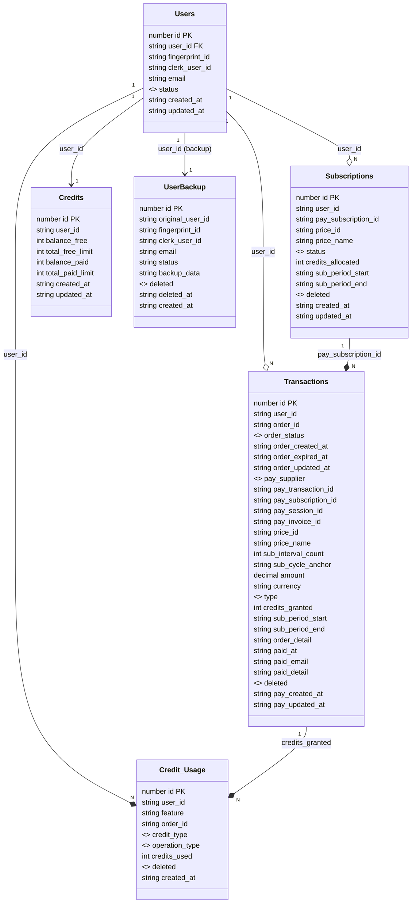
```mermaid
classDiagram
    class Users {
        number id PK
        string user_id FK
        string fingerprint_id
        string clerk_user_id
        string email
        <<enumeration>> status
        string created_at
        string updated_at
    }

    class Subscriptions {
        number id PK
        string user_id
        string pay_subscription_id
        string price_id
        string price_name
        <<enumeration>> status
        int credits_allocated
        string sub_period_start
        string sub_period_end
        <<enumeration>> deleted
        string created_at
        string updated_at
    }

    class Credits {
        number id PK
        string user_id
        int balance_free
        int total_free_limit
        int balance_paid
        int total_paid_limit
        string created_at
        string updated_at
    }

    class Transactions {
        number id PK
        string user_id
        string order_id
        <<enumeration>> order_status
        string order_created_at
        string order_expired_at
        string order_updated_at
        <<enumeration>> pay_supplier
        string pay_transaction_id
        string pay_subscription_id
        string pay_session_id
        string pay_invoice_id
        string price_id
        string price_name
        int sub_interval_count
        string sub_cycle_anchor
        decimal amount
        string currency
        <<enumeration>> type
        int credits_granted
        string sub_period_start
        string sub_period_end
        string order_detail
        string paid_at
        string paid_email
        string paid_detail
        <<enumeration>> deleted
        string pay_created_at
        string pay_updated_at
    }

    class Credit_Usage {
        number id PK
        string user_id
        string feature
        string order_id
        <<enumeration>> credit_type
        <<enumeration>> operation_type
        int credits_used
        <<enumeration>> deleted
        string created_at
    }

    class UserBackup {
        number id PK
        string original_user_id
        string fingerprint_id
        string clerk_user_id
        string email
        string status
        string backup_data
        <<enumeration>> deleted
        string deleted_at
        string created_at
    }

    Users "1" --o "N" Subscriptions : user_id
    Users "1" --> "1" Credits : user_id
    Users "1" --o "N" Transactions : user_id
    Users "1" --* "N" Credit_Usage : user_id
    Users "1" --> "1" UserBackup : user_id (backup)
    Subscriptions "1" --* "N" Transactions : pay_subscription_id
    Transactions "1" --* "N" Credit_Usage : credits_granted
```

### 3.4 数据模型表主题与优势分析

#### 3.4.1 各表主题含义分析

##### 3.4.1.1 用户表 (Users) - 用户身份管理
**主题含义**：用户身份识别与生命周期管理
- **核心职责**：统一管理匿名用户和注册用户身份
- **关键设计**：通过`fingerprint_id`实现匿名用户识别，通过`email`实现注册用户管理
- **业务价值**：支持用户从匿名到注册的无缝转换，保持数据连续性

##### 3.4.1.2 订阅表 (Subscriptions) - 订阅服务管理
**主题含义**：订阅服务的生命周期管理
- **核心职责**：跟踪用户的订阅状态、计费周期和积分分配
- **关键设计**：与Stripe深度集成，通过`price_id`和`price_name`管理订阅计划
- **业务价值**：支持灵活的订阅管理（升级、降级、取消、续费）

##### 3.4.1.3 积分表 (Credits) - 积分余额管理
**主题含义**：用户积分资产的管理
- **核心职责**：维护用户的积分余额和总量限制
- **关键设计**：区分免费积分和付费积分，设置总量限制防止滥用
- **业务价值**：为用户提供透明的积分管理，支持积分消耗和充值

##### 3.4.1.4 订单交易表 (Transactions) - 订单交易记录
**主题含义**：完整的订单交易生命周期管理
- **核心职责**：记录所有支付交易，包括订单状态、支付详情、积分授予
- **关键设计**：完整的订单状态流转，详细的支付信息记录
- **业务价值**：提供完整的交易审计和财务对账能力

##### 3.4.1.5 积分使用表 (Credit Usage) - 积分操作审计
**主题含义**：积分操作的完整审计追踪
- **核心职责**：记录所有积分消耗和充值操作
- **关键设计**：通过`operation_type`和`credit_type`区分操作类型
- **业务价值**：提供积分使用的完整审计和数据分析能力

#### 3.4.2 设计优势分析

##### 3.4.2.1 数据完整性
- **用户身份连续性**：通过`fingerprint_id`实现匿名到注册的无缝转换
- **交易完整性**：完整的订单状态流转和支付信息记录
- **积分审计完整性**：所有积分操作都有详细记录

##### 3.4.2.2 业务灵活性
- **订阅管理灵活**：支持多种订阅计划和计费周期
- **积分管理灵活**：支持免费和付费积分的混合使用
- **支付方式灵活**：与Stripe深度集成，支持多种支付方式

##### 3.4.2.3 系统可扩展性
- **字段设计合理**：预留了足够的扩展字段
- **关联关系清晰**：表间关联关系设计合理
- **索引策略完善**：关键字段都有索引支持

### 3.5 表数据运转架构图

#### 3.5.1 核心业务流程架构

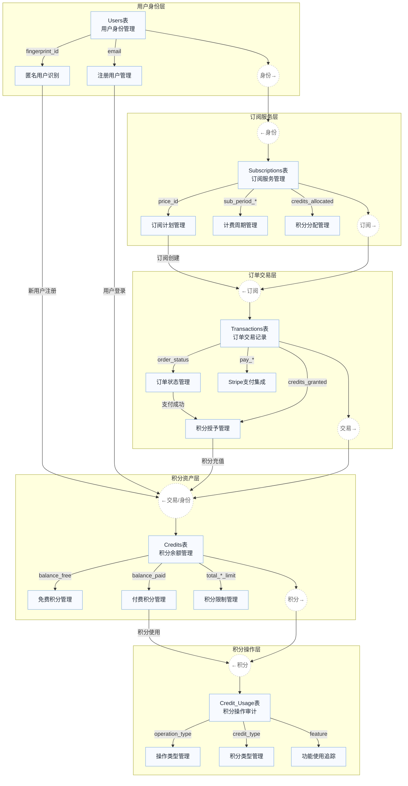
```mermaid
flowchart TB
    %% 自上而下布局，使用入口/出口汇聚点，减少跨层直连

    classDef entry fill:#fff,stroke:#bbb,stroke-dasharray:3 3,color:#666;
    classDef core fill:#f7faff,stroke:#7aa7e0,color:#1f2937;

    %% 用户身份层
    subgraph L1[用户身份层]
      direction TB
      U[Users表<br/>用户身份管理]:::core
      A[匿名用户识别]:::core
      R[注册用户管理]:::core
      U --> |fingerprint_id| A
      U --> |email| R
      L1_OUT((身份→)):::entry
      U --> L1_OUT
    end

    %% 订阅服务层
    subgraph L2[订阅服务层]
      direction TB
      L2_IN((←身份)):::entry
      S[Subscriptions表<br/>订阅服务管理]:::core
      P[订阅计划管理]:::core
      C[计费周期管理]:::core
      I[积分分配管理]:::core
      L2_IN --> S
      S --> |price_id| P
      S --> |sub_period_*| C
      S --> |credits_allocated| I
      L2_OUT((订阅→)):::entry
      S --> L2_OUT
    end

    %% 订单交易层
    subgraph L3[订单交易层]
      direction TB
      L3_IN((←订阅)):::entry
      T[Transactions表<br/>订单交易记录]:::core
      OS[订单状态管理]:::core
      SP[Stripe支付集成]:::core
      CG[积分授予管理]:::core
      L3_IN --> T
      T --> |order_status| OS
      T --> |pay_*| SP
      T --> |credits_granted| CG
      L3_OUT((交易→)):::entry
      T --> L3_OUT
    end

    %% 积分资产层
    subgraph L4[积分资产层]
      direction TB
      L4_IN((←交易/身份)):::entry
      CR[Credits表<br/>积分余额管理]:::core
      F[免费积分管理]:::core
      PD[付费积分管理]:::core
      L[积分限制管理]:::core
      L4_IN --> CR
      CR --> |balance_free| F
      CR --> |balance_paid| PD
      CR --> |total_*_limit| L
      L4_OUT((积分→)):::entry
      CR --> L4_OUT
    end

    %% 积分操作层
    subgraph L5[积分操作层]
      direction TB
      L5_IN((←积分)):::entry
      CU[Credit_Usage表<br/>积分操作审计]:::core
      OT[操作类型管理]:::core
      CT[积分类型管理]:::core
      FE[功能使用追踪]:::core
      L5_IN --> CU
      CU --> |operation_type| OT
      CU --> |credit_type| CT
      CU --> |feature| FE
    end

    %% 层级衔接（仅入口/出口连接，避免交叉）
    L1_OUT --> L2_IN
    L2_OUT --> L3_IN
    L3_OUT --> L4_IN
    L4_OUT --> L5_IN

    %% 业务事件通过入口路由到目标层，减少跨层线段
    A --> |新用户注册| L4_IN
    R --> |用户登录| L4_IN
    P --> |订阅创建| L3_IN
    OS --> |支付成功| CG
    CG --> |积分充值| L4_IN
    PD --> |积分使用| L5_IN
```

#### 3.5.2 数据流转时序架构

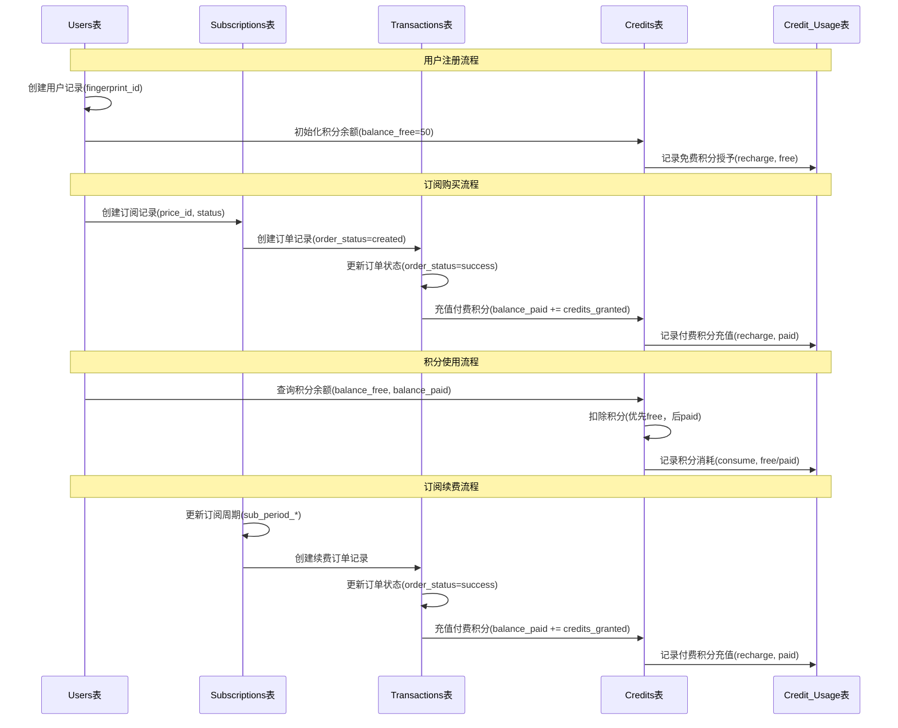
```mermaid
sequenceDiagram
    participant U as Users表
    participant S as Subscriptions表
    participant T as Transactions表
    participant C as Credits表
    participant CU as Credit_Usage表
    
    Note over U,CU: 用户注册流程
    U->>U: 创建用户记录(fingerprint_id)
    U->>C: 初始化积分余额(balance_free=50)
    C->>CU: 记录免费积分授予(recharge, free)
    
    Note over U,CU: 订阅购买流程
    U->>S: 创建订阅记录(price_id, status)
    S->>T: 创建订单记录(order_status=created)
    T->>T: 更新订单状态(order_status=success)
    T->>C: 充值付费积分(balance_paid += credits_granted)
    C->>CU: 记录付费积分充值(recharge, paid)
    
    Note over U,CU: 积分使用流程
    U->>C: 查询积分余额(balance_free, balance_paid)
    C->>C: 扣除积分(优先free，后paid)
    C->>CU: 记录积分消耗(consume, free/paid)
    
    Note over U,CU: 订阅续费流程
    S->>S: 更新订阅周期(sub_period_*)
    S->>T: 创建续费订单记录
    T->>T: 更新订单状态(order_status=success)
    T->>C: 充值付费积分(balance_paid += credits_granted)
    C->>CU: 记录付费积分充值(recharge, paid)
```

#### 3.5.3 状态流转架构

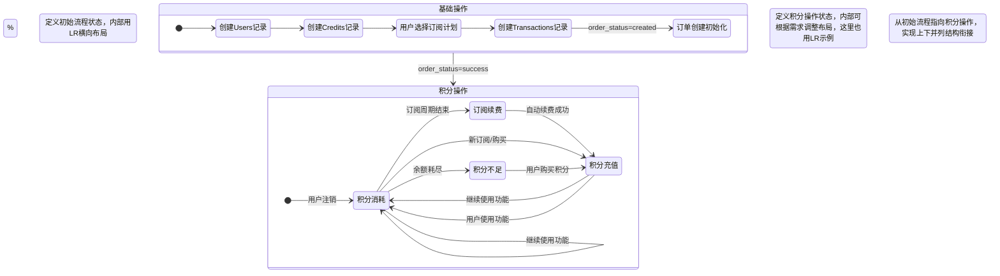
```mermaid
stateDiagram-v2
    direction TB  % 整体纵向布局，让初始流程和积分操作上下排列
    
    % 定义初始流程状态，内部用LR横向布局
    state "基础操作" as InitialFlow {
        direction LR  
        [*] --> 创建Users记录
        创建Users记录 --> 创建Credits记录
        创建Credits记录 --> 用户选择订阅计划
        用户选择订阅计划 --> 创建Transactions记录
        创建Transactions记录 --> 订单创建初始化: order_status=created
    }

    % 定义积分操作状态，内部可根据需求调整布局，这里也用LR示例
    state "积分操作" as CreditOps {
        direction LR  
        [*] --> 积分消耗: 用户注销
        积分充值 --> 积分消耗: 继续使用功能
        积分充值 --> 积分消耗: 用户使用功能
        订阅续费 --> 积分充值: 自动续费成功
        积分消耗 --> 积分充值: 新订阅/购买
        积分消耗 --> 积分不足: 余额耗尽
        积分不足 --> 积分充值: 用户购买积分
        积分消耗 --> 积分消耗: 继续使用功能
        积分消耗 --> 订阅续费: 订阅周期结束
    }

    % 从初始流程指向积分操作，实现上下并列结构衔接
    InitialFlow --> CreditOps: order_status=success
```

### 3.6 潜在改进建议与总结

#### 3.6.1 潜在改进建议

##### 3.6.1.1 数据一致性
- 建议在积分操作时使用数据库事务确保数据一致性
- 考虑添加积分余额的校验机制
- 建议添加定期对账机制，确保积分余额与使用记录一致

##### 3.6.1.2 性能优化
- 考虑对高频查询的积分余额进行Redis缓存
- 建议对历史数据按时间分区，提高查询性能
- 考虑对Credit_Usage表进行归档策略

##### 3.6.1.3 业务逻辑增强
- 建议添加积分过期机制，提高积分使用率
- 考虑添加积分转让功能，增强用户粘性
- 建议添加积分使用分析功能，优化产品策略

##### 3.6.1.4 监控告警
- 建议添加积分异常使用监控
- 考虑添加订单状态异常告警
- 建议添加积分余额不足提醒

#### 3.6.2 总结

这个数据模型设计整体上非常完善，具有以下特点：

1. **业务完整性**：覆盖了从用户注册到积分使用的完整业务流程
2. **数据一致性**：通过合理的表关联和状态管理确保数据一致性
3. **扩展性良好**：预留了足够的扩展字段和灵活的关联关系
4. **审计能力**：提供了完整的操作审计和数据分析能力

建议在实施过程中重点关注数据一致性、性能优化和业务监控，确保系统的稳定性和可维护性。

---

## 4. 数据流设计

### 4.1 订阅购买流程
1. **用户发起订阅**：
   - 用户在订阅管理界面选择计划。
   - 前端向后端发送请求，包含`plan_id`和`user_id`（或匿名用户的`fingerprint_id`）。
2. **创建Stripe会话**：
   - 后端为选定的计划创建Stripe Checkout Session (`pay_session_id`)。
   - 用户被重定向到Stripe的结账页面。
3. **支付完成**：
   - 支付成功后，Stripe向后端发送Webhook (`checkout.session.completed`)。
   - 后端更新`Subscriptions`表，创建订阅记录。
   - 在`Transactions`表中创建记录，包含`pay_session_id`、`amount`和`credits_granted`。
4. **积分充值**：
   - 从`Transactions`表的`credits_granted`字段获取积分数量。
   - 更新`Credits`表的`balance_paid`和`total_paid_limit`。
   - 在`Credit_Usage`表中插入充值记录，`operation_type`为`recharge`, `credit_type`为`paid`。
5. **用户通知**：
   - 用户收到确认电子邮件，界面显示更新后的积分余额。

### 4.2 积分使用流程

#### 4.2.1 积分消耗操作
1. **功能访问请求**：
   - 用户尝试访问高级功能（如API调用、工具使用）。
   - 前端向后端发送请求，包含`user_id`和功能标识。
2. **积分余额检查**：
   - 后端查询`Credits`表，获取`balance_free`和`balance_paid`。
   - 判断用户积分是否足够支付功能费用。
3. **积分扣除逻辑**：
   - **优先扣除策略**：优先从`balance_free`扣除，不足时从`balance_paid`扣除。
   - **数据更新**：更新`Credits`表中对应的余额字段。
   - **使用记录**：在`Credit_Usage`表中插入记录，`operation_type`为`consume`, `credit_type`为实际扣除的积分类型。
4. **功能授权**：
   - 积分扣除成功后，返回功能访问授权。
   - 积分不足时，提示用户购买积分或升级计划。

#### 4.2.2 积分充值操作
1. **系统授予免费积分**：
   - **触发场景**：新用户注册、活动奖励、系统补偿等。
   - **数据变化**：更新`Credits`表的`balance_free`和`total_free_limit`。
   - **记录追踪**：在`Credit_Usage`表中插入记录，`operation_type`为`recharge`, `credit_type`为`free`。

2. **用户支付后充值**：
   - **触发场景**：订阅支付成功、一次性购买完成。
   - **数据来源**：从`Transactions`表的`credits_granted`字段获取充值数量。
   - **数据变化**：更新`Credits`表的`balance_paid`和`total_paid_limit`。
   - **记录追踪**：在`Credit_Usage`表中插入记录，`operation_type`为`recharge`, `credit_type`为`paid`。

#### 4.2.3 积分余额管理
- **总量限制**：`total_free_limit`和`total_paid_limit`记录用户获得的总积分量。
- **余额计算**：`balance_free`和`balance_paid`为当前可用余额。
- **历史追踪**：通过`Credit_Usage`表完整记录所有积分操作历史。

### 4.3 订阅管理流程
- **自动续费**：
  - Stripe处理自动续费并向后端发送Webhook (`invoice.paid`)。
  - 后端更新`Subscriptions`表，创建续费交易记录。
  - 从`Transactions`表的`credits_granted`字段获取积分数量。
  - 更新`Credits`表的`balance_paid`和`total_paid_limit`。
  - 在`Credit_Usage`表中插入充值记录，`operation_type`为`recharge`, `credit_type`为`paid`。
- **取消**：
  - 用户通过订阅管理界面取消订阅。
  - 后端向Stripe发送取消请求，更新`Subscriptions`表（`status` = canceled）。
- **升级/降级**：
  - 用户选择新计划；后端更新Stripe订阅并按比例分配费用。
  - 更新`Subscriptions`表的`plan_id`和`credits_allocated`。
  - 处理按比例分配的积分充值，更新`Credits`表和`Credit_Usage`表。
- **附加包购买**：
  - 与订阅购买类似，但创建一次性Stripe Checkout Session。
  - Webhook确认后，创建交易记录并充值积分。

### 4.4 退款流程
1. **用户请求退款**：
   - 用户通过界面发起退款请求。
   - 后端验证退款资格（例如，7天内，基于`Transactions`表）。
2. **处理退款**：
   - 后端使用`pay_session_id`向Stripe发送退款请求。
   - Stripe处理退款并发送Webhook (`charge.refunded`)。
   - 后端更新`Transactions`表（`status` = refunded）。
   - 从`Transactions`表的`credits_granted`字段获取需要扣除的积分数量。
   - 更新`Credits`表的`balance_paid`和`total_paid_limit`（减少积分）。
   - 在`Credit_Usage`表中插入扣除记录，`operation_type`为`consume`, `credit_type`为`paid`。

### 4.5 Clerk用户认证流程

#### 4.5.1 匿名用户初始化
1. **前端处理**：
   - 用户访问平台时，前端生成Fingerprint ID。
   - 向后端发送初始化请求，包含`fingerprint_id`, `clerk_user_id`为空。
2. **后端处理**：
   - 查询Redis缓存，检查是否已有用户记录。
   - 缓存未命中时，查询数据库`Users`表。
   - 用户不存在时，创建新的匿名用户记录。
   - 分配50个免费积分，创建`Credits`和`Credit_Usage`记录。
   - 将用户信息缓存到Redis，TTL设置为24小时。
3. **返回结果**：
   - 返回用户信息和积分余额给前端。
   - 前端显示平台界面和积分余额。

#### 4.5.2 用户注册/登录
1. **Clerk认证**：
   - 用户通过Clerk界面完成注册或登录。
   - 通过`SignUp`组件传递`unsafeMetadata`，传递`fingerprint_id`以及数据库里的`user_id`(最核心的匹配数据)
   - Clerk验证用户信息，异步webhook回调API，发送`UserCreated`事件，返回`clerk_user_id`和`email`，以及`unsafeMetadata`：`user_id`和`fingerprint_id`
2. **后端异步处理**：
   - 查询Redis缓存，检查用户状态。
   - **匿名用户升级**：根据`user_id`查找记录，更新`Users`表，设置`email`和`clerk_user_id`，状态改为`registered`。
   - **新注册用户**：创建完整的用户记录，包括积分初始化。
   - 更新Redis缓存，包含新的用户信息。
3. **数据一致性**：
   - 通过`user_id`传递来确保`fingerprint_id`和`clerk_user_id`的关联关系正确。
   - 维护用户从匿名到注册的完整数据连续性。

#### 4.5.3 用户注销
1. **Clerk注销**：
   - 用户通过Clerk完成注销操作。
   - Clerk异步webhook回调API，发送`UserDeleted`事件，返回`clerk_user_id`。
2. **数据备份**：
   - 将用户数据备份到`UserBackup`表。
   - 硬删除`Users`及关联表记录。
3. **缓存清理**：
   - 删除Redis中所有相关的用户缓存。
   - 包括`fingerprint_id`、`email`、`user_id`相关的缓存。
4. **状态重置**：
   - 用户重新访问时，重新开始匿名用户流程。

#### 4.5.4 Redis缓存策略
1. **缓存键设计**：
   - `fingerprint_id:user_info`：用户身份信息
   - `user_id:user_info`：用户身份信息
   - `email:user_info`：邮箱关联的用户信息
   - `clerk_user_id:user_info`：Clerk用户关联信息
   - `user_id:credits`：用户积分余额
   - `user_id:session`：用户会话状态
2. **缓存更新策略**：
   - 用户信息变更时主动更新缓存。
   - 积分操作时更新积分缓存。
   - 用户注销时清理所有相关缓存。
3. **缓存一致性**：
   - 采用Cache-Aside模式，先更新数据库再更新缓存。
   - 缓存失效时从数据库重新加载。
   - 监控缓存命中率和响应时间。


### 4.6 Clerk Webhook回调

#### 4.6.1 API端点

```
POST /api/webhook/clerk/user
```

#### 4.6.2 环境配置

在`.env.local`文件中添加以下环境变量：

```bash
# Clerk Webhook签名密钥
CLERK_WEBHOOK_SECRET=whsec_xxxxxxxxxxxxxxxxxxxxxxx
```

#### 4.6.3 Clerk控制台配置

1. 登录 [Clerk Dashboard](https://dashboard.clerk.com/)
2. 选择你的应用
3. 进入 **Webhooks** 页面
4. 点击 **Add Endpoint**
5. 配置如下：
   - **Endpoint URL**: `https://yourdomain.com/api/webhook/clerk/user`
   - **Events**: 选择以下事件
     - `user.created`
     - `user.deleted`
6. 保存后复制 **Signing Secret** 到环境变量中

#### 4.6.4 本地开发配置

由于webhook需要公网访问，本地开发时需要使用隧道工具：

* 使用 ngrok

1. 安装ngrok：`npm install -g ngrok`
2. 启动开发服务器：`npm run dev`
3. 在另一个终端运行：`ngrok http 3000`
4. 使用ngrok提供的公网URL配置Clerk webhook

* 使用 Vercel

部署到Vercel后，直接使用生产URL配置webhook。

#### 4.6.5 数据流程

* 匿名用户注册流程

1. 匿名用户访问网站 → 生成fingerprint_id
2. 用户决定注册 → 通过Clerk SignUp组件传递user_id和fingerprint_id
3. Clerk验证用户信息 → 异步发送UserCreated webhook
4. 系统接收webhook → 查找匿名用户记录 → 升级为注册用户

* 直接注册流程

1. 新用户直接注册 → Clerk发送UserCreated webhook
2. 系统创建新用户记录 → 初始化50积分 → 记录积分操作

* 用户注销流程

1. 用户删除账户 → Clerk发送UserDeleted webhook
2. 系统备份用户数据 → 硬删除所有相关记录 → 清理缓存

#### 4.6.6 签名验证

API使用svix库验证Clerk webhook签名：

```javascript
const wh = new Webhook(process.env.CLERK_WEBHOOK_SECRET);
const event = wh.verify(rawBody, headers);
```

#### 4.6.7 正常处理和容错处理

* UserCreated事件数据结构

```json
{
  "data": {
    "email_addresses": ["xxx@gmail.com", "yyy@gmail.com"],
    "unsafe_metadata": {
      "user_id": "本系统的用户ID",
      "fingerprint_id": "浏览器指纹ID"
    }
    "id": "user_2g7np7Hrk0SN6kj5EDMLDaKNL0S"
  },
  "event_attributes": {
    "http_request": {
      "client_ip": "192.168.1.100",
      "user_agent": "Mozilla/5.0 (Macintosh; Intel Mac OS X 10_15_7) AppleWebKit/537.36 (KHTML, like Gecko) Chrome/128.0.0.0 Safari/537.36"
    }
  },
  "instance_id": "ins_2g7np7Hrk0SN6kj5EDMLDaKNL0S",
  "object": "event",
  "timestamp": 1716883200,
  "type": "user.created"
}
```

* UserDeleted事件数据结构

```json
{
  "data": {
    "deleted": true,
    "id": "user_29wBMCtzATuFJut8jO2VNTVekS4",
    "object": "user"
  },
  "event_attributes": {
    "http_request": {
      "client_ip": "0.0.0.0",
      "user_agent": "Mozilla/5.0 (Macintosh; Intel Mac OS X 10_15_7) AppleWebKit/537.36 (KHTML, like Gecko) Chrome/128.0.0.0 Safari/537.36"
    }
  },
  "object": "event",
  "timestamp": 1661861640000,
  "type": "user.deleted"
}
```

* webhook处理完成后会返回：

```json
{
  "received": true
}
```

* 异常情况
  
- 缺少必要的headers → 返回400错误
- 签名验证失败 → 返回400错误
- 系统处理异常 → 返回500错误，记录错误日志

#### 4.6.8 安全考虑

1. **环境变量**：webhook signing secret必须存储为环境变量
2. **签名验证**：所有webhook请求都必须通过签名验证
3. **错误处理**：适当的错误处理避免敏感信息泄露
4. **日志记录**：记录关键操作用于审计和调试

#### 4.6.9 监控和日志

系统会记录以下日志：
- webhook事件类型和处理状态
- 用户创建/删除操作结果
- 积分操作记录
- 错误和异常信息

### 4.7 Fingerprint匿名机制详细设计

#### 4.7.1 匿名用户首次访问时序图

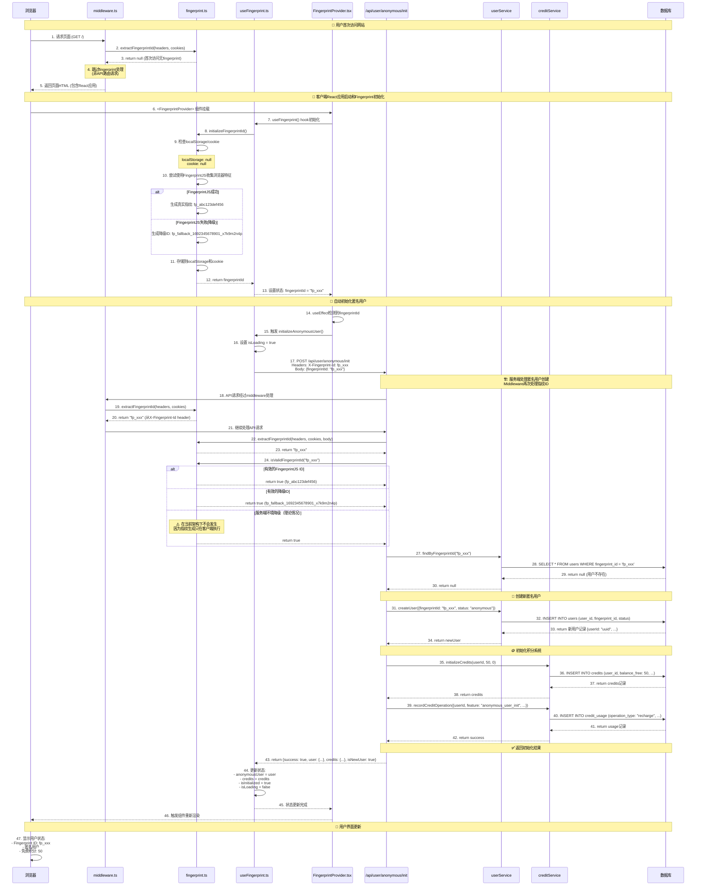
```mermaid
sequenceDiagram
    participant Browser as 浏览器
    participant Middleware as middleware.ts
    participant FP_Lib as fingerprint.ts
    participant Hook as useFingerprint.ts
    participant Provider as FingerprintProvider.tsx
    participant API as /api/user/anonymous/init
    participant UserService as userService
    participant CreditService as creditService
    participant DB as 数据库

    Note over Browser,DB: 🚀 用户首次访问网站

    Browser->>Middleware: 1. 请求页面 (GET /)
    Middleware->>FP_Lib: 2. extractFingerprintId(headers, cookies)
    FP_Lib-->>Middleware: 3. return null (首次访问无fingerprint)
    Note over Middleware: 4. 跳过fingerprint处理<br/>(非API路由请求)
    Middleware-->>Browser: 5. 返回页面HTML (包含React应用)

    Note over Browser,DB: 📱 客户端React应用启动和Fingerprint初始化

    Browser->>Provider: 6. <FingerprintProvider> 组件挂载
    Provider->>Hook: 7. useFingerprint() hook初始化
    Hook->>FP_Lib: 8. initializeFingerprintId()
    FP_Lib->>FP_Lib: 9. 检查localStorage/cookie
    Note over FP_Lib: localStorage: null<br/>cookie: null
    FP_Lib->>FP_Lib: 10. 尝试使用FingerprintJS收集浏览器特征
    
    alt FingerprintJS成功
        FP_Lib->>FP_Lib: 生成真实指纹: fp_abc123def456
    else FingerprintJS失败(降级)
        FP_Lib->>FP_Lib: 生成降级ID: fp_fallback_1692345678901_x7k9m2n4p
    end
    
    FP_Lib->>FP_Lib: 11. 存储到localStorage和cookie
    FP_Lib-->>Hook: 12. return fingerprintId
    Hook-->>Provider: 13. 设置状态: fingerprintId = "fp_xxx"

    Note over Browser,DB: 🔄 自动初始化匿名用户

    Provider->>Provider: 14. useEffect检测到fingerprintId
    Provider->>Hook: 15. 触发 initializeAnonymousUser()
    Hook->>Hook: 16. 设置 isLoading = true
    Hook->>API: 17. POST /api/user/anonymous/init<br/>Headers: X-Fingerprint-Id: fp_xxx<br/>Body: {fingerprintId: "fp_xxx"}

    Note over API,DB: 🏗️ 服务端处理匿名用户创建<br/>Middleware再次处理指纹ID

    API->>Middleware: 18. API请求经过middleware处理
    Middleware->>FP_Lib: 19. extractFingerprintId(headers, cookies)
    FP_Lib-->>Middleware: 20. return "fp_xxx" (从X-Fingerprint-Id header)
    Middleware->>API: 21. 继续处理API请求
    
    API->>FP_Lib: 22. extractFingerprintId(headers, cookies, body)
    FP_Lib-->>API: 23. return "fp_xxx"
    API->>FP_Lib: 24. isValidFingerprintId("fp_xxx")
    
    alt 有效的FingerprintJS ID
        FP_Lib-->>API: return true (fp_abc123def456)
    else 有效的降级ID  
        FP_Lib-->>API: return true (fp_fallback_1692345678901_x7k9m2n4p)
    else 服务端环境降级（理论情况）
        Note over FP_Lib: ⚠️ 在当前架构下不会发生<br/>因为指纹生成只在客户端执行
        FP_Lib-->>API: return true
    end
    API->>UserService: 27. findByFingerprintId("fp_xxx")
    UserService->>DB: 28. SELECT * FROM users WHERE fingerprint_id = 'fp_xxx'
    DB-->>UserService: 29. return null (用户不存在)
    UserService-->>API: 30. return null

    Note over API,DB: 📝 创建新匿名用户

    API->>UserService: 31. createUser({fingerprintId: "fp_xxx", status: "anonymous"})
    UserService->>DB: 32. INSERT INTO users (user_id, fingerprint_id, status)
    DB-->>UserService: 33. return 新用户记录 {userId: "uuid", ...}
    UserService-->>API: 34. return newUser

    Note over API,DB: 🪙 初始化积分系统

    API->>CreditService: 35. initializeCredits(userId, 50, 0)
    CreditService->>DB: 36. INSERT INTO credits (user_id, balance_free: 50, ...)
    DB-->>CreditService: 37. return credits记录
    CreditService-->>API: 38. return credits

    API->>CreditService: 39. recordCreditOperation({userId, feature: "anonymous_user_init", ...})
    CreditService->>DB: 40. INSERT INTO credit_usage (operation_type: "recharge", ...)
    DB-->>CreditService: 41. return usage记录
    CreditService-->>API: 42. return success

    Note over API,DB: ✅ 返回初始化结果

    API-->>Hook: 43. return {success: true, user: {...}, credits: {...}, isNewUser: true}

    Hook->>Hook: 44. 更新状态:<br/>- anonymousUser = user<br/>- credits = credits<br/>- isInitialized = true<br/>- isLoading = false
    Hook-->>Provider: 45. 状态更新完成
    Provider-->>Browser: 46. 触发组件重新渲染

    Note over Browser,DB: 🎉 用户界面更新

    Browser->>Browser: 47. 显示用户状态:<br/>- Fingerprint ID: fp_xxx<br/>- 匿名用户<br/>- 免费积分: 50
```

#### 4.7.2 匿名用户首次访问流程图


```mermaid
flowchart TD
    Start([用户访问网站]) --> CheckBrowser{浏览器环境?}
    
    CheckBrowser -->|否| ServerSide[服务端渲染]
    CheckBrowser -->|是| InitFP[初始化Fingerprint]
    
    ServerSide --> Middleware[middleware.ts处理]
    Middleware --> ExtractFP[提取fingerprint ID]
    ExtractFP --> FPExists{fingerprint存在?}
    FPExists -->|否| SkipFP[跳过fingerprint处理]
    FPExists -->|是| SetHeader[设置响应header]
    SkipFP --> ReturnHTML[返回HTML页面]
    SetHeader --> ReturnHTML
    
    InitFP --> CheckStorage{检查本地存储}
    CheckStorage -->|localStorage有| UseExisting[使用现有fingerprint]
    CheckStorage -->|cookie有| UseExisting
    CheckStorage -->|都没有| Generate[生成新fingerprint ID]
    
    Generate --> GenerateID["生成: fp_ + 32位随机字符"]
    GenerateID --> SaveStorage[保存到localStorage和cookie]
    SaveStorage --> FPReady[fingerprint ID就绪]
    UseExisting --> FPReady
    
    ReturnHTML --> ReactInit[React应用初始化]
    ReactInit --> ProviderMount[FingerprintProvider挂载]
    ProviderMount --> HookInit[useFingerprint初始化]
    HookInit --> FPReady
    
    FPReady --> AutoInit{autoInitialize?}
    AutoInit -->|否| WaitManual[等待手动调用]
    AutoInit -->|是| CheckUser[检查用户是否已存在]
    
    CheckUser --> CallAPI["调用 GET /api/user/anonymous/init"]
    CallAPI --> UserExists{用户存在?}
    UserExists -->|是| LoadUser[加载现有用户数据]
    UserExists -->|否| CreateUser[创建新匿名用户]
    
    LoadUser --> UpdateState[更新React状态]
    
    CreateUser --> ValidateFP[验证fingerprint格式]
    ValidateFP --> Invalid{有效?}
    Invalid -->|否| ErrorState[错误状态]
    Invalid -->|是| CreateUserRecord[创建用户记录]
    
    CreateUserRecord --> DBInsert["数据库插入:\nusers表 (user_id, fingerprint_id, status)"]
    DBInsert --> InitCredits[初始化积分]
    InitCredits --> CreditInsert["数据库插入:\ncredits表 (balance_free: 50)"]
    CreditInsert --> RecordUsage[记录积分操作]
    RecordUsage --> UsageInsert["数据库插入:\ncredit_usage表 (recharge, free)"]
    UsageInsert --> Success[创建成功]
    
    Success --> UpdateState
    UpdateState --> RenderUI[渲染用户界面]
    RenderUI --> ShowStatus["显示:\n- Fingerprint ID\n- 匿名用户状态\n- 50免费积分"]
    
    WaitManual --> ManualTrigger[手动调用initializeAnonymousUser]
    ManualTrigger --> CheckUser
    
    ErrorState --> ShowError[显示错误信息]
    
    style Start fill:#e1f5fe
    style FPReady fill:#f3e5f5
    style Success fill:#e8f5e8
    style ShowStatus fill:#fff3e0
    style ErrorState fill:#ffebee
```

#### 4.7.3 核心交互图

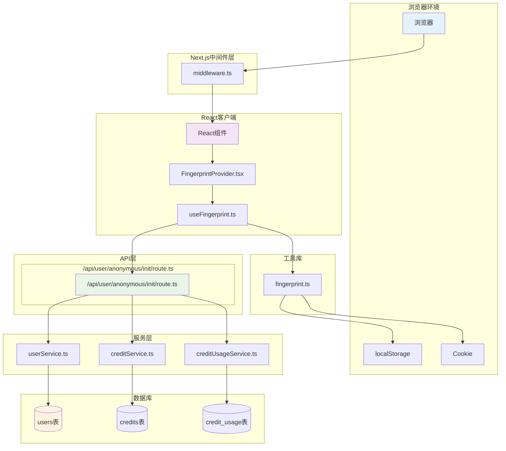
```mermaid
flowchart TD
    subgraph 浏览器环境
        浏览器
        localStorage[localStorage]
        Cookie[Cookie]
    end
    
    subgraph Next.js中间件层
        middleware.ts
    end
    
    subgraph React客户端
        React组件
        FingerprintProvider.tsx
        useFingerprint.ts
    end
    
    subgraph 工具库
        fingerprint.ts
    end
    
    subgraph API层
        subgraph "/api/user/anonymous/init/route.ts"
            InitAPI["/api/user/anonymous/init/route.ts"]
        end
    end
    
    subgraph 服务层
        userService.ts
        creditService.ts
        creditUsageService.ts
    end
    
    subgraph 数据库
        users表[(users表)]
        credits表[(credits表)]
        credit_usage表[(credit_usage表)]
    end
    
    浏览器 --> middleware.ts
    middleware.ts --> React组件
    React组件 --> FingerprintProvider.tsx
    FingerprintProvider.tsx --> useFingerprint.ts
    useFingerprint.ts --> fingerprint.ts
    useFingerprint.ts --> InitAPI
    
    fingerprint.ts --> localStorage
    fingerprint.ts --> Cookie
    
    InitAPI --> userService.ts
    InitAPI --> creditService.ts
    InitAPI --> creditUsageService.ts
    
    userService.ts --> users表
    creditService.ts --> credits表
    creditUsageService.ts --> credit_usage表
    
    style 浏览器 fill:#e3f2fd
    style React组件 fill:#f3e5f5
    style InitAPI fill:#e8f5e8
    style users表 fill:#fff3e0
```

#### 4.7.4 关键代码执行顺序

1. **浏览器访问** (`/` 路径)
2. **middleware.ts:21** - `handleFingerprintId()` 尝试提取fingerprint
3. **fingerprint.ts:131** - `extractFingerprintId()` 检查headers/cookies, 如果没有就是null
4. **React渲染** - 页面组件开始渲染
5. **FingerprintProvider.tsx:45** - Provider组件挂载
6. **useFingerprint.ts:140** - Hook初始化，调用`checkExistingUser()`
7. **fingerprint.ts:47** - `getOrGenerateFingerprintId()` 生成新ID
8. **fingerprint.ts:21** - `generateFingerprintId()` 创建唯一ID
9. **useFingerprint.ts:164** - 自动调用`initializeAnonymousUser()`
10. **route.ts:17** - API接收POST请求初始化用户
11. **userService.ts:17** - 创建新用户记录
12. **creditService.ts:14** - 初始化50免费积分
13. **creditUsageService.ts:40** - 记录积分充值操作
14. **useFingerprint.ts:113** - 更新React状态
15. **界面渲染** - 显示匿名用户状态和积分信息

#### 4.7.5 数据流程总结

1. **首次访问**：
   - 生成fingerprint ID
   - 调用 `/api/user/anonymous/init` 创建匿名用户
   - 分配50免费积分

2. **再次访问**：
   - 从localStorage/cookie获取fingerprint ID
   - 调用 `/api/user/anonymous/init` 获取现有用户数据

3. **用户注册**：
   - Clerk webhook接收用户创建事件
   - 根据传递的user_id升级匿名用户为注册用户

4. **用户注销**：
   - Clerk webhook接收用户删除事件
   - 备份并删除用户数据
   - 用户重新成为匿名状态
  
---

## 5. Mermaid流程图

### 5.1 匿名用户与注册用户数据流程图

以下是匿名用户到注册用户、注销、再次注册的综合数据流程图，展示数据如何在系统中流动。

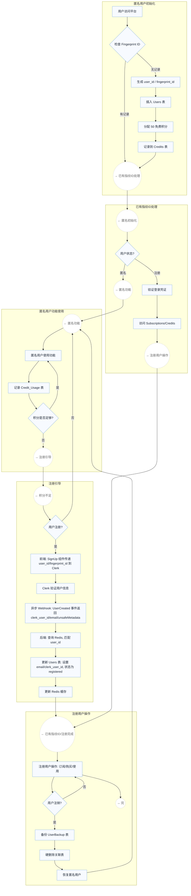
```mermaid
flowchart TB
    %% 自上而下布局，模块内顺序化；使用入口/出口汇聚节点减少跨模块交叉
    classDef entry fill:#fff,stroke:#bbb,stroke-dasharray:3 3,color:#666;
    classDef core fill:#f7faff,stroke:#7aa7e0,color:#1f2937;

    %% 模块1：匿名用户初始化
    subgraph M1[匿名用户初始化]
      direction LR
      A[用户访问平台]:::core --> B{检查 Fingerprint ID}:::core
      B -->|无记录| C[生成 user_id / fingerprint_id]:::core
      C --> D[插入 Users 表]:::core --> E[分配 50 免费积分]:::core --> F[记录到 Credits 表]:::core
      B -->|有记录| M1_OUT((→ 已有指纹ID处理)):::entry
      F --> M1_OUT
    end

    %% 模块2：已有指纹ID处理
    subgraph M2[已有指纹ID处理]
      direction LR
      M2_IN((← 匿名初始化)):::entry
      M2_IN --> G{用户状态?}:::core
      G -->|匿名| M2_OUT_ANON((→ 匿名功能)):::entry
      G -->|注册| I[验证登录凭证]:::core --> J[访问 Subscriptions/Credits]:::core --> M2_OUT_REG((→ 注册用户操作)):::entry
    end

    %% 模块3：匿名用户功能使用
    subgraph M3[匿名用户功能使用]
      direction LR
      M3_IN((← 匿名功能)):::entry
      M3_IN --> K[匿名用户使用功能]:::core --> L[记录 Credit_Usage 表]:::core --> M{积分是否足够?}:::core
      M -->|是| K
      M -->|否| M3_OUT_NEEDREG((→ 注册引导)):::entry
    end

    %% 模块4：注册用户操作
    subgraph M4[注册用户操作]
      direction LR
      M4_IN((← 已有指纹ID/注册完成)):::entry
      M4_IN --> O[注册用户操作: 订阅/购买/使用]:::core --> P{用户注销?}:::core
      P -->|是| Q[备份 UserBackup 表]:::core --> R[硬删除关联表]:::core --> S[恢复匿名用户]:::core --> M3_IN
      P -->|否| O
      O --> M4_OUT((→ 完)):::entry
    end

    %% 模块5：注册引导（新增Clerk注册流程）
    subgraph M5[注册引导]
      direction LR
      M5_IN((← 积分不足)):::entry
      M5_IN --> U{用户注册?}:::core
      U -->|是| V1[前端: SignUp 组件传递 user_id/fingerprint_id 到 Clerk]:::core
      V1 --> V2[Clerk 验证用户信息]:::core
      V2 --> V3[异步 Webhook: UserCreated 事件返回 clerk_user_id/email/unsafeMetadata]:::core
      V3 --> V4[后端: 查询 Redis, 匹配 user_id]:::core
      V4 --> V5[更新 Users 表: 设置 email/clerk_user_id, 状态为 registered]:::core
      V5 --> V6[更新 Redis 缓存]:::core --> M4_IN
      U -->|否| M3_IN
    end

    %% 模块衔接（仅入口/出口连接，减少交叉）
    M1_OUT --> M2_IN
    M2_OUT_ANON --> M3_IN
    M2_OUT_REG --> M4_IN
    M3_OUT_NEEDREG --> M5_IN
```

### 5.2 匿名用户积分使用流程图

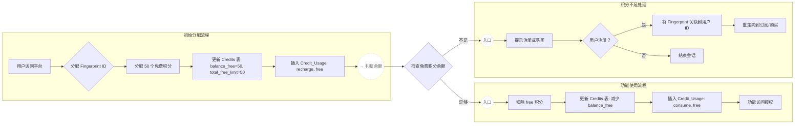
```mermaid
flowchart LR
    classDef entry fill:#fff,stroke:#bbb,stroke-dasharray:3 3,color:#666;

    %% 模块1：初始分配流程（子图横向）
    subgraph 初始分配流程
        direction LR
        A[用户访问平台] --> B{分配 Fingerprint ID}
        B --> C[分配 50 个免费积分]
        C --> D[更新 Credits 表: balance_free=50, total_free_limit=50]
        D --> E[插入 Credit_Usage: recharge, free]
        E --> OUT_INIT((→ 判断余额)):::entry
    end

    %% 中央判断
    G{检查免费积分余额}

    OUT_INIT --> G

    %% 模块2：功能使用流程（子图横向）
    subgraph 功能使用流程
        direction LR
        IN_USE((入口)):::entry --> H[扣除 free 积分] --> I[更新 Credits 表: 减少 balance_free] --> J[插入 Credit_Usage: consume, free] --> K[功能访问授权]
    end

    %% 模块3：积分不足处理（子图横向）
    subgraph 积分不足处理
        direction LR
        IN_LOW((入口)):::entry --> L[提示注册或购买] --> M{用户注册？}
        M -->|是| N[将 Fingerprint 关联到用户 ID] --> P[重定向到订阅/购买]
        M -->|否| O[结束会话]
    end

    %% 模块间连接（仅通过入口/出口）
    G -->|足够| IN_USE
    G -->|不足| IN_LOW
```

### 5.3 登录用户订阅流程图

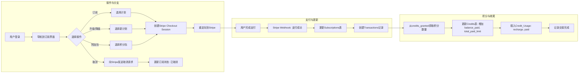
```mermaid
flowchart LR
    %% ========== 子图1：核心操作与分支（内部横向布局） ==========
    subgraph 操作与分支
        direction LR  %% 子图内节点横向排列
        A[用户登录] --> B[导航到订阅界面]
        B --> C{选择操作}
        %% 所有分支都在第一个子图内
        C -->|订阅| D[选择计划]
        C -->|升级/降级| E[选择新计划]
        C -->|取消| F[向Stripe发送取消请求]
        C -->|附加包| G[选择积分包]
        %% 汇聚到统一节点，进入支付流程
        D & E & G --> H[创建Stripe Checkout Session]
        F --> I[更新订阅状态: 已取消]
        H --> J[重定向到Stripe]
    end

    %% ========== 子图2：支付与订阅更新（内部横向布局） ==========
    subgraph 支付与更新
        direction LR  %% 子图内节点横向排列
        J --> K[用户完成支付]
        K --> L[Stripe Webhook: 支付成功]
        L --> M[更新Subscriptions表]
        M --> N[创建Transactions记录]
    end

    %% ========== 子图3：积分与交易收尾（内部横向布局） ==========
    subgraph 积分与收尾
        direction LR  %% 子图内节点横向排列
        N --> O[从credits_granted获取积分数量]
        O --> P[更新Credits表: 增加balance_paid, total_paid_limit]
        P --> Q[插入Credit_Usage: recharge, paid]
        Q --> R[记录交易完成]
    end

    
```

### 5.4 积分操作流程图

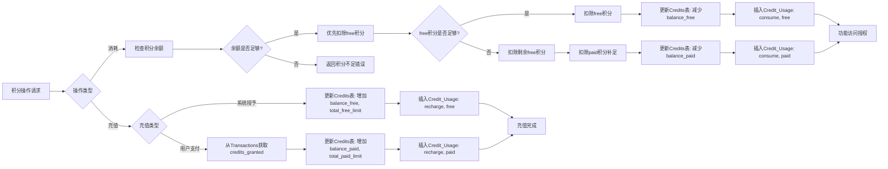
```mermaid
flowchart LR
    A[积分操作请求] --> B{操作类型}
    
    B -->|消耗| C[检查积分余额]
    C --> D{余额是否足够?}
    D -->|是| E[优先扣除free积分]
    E --> F{free积分是否足够?}
    F -->|是| G[扣除free积分]
    F -->|否| H[扣除剩余free积分]
    H --> I[扣除paid积分补足]
    G --> J[更新Credits表: 减少balance_free]
    I --> K[更新Credits表: 减少balance_paid]
    J --> L[插入Credit_Usage: consume, free]
    K --> M[插入Credit_Usage: consume, paid]
    L --> N[功能访问授权]
    M --> N
    D -->|否| O[返回积分不足错误]
    
    B -->|充值| P{充值类型}
    P -->|系统授予| Q[更新Credits表: 增加balance_free, total_free_limit]
    P -->|用户支付| R[从Transactions获取credits_granted]
    R --> S[更新Credits表: 增加balance_paid, total_paid_limit]
    Q --> T[插入Credit_Usage: recharge, free]
    S --> U[插入Credit_Usage: recharge, paid]
    T --> V[充值完成]
    U --> V
```

---

## 6. Mermaid时序图

### 6.1 匿名用户订阅时序图

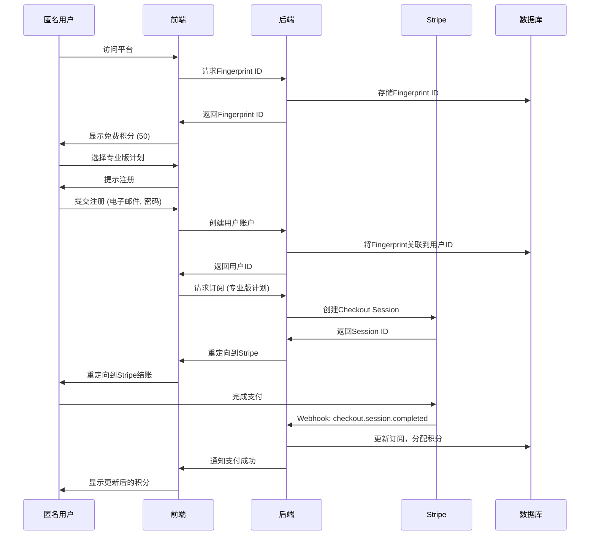
```mermaid
sequenceDiagram
    participant U as 匿名用户
    participant F as 前端
    participant B as 后端
    participant S as Stripe
    participant D as 数据库

    U->>F: 访问平台
    F->>B: 请求Fingerprint ID
    B->>D: 存储Fingerprint ID
    B->>F: 返回Fingerprint ID
    F->>U: 显示免费积分 (50)
    U->>F: 选择专业版计划
    F->>U: 提示注册
    U->>F: 提交注册 (电子邮件, 密码)
    F->>B: 创建用户账户
    B->>D: 将Fingerprint关联到用户ID
    B->>F: 返回用户ID
    F->>B: 请求订阅 (专业版计划)
    B->>S: 创建Checkout Session
    S->>B: 返回Session ID
    B->>F: 重定向到Stripe
    F->>U: 重定向到Stripe结账
    U->>S: 完成支付
    S->>B: Webhook: checkout.session.completed
    B->>D: 更新订阅，分配积分
    B->>F: 通知支付成功
    F->>U: 显示更新后的积分
```

### 6.2 登录用户升级订阅时序图

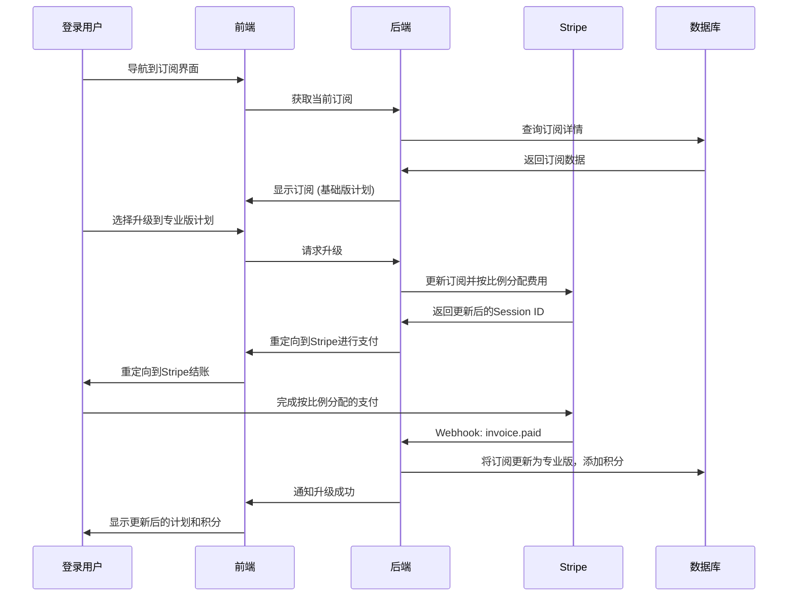
```mermaid
sequenceDiagram
    participant U as 登录用户
    participant F as 前端
    participant B as 后端
    participant S as Stripe
    participant D as 数据库

    U->>F: 导航到订阅界面
    F->>B: 获取当前订阅
    B->>D: 查询订阅详情
    D->>B: 返回订阅数据
    B->>F: 显示订阅 (基础版计划)
    U->>F: 选择升级到专业版计划
    F->>B: 请求升级
    B->>S: 更新订阅并按比例分配费用
    S->>B: 返回更新后的Session ID
    B->>F: 重定向到Stripe进行支付
    F->>U: 重定向到Stripe结账
    U->>S: 完成按比例分配的支付
    S->>B: Webhook: invoice.paid
    B->>D: 将订阅更新为专业版，添加积分
    B->>F: 通知升级成功
    F->>U: 显示更新后的计划和积分
```

### 6.3 积分消耗操作时序图

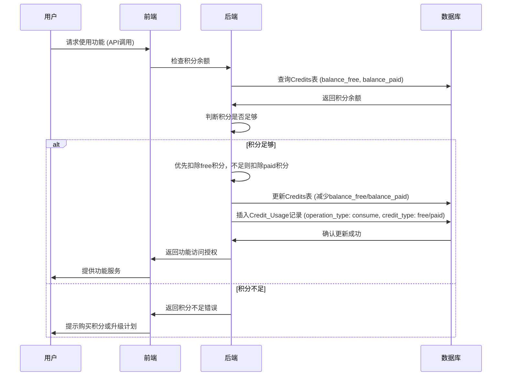
```mermaid
sequenceDiagram
    participant U as 用户
    participant F as 前端
    participant B as 后端
    participant D as 数据库

    U->>F: 请求使用功能 (API调用)
    F->>B: 检查积分余额
    B->>D: 查询Credits表 (balance_free, balance_paid)
    D->>B: 返回积分余额
    B->>B: 判断积分是否足够
    alt 积分足够
        B->>B: 优先扣除free积分，不足则扣除paid积分
        B->>D: 更新Credits表 (减少balance_free/balance_paid)
        B->>D: 插入Credit_Usage记录 (operation_type: consume, credit_type: free/paid)
        D->>B: 确认更新成功
        B->>F: 返回功能访问授权
        F->>U: 提供功能服务
    else 积分不足
        B->>F: 返回积分不足错误
        F->>U: 提示购买积分或升级计划
    end
```

### 6.4 系统授予免费积分时序图

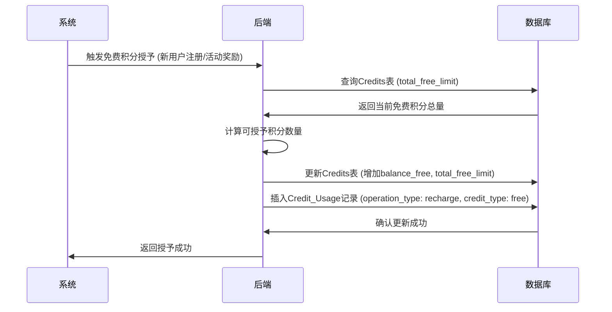
```mermaid
sequenceDiagram
    participant S as 系统
    participant B as 后端
    participant D as 数据库

    S->>B: 触发免费积分授予 (新用户注册/活动奖励)
    B->>D: 查询Credits表 (total_free_limit)
    D->>B: 返回当前免费积分总量
    B->>B: 计算可授予积分数量
    B->>D: 更新Credits表 (增加balance_free, total_free_limit)
    B->>D: 插入Credit_Usage记录 (operation_type: recharge, credit_type: free)
    D->>B: 确认更新成功
    B->>S: 返回授予成功
```

### 6.5 用户支付后积分充值时序图

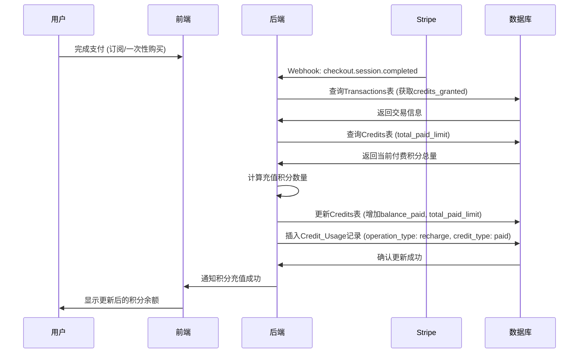
```mermaid
sequenceDiagram
    participant U as 用户
    participant F as 前端
    participant B as 后端
    participant S as Stripe
    participant D as 数据库

    U->>F: 完成支付 (订阅/一次性购买)
    S->>B: Webhook: checkout.session.completed
    B->>D: 查询Transactions表 (获取credits_granted)
    D->>B: 返回交易信息
    B->>D: 查询Credits表 (total_paid_limit)
    D->>B: 返回当前付费积分总量
    B->>B: 计算充值积分数量
    B->>D: 更新Credits表 (增加balance_paid, total_paid_limit)
    B->>D: 插入Credit_Usage记录 (operation_type: recharge, credit_type: paid)
    D->>B: 确认更新成功
    B->>F: 通知积分充值成功
    F->>U: 显示更新后的积分余额
```

### 6.6 积分余额查询时序图

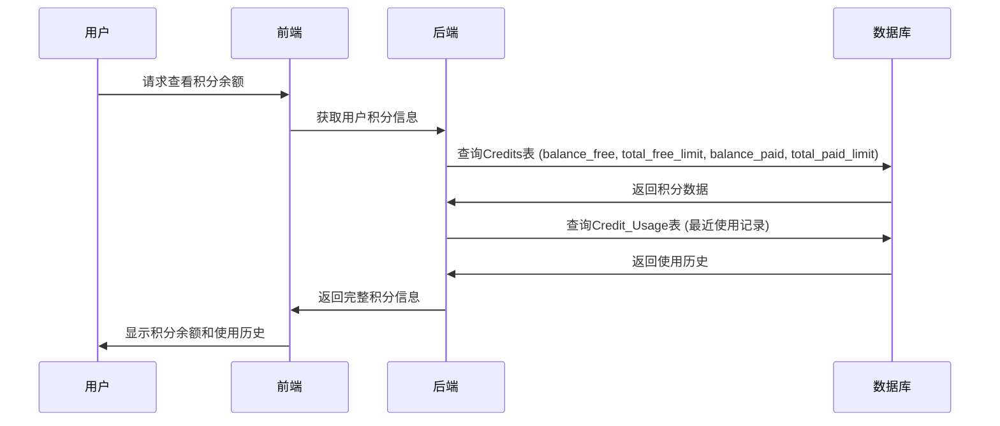
```mermaid
sequenceDiagram
    participant U as 用户
    participant F as 前端
    participant B as 后端
    participant D as 数据库

    U->>F: 请求查看积分余额
    F->>B: 获取用户积分信息
    B->>D: 查询Credits表 (balance_free, total_free_limit, balance_paid, total_paid_limit)
    D->>B: 返回积分数据
    B->>D: 查询Credit_Usage表 (最近使用记录)
    D->>B: 返回使用历史
    B->>F: 返回完整积分信息
    F->>U: 显示积分余额和使用历史
```

### 6.7 Clerk用户登录时序图

#### 6.7.1 匿名用户首次访问时序图

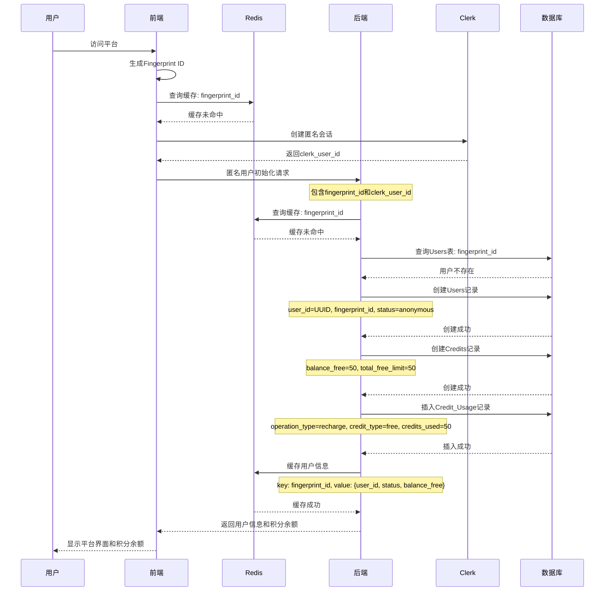
```mermaid
sequenceDiagram
    participant U as 用户
    participant F as 前端
    participant R as Redis
    participant B as 后端
    participant C as Clerk
    participant DB as 数据库

    U->>F: 访问平台
    F->>F: 生成Fingerprint ID
    F->>R: 查询缓存: fingerprint_id
    R-->>F: 缓存未命中
    
    F->>C: 创建匿名会话
    C-->>F: 返回clerk_user_id
    
    F->>B: 匿名用户初始化请求
    Note over B: 包含fingerprint_id和clerk_user_id
    
    B->>R: 查询缓存: fingerprint_id
    R-->>B: 缓存未命中
    
    B->>DB: 查询Users表: fingerprint_id
    DB-->>B: 用户不存在
    
    B->>DB: 创建Users记录
    Note over B: user_id=UUID, fingerprint_id, status=anonymous
    DB-->>B: 创建成功
    
    B->>DB: 创建Credits记录
    Note over B: balance_free=50, total_free_limit=50
    DB-->>B: 创建成功
    
    B->>DB: 插入Credit_Usage记录
    Note over B: operation_type=recharge, credit_type=free, credits_used=50
    DB-->>B: 插入成功
    
    B->>R: 缓存用户信息
    Note over B: key: fingerprint_id, value: {user_id, status, balance_free}
    R-->>B: 缓存成功
    
    B-->>F: 返回用户信息和积分余额
    F-->>U: 显示平台界面和积分余额
```

#### 6.7.2 匿名用户注册登录时序图

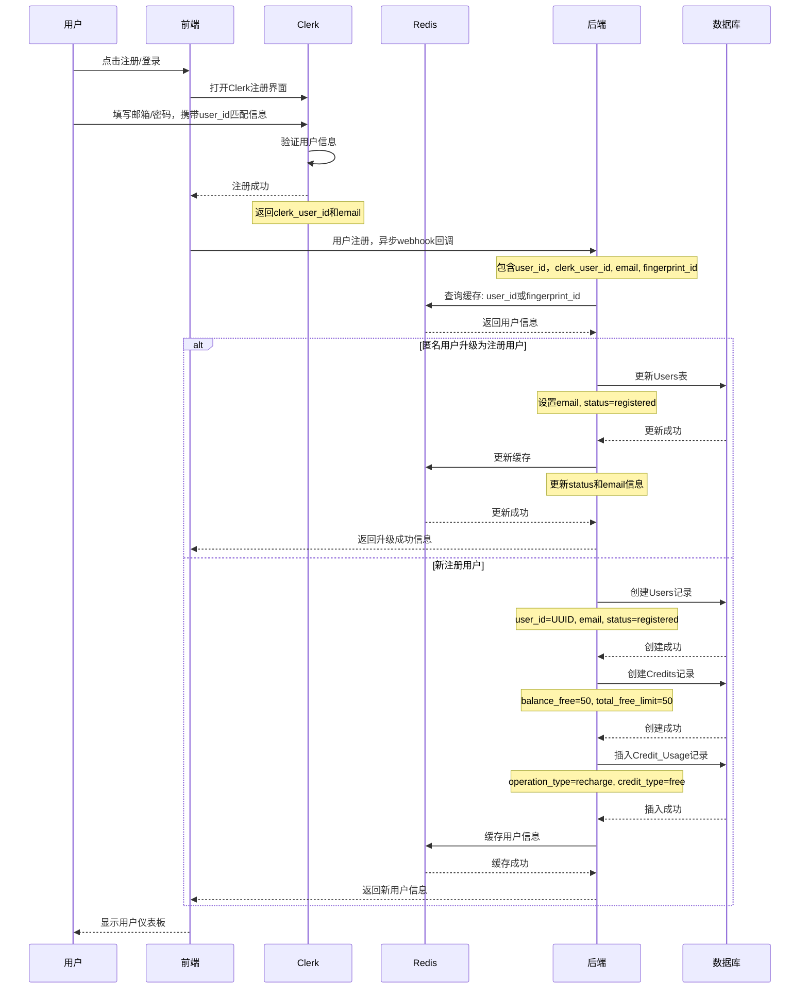
```mermaid
sequenceDiagram
    participant U as 用户
    participant F as 前端
    participant C as Clerk
    participant R as Redis
    participant B as 后端
    participant DB as 数据库

    U->>F: 点击注册/登录
    F->>C: 打开Clerk注册界面
    U->>C: 填写邮箱/密码，携带user_id匹配信息
    C->>C: 验证用户信息
    C-->>F: 注册成功
    Note over C: 返回clerk_user_id和email
    
    F->>B: 用户注册，异步webhook回调
    Note over B: 包含user_id，clerk_user_id, email, fingerprint_id
    
    B->>R: 查询缓存: user_id或fingerprint_id
    R-->>B: 返回用户信息
    
    alt 匿名用户升级为注册用户
        B->>DB: 更新Users表
        Note over B: 设置email, status=registered
        DB-->>B: 更新成功
        
        B->>R: 更新缓存
        Note over B: 更新status和email信息
        R-->>B: 更新成功
        
        B-->>F: 返回升级成功信息
    else 新注册用户
        B->>DB: 创建Users记录
        Note over B: user_id=UUID, email, status=registered
        DB-->>B: 创建成功
        
        B->>DB: 创建Credits记录
        Note over B: balance_free=50, total_free_limit=50
        DB-->>B: 创建成功
        
        B->>DB: 插入Credit_Usage记录
        Note over B: operation_type=recharge, credit_type=free
        DB-->>B: 插入成功
        
        B->>R: 缓存用户信息
        R-->>B: 缓存成功
        
        B-->>F: 返回新用户信息
    end
    
    F-->>U: 显示用户仪表板
```

#### 6.7.3 注册用户登录时序图

```mermaid
sequenceDiagram
    participant U as 用户
    participant F as 前端
    participant C as Clerk
    participant R as Redis
    participant B as 后端
    participant DB as 数据库

    U->>F: 点击登录
    F->>C: 打开Clerk登录界面
    U->>C: 输入邮箱/密码
    C->>C: 验证用户凭证
    C-->>F: 登录成功
    Note over C: 返回clerk_user_id和email
    
    F->>B: 用户登录请求
    Note over B: 包含clerk_user_id和email
    
    B->>R: 查询缓存: email
    R-->>B: 缓存命中，返回用户信息
    
    B->>R: 查询缓存: user_id积分信息
    R-->>B: 返回积分余额
    
    B-->>F: 返回用户信息和积分余额
    F-->>U: 显示用户仪表板
    
    Note over B: 异步更新缓存
    B->>DB: 查询最新用户信息
    DB-->>B: 返回用户数据
    B->>R: 更新缓存
    R-->>B: 更新成功
```

#### 6.7.4 用户注销时序图

```mermaid
sequenceDiagram
    participant U as 用户
    participant F as 前端
    participant C as Clerk
    participant R as Redis
    participant B as 后端
    participant DB as 数据库

    U->>F: 点击注销
    F->>C: 调用Clerk注销
    C-->>F: 注销成功
    
    F->>B: 异步webhook回调，用户注销请求
    Note over B: clerk_user_id
    
    B->>DB: 备份用户数据到UserBackup表
    DB-->>B: 备份成功
    
    B->>DB: 硬删除Users及关联表记录
    DB-->>B: 删除成功
    
    B->>R: 删除缓存: user_id相关数据
    R-->>B: 删除成功
    
    B->>R: 删除缓存: fingerprint_id相关数据
    R-->>B: 删除成功
    
    B-->>F: 注销完成
    F-->>U: 重定向到首页
```

#### 6.7.5 Redis缓存设计

##### 6.7.5.1 缓存键设计

```mermaid
graph TD
    A[Redis缓存键设计] --> B[用户身份缓存]
    A --> C[积分余额缓存]
    A --> D[会话状态缓存]
    
    B --> B1[fingerprint_id:user_info]
    B --> B2[email:user_info]
    B --> B3[clerk_user_id:user_info]
    
    C --> C1[user_id:credits]
    C --> C2[user_id:credit_usage]
    
    D --> D1[user_id:session]
    D --> D2[fingerprint_id:session]
```

##### 6.7.5.2 缓存数据结构

```json
{
  "fingerprint_id:user_info": {
    "user_id": "uuid",
    "fingerprint_id": "fp_xxx",
    "email": "user@example.com",
    "status": "anonymous|registered",
    "created_at": "timestamp"
  },
  "user_id:credits": {
    "balance_free": 50,
    "total_free_limit": 50,
    "balance_paid": 100,
    "total_paid_limit": 100,
    "updated_at": "timestamp"
  },
  "user_id:session": {
    "clerk_user_id": "clerk_xxx",
    "last_active": "timestamp",
    "fingerprint_id": "fp_xxx"
  }
}
```

##### 6.7.5.3 缓存策略

| 缓存类型 | 键格式 | TTL | 更新策略 | 失效策略 |
|---------|--------|-----|----------|----------|
| 用户身份 | `fingerprint_id:user_info` | 24小时 | 用户信息变更时 | 用户注销时 |
| 用户身份 | `email:user_info` | 24小时 | 用户信息变更时 | 用户注销时 |
| 积分余额 | `user_id:credits` | 1小时 | 积分操作时 | 定时刷新 |
| 会话状态 | `user_id:session` | 30分钟 | 用户活动时 | 会话超时 |
| 积分使用记录 | `user_id:credit_usage` | 30分钟 | 积分操作时 | 定时刷新 |

##### 6.7.5.4 缓存一致性保证

1. **写入策略**：先更新数据库，再更新缓存
2. **读取策略**：先查缓存，缓存未命中则查数据库并更新缓存
3. **失效策略**：数据变更时主动失效相关缓存
4. **降级策略**：缓存服务不可用时直接访问数据库
5. **监控策略**：监控缓存命中率和响应时间

---

## 7. Mermaid状态机图

### 7.1 用户生命周期状态机图

以下状态机图描述了用户从匿名状态到注册、登录、注销、再注册的生命周期状态转换，涵盖 `Users` 表的状态变化。

```mermaid
stateDiagram-v2
    direction TB
    
    [*] --> Anonymous
    
    Anonymous --> Registering : 选择注册
    Anonymous --> [*] : 离开平台
    
    Registering --> Registered : 提交信息完成注册
    
    Registered --> LoggedIn : 登录成功
    
    LoggedIn --> LoggedIn : 进行操作(订阅/使用)
    LoggedIn --> Anonymous : 登出
    LoggedIn --> Deleting : 发起注销请求
    
    Deleting --> Backup : 执行数据备份
    
    Backup --> Deleted : 备份完成，执行硬删除
    
    Deleted --> Anonymous : 重新访问平台
```

### 7.2 订阅状态机

以下状态机表示用户订阅的生命周期，包括用户操作或Stripe Webhook触发的状态转换。

```mermaid
stateDiagram-v2
    direction TB
    
    [*] --> 订单创建: 用户发起支付
    订单创建 --> 支付成功: Stripe支付完成
    订单创建 --> 支付失败: 支付被拒/取消/超时
    支付失败 --> 订单创建: 用户重试支付
    支付失败 --> 订单失败: 用户放弃支付
    支付成功 --> 订单完成: 积分充值成功
    支付成功 --> 订单失败: 积分充值失败
        
    state 订单终态 {
       direction TB
       订单完成 --> 退款: 用户申请退款
       订单完成 --> 冻结: 风控介入
       退款 --> 订单完成: 人工成功
       退款 --> 订单失败: 人工失败
       冻结 --> 订单完成: 风控解除
       冻结 --> 订单失败: 风控取消
   }
    
    %% 状态说明
    note right of 订单创建
        订单状态：
        - created: 订单已创建
        - success: 支付成功
        - failed: 支付失败
        - completed: 订单完成
        - refunded: 订单退款
        - frozen: 订单冻结
        - failed: 订单失败
    end note
    
    note right of 订单终态
        终态特性：
        - 订单完成：不可逆转，可退款
        - 订单失败：不可逆转，可人工重试
        - 订单退款：不可逆转
    end note
```

### 7.3 积分使用状态机

此状态机表示用户积分余额在使用过程中的状态。

```mermaid
stateDiagram-v2
    direction TB
        [*] --> 余额 : 分配免费/付费积分
        
        余额 --> 检查余额 : 触发消耗
        检查余额 --> 足够 : 余额够
        检查余额 --> 不足 : 余额不够
        
        足够 --> 扣除 : 扣 free→paid
        扣除 --> 已扣 : 扣除完成
        已扣 --> 足够 : 有剩余
        
        不足 --> 提示 : 提醒购买
        提示 --> 无操作 : 拒绝
        无操作 --> [*] : 结束
        提示 --> 充值 : 购买积分
        充值 --> 余额 : 补充积分
        
```

### 7.4 订单状态流转架构

以下状态机图描述了订单的核心状态流转，简化了中间状态，专注于关键业务节点。

```mermaid
stateDiagram-v2
    [*] --> 订单创建: 用户发起支付
    
    订单创建 --> 支付成功: Stripe支付完成
    订单创建 --> 支付失败: 支付被拒绝/取消/超时
    
    支付成功 --> 订单完成: 积分充值成功
    支付成功 --> 订单失败: 积分充值失败
    
    支付失败 --> 订单创建: 用户重试支付
    支付失败 --> 订单失败: 用户放弃支付
    
    订单完成 --> 退款refunded: 用户申请退款
    订单完成 --> 订单冻结: 风控/合规介入
    
    退款refunded --> 订单完成: 人工处理成功
    退款refunded --> 订单失败: 人工处理失败
    
    订单冻结 --> 订单完成: 风控解除
    订单冻结 --> 订单失败: 风控取消
    
    %% 终态定义
    state 终态 {
        订单完成: 最终成功状态
        订单失败: 最终失败状态
        退款refunded: 最终退款状态
    }
    
    %% 状态说明
    note right of 订单创建
        核心订单状态：
        - created: 订单已创建
        - success: 支付成功
        - failed: 支付失败
        - completed: 订单完成
        - refunded: 订单退款
        - frozen: 订单冻结
        - failed: 订单失败
    end note
    
    note right of 终态
        终态特性：
        - 订单完成：不可逆转，可退款
        - 订单失败：不可逆转，可人工重试
        - 订单退款：不可逆转
    end note
```

**订单状态详细说明：**

#### 7.4.1 订单状态定义

| 状态 | 状态值 | 描述 | 是否终态 | 可逆转性 |
|------|--------|------|----------|----------|
| 订单创建 | `created` | 订单已创建，等待支付 | ❌ | ✅ 可重试 |
| 支付成功 | `success` | Stripe支付成功 | ❌ | ✅ 可失败 |
| 支付失败 | `failed` | 支付被拒绝/取消/超时 | ❌ | ✅ 可重试 |
| 订单完成 | `completed` | 订单成功完成，积分已充值 | ✅ | ❌ 不可逆转 |
| 订单退款 | `refunded` | 订单已退款（部分或全额） | ✅ | ❌ 不可逆转 |
| 订单冻结 | `frozen` | 风控或合规介入冻结 | ❌ | ✅ 可解除 |
| 订单失败 | `failed` | 最终失败状态 | ✅ | ❌ 不可逆转 |

#### 7.4.2 状态转换规则

**自动转换规则：**
- `created` → `success`: Stripe支付成功
- `created` → `failed`: Stripe支付失败/取消/超时
- `success` → `completed`: 积分充值成功
- `success` → `failed`: 积分充值失败

**用户操作转换：**
- `failed` → `created`: 用户重试支付
- `completed` → `refunded`: 用户申请退款

**人工介入转换：**
- `completed` → `frozen`: 风控冻结订单
- `frozen` → `completed`: 风控解除冻结
- `frozen` → `failed`: 风控取消订单
- `refunded` → `completed`: 人工处理成功
- `refunded` → `failed`: 人工处理失败

#### 7.4.3 终态管理策略

**终态定义：**
1. **订单完成 (`completed`)**: 最终成功状态，不可逆转
2. **订单失败 (`failed`)**: 最终失败状态，不可逆转
3. **退款refunded (`refunded`)**: 最终退款状态，不可逆转

**终态特性：**
- **不可逆转性**: 终态订单不能通过正常流程改变状态
- **人工介入**: 只有通过人工介入才能改变终态
- **审计要求**: 所有终态变更都需要记录操作日志
- **权限控制**: 终态变更需要高级权限

#### 7.4.4 异常处理机制

**系统异常处理：**
- **积分充值失败**: 自动重试3次，失败后转为`failed`状态
- **Stripe Webhook失败**: 使用幂等性机制，避免重复处理
- **数据库连接异常**: 使用事务回滚，保持数据一致性

**人工介入场景：**
- **风控介入**: 可疑交易冻结，需要风控审核
- **合规介入**: 违反政策订单，需要合规处理
- **技术介入**: 系统异常订单，需要技术处理
- **客服介入**: 用户投诉订单，需要客服处理

**监控告警：**
- **状态异常**: 订单在非终态停留时间过长
- **转换异常**: 非法的状态转换尝试
- **人工介入**: 终态订单被人工修改
- **系统异常**: 订单处理失败率过高

---

## 8. 订阅管理界面

### 8.1 布局
- **顶部**：
  - 显示当前免费积分(`balance_free`)和付费积分(`balance_paid`)。
  - 管理订阅按钮（重定向到Stripe客户门户）。
- **主区域**：
  - 列出可用计划及其详细信息（价格、积分、功能）。
  - 提供购买一次性积分附加包的选项。
- **历史记录区域**：
  - 交易历史选项卡（支付详情、发票）。
  - 积分使用历史选项卡（功能、消耗积分、时间戳）。
- **底部**：
  - 支持、退款政策和服务条款链接。

### 8.2 示例线框
```
----------------------------------------
| 免费积分: 50 | 付费积分: 200         |
| [管理订阅]                           |
----------------------------------------
| 计划:                                |
| - 基础版 (￥70/月, 100积分)          |
| - 专业版 (￥140/月, 250积分)         |
| - 企业版 (￥350/月, 1000积分)        |
| [购买附加积分]                       |
----------------------------------------
| 历史记录:                            |
| - 交易 | 积分使用                    |
| [交易列表]                           |
----------------------------------------
```

---

## 9. 关键考虑

### 9.1 数据连续性
- 匿名用户通过 `user_id` 和 `fingerprint_id` 保持数据连续性，注册后复用 `user_id`，避免数据断裂。
- 软删除策略允许用户注销后再次注册时保留部分历史数据（如积分使用记录）。

### 9.2 GDPR 合规
- 硬删除需确保所有关联表（`Subscriptions`、`Credits`、`Transactions`、`Credit_Usage`）的数据被移除。
- 软删除可保留 `user_id` 和 `fingerprint_id`，便于用户重新注册。
- 用户删除操作需身份验证（密码或 SSO），防止恶意操作。
- 先硬删除用户表记录+备份，再生成新user_id和fingerprint_id，避免数据断裂；其他数据异步清理归档，满足GDPR合规

### 9.3 安全性
- **Fingerprint**：通过限制每设备积分分配，防止免费积分滥用。
- **Stripe Webhook**：验证签名以确保真实性。
- **数据隐私**：加密敏感数据（例如，`pay_session_id`）并符合GDPR。
- 使用 `fingerprint_id` 防止匿名用户滥用免费积分。
- 注销时需身份验证（密码或 SSO），防止恶意操作。

### 9.4 可扩展性
- **数据库索引**：优化`user_id`、`fingerprint_id`和`pay_session_id`的查询。
- **缓存**：使用Redis缓存积分余额和订阅状态。
- **异步处理**：异步处理Stripe Webhook，避免用户操作延迟。
- **负载均衡**：使用负载均衡器将流量分配到多个后端服务器。
- 为 `Users.user_id` 和 `fingerprint_id` 创建索引，优化查询。
- 使用缓存（如 Redis）存储活跃用户的 `Credits` 和 `Subscriptions` 数据。

### 9.5 用户体验
- **清晰提示**：当积分耗尽时，引导匿名用户注册。
- **透明历史记录**：提供详细的交易和使用日志。
- **响应式界面**：确保订阅界面适配移动设备。

### 9.6 性能
- 为 `Users.user_id` 和 `fingerprint_id` 创建索引，优化查询。
- 使用缓存（如 Redis）存储活跃用户的 `Credits` 和 `Subscriptions` 数据。

### 9.7 补充说明

- **软删除 vs. 硬删除**：
  - 软删除更适合保留用户历史数据，便于分析或用户返回。
  - 硬删除满足严格的隐私要求，但可能导致数据丢失，需谨慎使用。
- **Fingerprint 更新**：
  - 如果用户更换设备，系统可能需更新 `fingerprint_id`，并通过登录验证关联到原有 `user_id`。
- **错误处理**：
  - 注册时验证 `email` 唯一性，防止重复注册。
  - 注销时确保关联数据（如活跃订阅）已处理（如通过 Stripe 取消）。

---

## 10. 未来改进
- **多货币支持**：通过Stripe支持多种货币支付。
- **促销积分**：提供限时促销积分用于营销活动。
- **通知**：为低积分余额或订阅变化发送电子邮件/短信提醒。
- **分析仪表板**：为用户提供积分使用模式的洞察。
- **API访问**：提供API供开发者集成订阅系统（参考 https://x.ai/api）。

---

## 11. 参考资料
- Stripe文档：https://stripe.com/docs
- Stripe Webhook文档：https://stripe.com/docs/webhooks
- Fingerprint文档：https://fingerprint.com/docs
- Mermaid语法：https://mermaid.js.org/syntax/sequenceDiagram.html
- 示例UI灵感：https://pikttochart.com/generative-ai/editor/ 

 